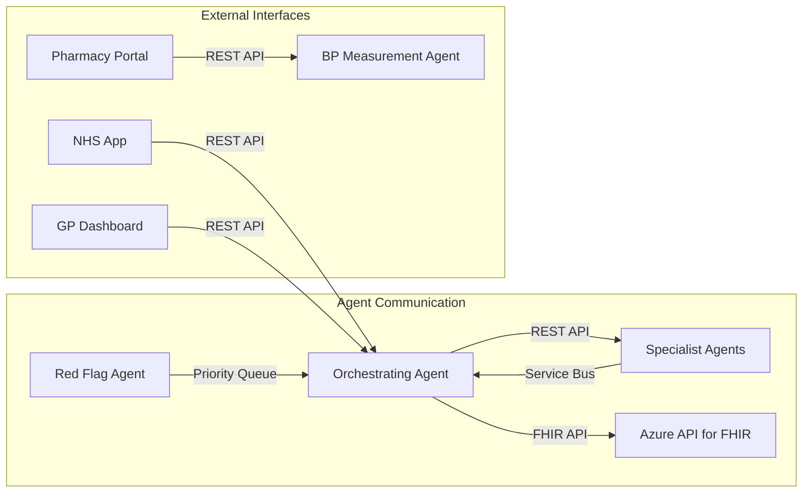

# My BP Agent API Specifications

**⚠️ SIMULATION ONLY - NOT FOR CLINICAL USE ⚠️**

*This document defines the API contracts and communication protocols for the My BP multi-agentic AI system using dummy data for demonstration purposes.*

## API Architecture Overview

### Communication Patterns



### Message Types

| Type | Priority | Timeout | Retry Policy |
|------|----------|---------|--------------|
| `REQUEST` | Normal | 30s | 3 attempts |
| `RESPONSE` | Normal | N/A | None |
| `EVENT` | Low | 60s | 2 attempts |
| `ALERT` | Critical | 5s | 5 attempts |

## Core Data Models

### Patient Data Model (Dummy Data)

```typescript
interface DummyPatient {
  id: string;                    // Format: "DUMMY-{uuid}"
  nhs_number: string;           // Format: "DEMO-{9-digits}"
  demographics: {
    name: {
      family: string;
      given: string[];
    };
    birth_date: string;         // ISO8601 date
    gender: "male" | "female" | "other";
    address: {
      line: string[];
      city: string;
      postal_code: string;
      country: "GB";
    };
  };
  category: "A" | "B" | "C";    // Patient category per MVP spec
  clinical_data: {
    bp_readings: BPReading[];
    medications: Medication[];
    care_plan: CarePlan;
    alerts: ClinicalAlert[];
  };
  metadata: {
    is_dummy_data: true;
    created_at: string;
    updated_at: string;
    data_source: "simulation";
  };
}
```

### Blood Pressure Reading Model

```typescript
interface BPReading {
  id: string;
  patient_id: string;
  systolic: number;             // mmHg
  diastolic: number;            // mmHg
  measurement_time: string;     // ISO8601 timestamp
  measurement_method: "clinic" | "home" | "abpm" | "pharmacy";
  device_info?: {
    manufacturer: string;
    model: string;
    calibration_date?: string;
  };
  location: {
    type: "pharmacy" | "gp_practice" | "home" | "hospital";
    name: string;
    address?: string;
  };
  quality_indicators: {
    valid_reading: boolean;
    cuff_size_appropriate: boolean;
    patient_position: "sitting" | "standing" | "lying";
    rest_period_minutes: number;
  };
  metadata: {
    recorded_by: "patient" | "clinician" | "automated";
    is_dummy_data: true;
  };
}
```

### Clinical Alert Model

```typescript
interface ClinicalAlert {
  id: string;
  patient_id: string;
  alert_type: "red_flag" | "medication_adherence" | "bp_target" | "side_effect";
  severity: "low" | "medium" | "high" | "critical";
  title: string;
  description: string;
  triggered_by: {
    agent: string;
    data_point: string;
    threshold_value: number;
    actual_value: number;
  };
  recommended_actions: string[];
  escalation_required: boolean;
  escalation_timeframe?: "immediate" | "urgent" | "routine";
  status: "active" | "acknowledged" | "resolved";
  created_at: string;
  resolved_at?: string;
  metadata: {
    is_dummy_data: true;
    simulation_scenario: string;
  };
}
```

## Agent API Specifications

### 1. Orchestrating Agent API

**Base URL**: `https://endpoint-orchestrating.{region}.inference.ml.azure.com`

#### Core Endpoints

```yaml
openapi: 3.0.3
info:
  title: Orchestrating Agent API
  version: 1.0.0
  description: Central coordination agent for hypertension management

paths:
  /health:
    get:
      summary: Health check endpoint
      responses:
        '200':
          description: Agent is healthy
          content:
            application/json:
              schema:
                type: object
                properties:
                  status: 
                    type: string
                    enum: [healthy, degraded, unhealthy]
                  timestamp:
                    type: string
                    format: date-time
                  dependencies:
                    type: object
                    properties:
                      fhir_service:
                        type: string
                        enum: [available, unavailable]
                      service_bus:
                        type: string
                        enum: [connected, disconnected]

  /patients/{patient_id}/care-pathway:
    get:
      summary: Get current care pathway for patient
      parameters:
        - name: patient_id
          in: path
          required: true
          schema:
            type: string
            pattern: '^DUMMY-[a-f0-9-]+$'
      responses:
        '200':
          description: Current care pathway
          content:
            application/json:
              schema:
                $ref: '#/components/schemas/CarePathway'

    post:
      summary: Initiate or update care pathway
      parameters:
        - name: patient_id
          in: path
          required: true
          schema:
            type: string
      requestBody:
        content:
          application/json:
            schema:
              $ref: '#/components/schemas/CarePathwayUpdate'
      responses:
        '200':
          description: Pathway updated successfully
        '400':
          description: Invalid request

  /patients/{patient_id}/escalate:
    post:
      summary: Escalate patient care to GP
      parameters:
        - name: patient_id
          in: path
          required: true
          schema:
            type: string
      requestBody:
        content:
          application/json:
            schema:
              type: object
              properties:
                urgency:
                  type: string
                  enum: [immediate, urgent, routine]
                reason:
                  type: string
                clinical_data:
                  type: object
                recommended_actions:
                  type: array
                  items:
                    type: string
      responses:
        '202':
          description: Escalation request accepted

components:
  schemas:
    CarePathway:
      type: object
      properties:
        patient_id:
          type: string
        current_stage:
          type: string
          enum: [screening, diagnostic, treatment, monitoring, maintenance]
        active_agents:
          type: array
          items:
            type: string
        next_actions:
          type: array
          items:
            type: object
            properties:
              agent:
                type: string
              action:
                type: string
              due_date:
                type: string
                format: date-time
        safety_status:
          type: string
          enum: [safe, caution, alert, critical]
```

#### Message Processing

```typescript
// Orchestrating Agent message handler
interface OrchestrationMessage {
  message_id: string;
  source_agent: string;
  message_type: "agent_response" | "care_update" | "escalation_request";
  patient_id: string;
  payload: {
    action_completed?: string;
    recommendations?: string[];
    next_steps?: string[];
    urgency?: "low" | "medium" | "high" | "critical";
  };
  metadata: {
    timestamp: string;
    correlation_id: string;
  };
}

// Response format
interface OrchestrationResponse {
  response_id: string;
  target_agents: string[];
  actions: {
    agent: string;
    action: string;
    parameters: object;
    deadline: string;
  }[];
  escalation_required: boolean;
  monitoring_required: boolean;
}
```

### 2. BP Measurement Agent API

**Base URL**: `https://endpoint-bp-measurement.{region}.inference.ml.azure.com`

#### Measurement Coordination

```yaml
paths:
  /measurements/schedule:
    post:
      summary: Schedule BP measurement
      requestBody:
        content:
          application/json:
            schema:
              type: object
              properties:
                patient_id:
                  type: string
                preferred_location_type:
                  type: string
                  enum: [pharmacy, gp_practice, home, any]
                urgency:
                  type: string
                  enum: [routine, urgent, immediate]
                preferred_date_range:
                  type: object
                  properties:
                    start_date: 
                      type: string
                      format: date
                    end_date:
                      type: string
                      format: date
      responses:
        '200':
          description: Measurement scheduled
          content:
            application/json:
              schema:
                type: object
                properties:
                  appointment_id:
                    type: string
                  location:
                    $ref: '#/components/schemas/MeasurementLocation'
                  scheduled_time:
                    type: string
                    format: date-time

  /measurements/{measurement_id}/record:
    post:
      summary: Record new BP measurement
      parameters:
        - name: measurement_id
          in: path
          required: true
          schema:
            type: string
      requestBody:
        content:
          application/json:
            schema:
              $ref: '#/components/schemas/BPReading'
      responses:
        '201':
          description: Measurement recorded successfully
        '400':
          description: Invalid measurement data

  /locations/search:
    get:
      summary: Find available measurement locations
      parameters:
        - name: postcode
          in: query
          required: true
          schema:
            type: string
        - name: radius_miles
          in: query
          schema:
            type: integer
            default: 5
        - name: location_type
          in: query
          schema:
            type: string
            enum: [pharmacy, gp_practice, community_hub]
      responses:
        '200':
          description: Available locations
          content:
            application/json:
              schema:
                type: array
                items:
                  $ref: '#/components/schemas/MeasurementLocation'

components:
  schemas:
    MeasurementLocation:
      type: object
      properties:
        id:
          type: string
        name:
          type: string
        type:
          type: string
          enum: [pharmacy, gp_practice, community_hub]
        address:
          type: object
          properties:
            line:
              type: array
              items:
                type: string
            postcode:
              type: string
        contact:
          type: object
          properties:
            phone:
              type: string
            opening_hours:
              type: object
        capabilities:
          type: object
          properties:
            abpm_available:
              type: boolean
            wheelchair_accessible:
              type: boolean
            languages_supported:
              type: array
              items:
                type: string
```

### 3. Red Flag Agent API

**Base URL**: `https://endpoint-red-flag.{region}.inference.ml.azure.com`

#### Emergency Detection and Response

```yaml
paths:
  /alerts/evaluate:
    post:
      summary: Evaluate clinical data for red flags
      requestBody:
        content:
          application/json:
            schema:
              type: object
              properties:
                patient_id:
                  type: string
                clinical_data:
                  type: object
                  properties:
                    bp_reading:
                      $ref: '#/components/schemas/BPReading'
                    symptoms:
                      type: array
                      items:
                        type: string
                    medication_changes:
                      type: array
                      items:
                        type: object
                context:
                  type: object
                  properties:
                    source_agent:
                      type: string
                    measurement_source:
                      type: string
      responses:
        '200':
          description: Evaluation completed
          content:
            application/json:
              schema:
                type: object
                properties:
                  red_flags_detected:
                    type: boolean
                  alerts:
                    type: array
                    items:
                      $ref: '#/components/schemas/ClinicalAlert'
                  recommended_actions:
                    type: array
                    items:
                      type: object
                      properties:
                        action:
                          type: string
                        urgency:
                          type: string
                        target:
                          type: string

  /alerts/{alert_id}/escalate:
    post:
      summary: Escalate critical alert
      parameters:
        - name: alert_id
          in: path
          required: true
          schema:
            type: string
      requestBody:
        content:
          application/json:
            schema:
              type: object
              properties:
                escalation_level:
                  type: string
                  enum: [gp_urgent, emergency_services, specialist_referral]
                clinical_summary:
                  type: string
                immediate_actions_taken:
                  type: array
                  items:
                    type: string
      responses:
        '202':
          description: Escalation initiated

  /monitoring/continuous:
    post:
      summary: Enable continuous monitoring for high-risk patient
      requestBody:
        content:
          application/json:
            schema:
              type: object
              properties:
                patient_id:
                  type: string
                monitoring_parameters:
                  type: object
                  properties:
                    bp_threshold_systolic:
                      type: integer
                    bp_threshold_diastolic:
                      type: integer
                    check_frequency_hours:
                      type: integer
                    alert_contacts:
                      type: array
                      items:
                        type: string
      responses:
        '200':
          description: Continuous monitoring activated
```

## Service Bus Message Schemas

### Agent Coordination Messages

```typescript
// Standard agent request message
interface AgentRequest {
  messageId: string;
  correlationId: string;
  sourceAgent: string;
  targetAgent: string;
  timestamp: string;
  messageType: "REQUEST";
  priority: "LOW" | "NORMAL" | "HIGH" | "CRITICAL";
  payload: {
    action: string;
    patientId: string;
    parameters: Record<string, any>;
    metadata: {
      isDummyData: true;
      simulationScenario?: string;
    };
  };
  replyTo?: string;
  timeToLive: number; // seconds
}

// Agent response message
interface AgentResponse {
  messageId: string;
  correlationId: string;
  sourceAgent: string;
  targetAgent: string;
  timestamp: string;
  messageType: "RESPONSE";
  payload: {
    status: "SUCCESS" | "ERROR" | "PARTIAL";
    result?: Record<string, any>;
    error?: {
      code: string;
      message: string;
      details?: Record<string, any>;
    };
    recommendations?: string[];
    nextActions?: {
      agent: string;
      action: string;
      deadline?: string;
    }[];
  };
}

// Clinical event notification
interface ClinicalEvent {
  messageId: string;
  sourceAgent: string;
  timestamp: string;
  messageType: "EVENT";
  priority: "LOW" | "NORMAL" | "HIGH" | "CRITICAL";
  payload: {
    eventType: string;
    patientId: string;
    clinicalData: Record<string, any>;
    significance: "routine" | "notable" | "concerning" | "critical";
    requiredActions?: string[];
    metadata: {
      isDummyData: true;
      eventSource: string;
    };
  };
}
```

### Topic Subscription Patterns

| Topic | Message Types | Subscribers |
|-------|---------------|-------------|
| `agent-coordination` | REQUEST, RESPONSE | All agents |
| `patient-events` | EVENT (clinical updates) | Orchestrating, Red Flag |
| `clinical-alerts` | ALERT (safety concerns) | Red Flag, GP Dashboard |
| `monitoring-data` | EVENT (system metrics) | Monitoring Service |
| `audit-trail` | EVENT (governance logs) | Audit Service |

## Authentication and Authorization

### Azure AD Integration

```yaml
authentication:
  type: "azure_ad"
  tenant_id: "${AZURE_TENANT_ID}"
  
  service_principals:
    - name: "mybp-agents"
      app_id: "${AGENTS_CLIENT_ID}"
      roles: ["agent.read", "agent.write", "fhir.access"]
    
    - name: "mybp-dashboard"
      app_id: "${DASHBOARD_CLIENT_ID}" 
      roles: ["dashboard.read", "patient.view"]

authorization:
  rbac_enabled: true
  
  roles:
    agent.read:
      description: "Read access to patient data and agent APIs"
      permissions:
        - "patients:read"
        - "measurements:read"
        - "care-plans:read"
    
    agent.write:
      description: "Write access for agent operations"
      permissions:
        - "patients:read"
        - "measurements:write"
        - "care-plans:write"
        - "alerts:create"
    
    fhir.access:
      description: "Access to FHIR service"
      permissions:
        - "fhir:read"
        - "fhir:write"
```

### API Key Management

```typescript
// Request authentication header
const headers = {
  'Authorization': `Bearer ${azureAdToken}`,
  'X-API-Key': `${endpointKey}`,
  'X-Dummy-Data': 'true',
  'Content-Type': 'application/json'
};

// Token validation
interface TokenValidation {
  validateToken(token: string): Promise<{
    valid: boolean;
    claims: {
      sub: string;
      roles: string[];
      tenant: string;
    };
  }>;
}
```

## Error Handling and Resilience

### Standard Error Response

```typescript
interface APIError {
  error: {
    code: string;
    message: string;
    details?: Record<string, any>;
    timestamp: string;
    trace_id: string;
  };
}

// Common error codes
const ErrorCodes = {
  // Authentication/Authorization
  INVALID_TOKEN: "AUTH001",
  INSUFFICIENT_PERMISSIONS: "AUTH002",
  
  // Data Validation
  INVALID_PATIENT_ID: "DATA001",
  INVALID_BP_READING: "DATA002",
  MISSING_REQUIRED_FIELD: "DATA003",
  
  // Business Logic
  PATIENT_NOT_FOUND: "BIZ001",
  INVALID_CARE_PATHWAY: "BIZ002",
  ESCALATION_REQUIRED: "BIZ003",
  
  // System Errors
  FHIR_SERVICE_UNAVAILABLE: "SYS001",
  SERVICE_BUS_ERROR: "SYS002",
  AGENT_TIMEOUT: "SYS003"
};
```

### Circuit Breaker Implementation

```typescript
interface CircuitBreakerConfig {
  failureThreshold: number;
  recoveryTimeout: number;
  requestTimeout: number;
}

class AgentCircuitBreaker {
  private state: 'CLOSED' | 'OPEN' | 'HALF_OPEN' = 'CLOSED';
  private failureCount = 0;
  private lastFailureTime?: number;
  
  async execute<T>(operation: () => Promise<T>): Promise<T> {
    if (this.state === 'OPEN') {
      if (this.shouldAttemptRecovery()) {
        this.state = 'HALF_OPEN';
      } else {
        throw new Error('Circuit breaker is OPEN');
      }
    }
    
    try {
      const result = await Promise.race([
        operation(),
        this.timeoutPromise()
      ]);
      
      this.onSuccess();
      return result;
    } catch (error) {
      this.onFailure();
      throw error;
    }
  }
}
```

## Rate Limiting and Throttling

### Request Rate Limits

| Endpoint Category | Requests/Minute | Burst Limit |
|------------------|-----------------|-------------|
| Health Checks | 1000 | 1500 |
| Patient Queries | 500 | 750 |
| Measurements | 200 | 400 |
| Escalations | 50 | 100 |

### Implementation

```typescript
interface RateLimitConfig {
  windowSizeMs: number;
  maxRequests: number;
  burstLimit: number;
}

// Rate limiting headers
const rateLimitHeaders = {
  'X-RateLimit-Limit': '500',
  'X-RateLimit-Remaining': '487',
  'X-RateLimit-Reset': '1640995200',
  'X-RateLimit-Burst': '750'
};
```

## API Testing and Validation

### Contract Testing

```typescript
// API contract validation
describe('Orchestrating Agent API Contract', () => {
  test('health endpoint returns expected schema', async () => {
    const response = await fetch('/health');
    const data = await response.json();
    
    expect(data).toMatchSchema({
      type: 'object',
      required: ['status', 'timestamp'],
      properties: {
        status: { enum: ['healthy', 'degraded', 'unhealthy'] },
        timestamp: { type: 'string', format: 'date-time' }
      }
    });
  });
  
  test('care pathway endpoint validates dummy patient ID', async () => {
    const response = await fetch('/patients/DUMMY-12345/care-pathway');
    expect(response.status).toBe(200);
    
    const invalidResponse = await fetch('/patients/REAL-12345/care-pathway');
    expect(invalidResponse.status).toBe(400);
  });
});
```

### Load Testing

```yaml
# Load testing configuration
load_test:
  scenarios:
    - name: "normal_operation"
      duration: "10m"
      requests_per_second: 100
      endpoints:
        - "/health" (50%)
        - "/patients/{dummy_id}/care-pathway" (30%)
        - "/measurements/schedule" (20%)
    
    - name: "peak_load"
      duration: "5m"
      requests_per_second: 500
      ramp_up: "30s"
    
    - name: "emergency_scenario"
      duration: "2m"
      requests_per_second: 50
      focus_endpoints:
        - "/alerts/evaluate"
        - "/alerts/{id}/escalate"
```

## Monitoring and Observability

### Application Insights Integration

```typescript
// Custom telemetry for API calls
class APITelemetry {
  trackAPICall(
    endpoint: string,
    method: string,
    statusCode: number,
    duration: number,
    isDummyData: boolean
  ) {
    this.telemetryClient.trackRequest({
      name: `${method} ${endpoint}`,
      url: endpoint,
      duration,
      resultCode: statusCode.toString(),
      success: statusCode < 400,
      properties: {
        isDummyData: isDummyData.toString(),
        environment: 'demo'
      }
    });
  }
  
  trackClinicalEvent(
    patientId: string,
    eventType: string,
    agent: string
  ) {
    this.telemetryClient.trackEvent({
      name: 'ClinicalEvent',
      properties: {
        patientId: `DUMMY-${patientId}`,
        eventType,
        sourceAgent: agent,
        isDummyData: 'true'
      }
    });
  }
}
```

### Health Check Endpoints

```typescript
interface HealthCheckResponse {
  status: 'healthy' | 'degraded' | 'unhealthy';
  timestamp: string;
  version: string;
  dependencies: {
    fhir_service: {
      status: 'available' | 'unavailable';
      response_time_ms?: number;
    };
    service_bus: {
      status: 'connected' | 'disconnected';
      queue_depth?: number;
    };
    key_vault: {
      status: 'accessible' | 'inaccessible';
    };
  };
  metadata: {
    instance_id: string;
    dummy_data_enabled: true;
  };
}
```

---

**This API specification provides comprehensive guidance for implementing the My BP agent communication system on Azure AI Foundry using dummy data for demonstration purposes only.**