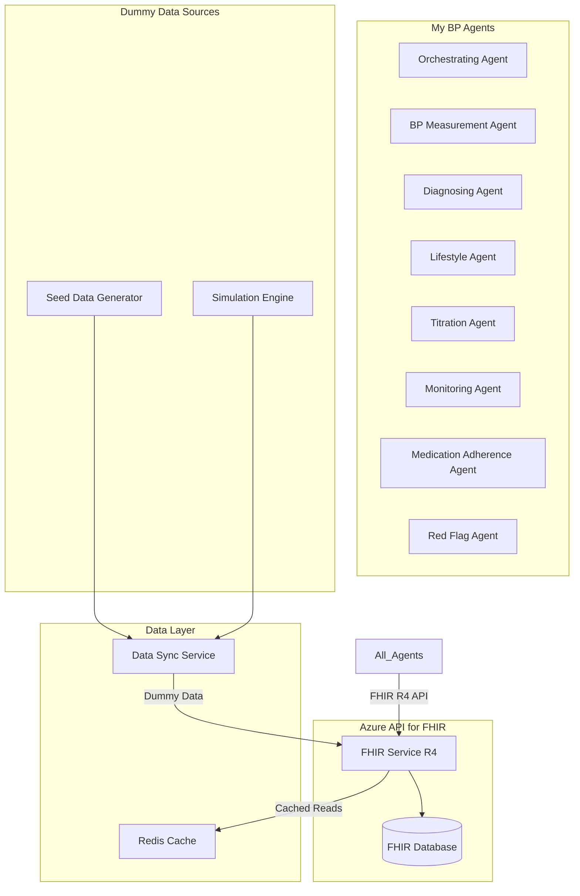

# Azure API for FHIR Integration for My BP

**⚠️ SIMULATION ONLY - NOT FOR CLINICAL USE ⚠️**

*This document defines the integration patterns and dummy data structures for using Azure API for FHIR as the backend data store for the My BP multi-agentic AI system.*

## FHIR Integration Overview

### Architecture Pattern



### Key Integration Principles

1. **FHIR R4 Compliance**: All data structures follow FHIR R4 specifications
2. **Dummy Data Marking**: All resources clearly marked as simulation/demo data
3. **Clinical Safety**: Proper resource relationships and data integrity
4. **Performance Optimization**: Caching and efficient query patterns
5. **Audit Trail**: Complete tracking of all data access and modifications

## FHIR Resource Mapping

### Core Resources for Hypertension Management

| Clinical Concept | FHIR Resource | Purpose |
|-----------------|---------------|---------|
| **Patient Demographics** | `Patient` | Identity and basic information |
| **BP Measurements** | `Observation` | Blood pressure readings |
| **Medications** | `MedicationStatement`, `MedicationRequest` | Current and prescribed medications |
| **Care Plans** | `CarePlan` | Treatment pathways and goals |
| **Clinical Alerts** | `Flag`, `ClinicalImpression` | Safety alerts and assessments |
| **Appointments** | `Appointment` | BP measurement scheduling |
| **Encounters** | `Encounter` | Clinical interactions |
| **Diagnostic Reports** | `DiagnosticReport` | ABPM results and analysis |

## Dummy Data Resource Definitions

### Patient Resource (Dummy Data)

```json
{
  "resourceType": "Patient",
  "id": "dummy-patient-001",
  "identifier": [
    {
      "use": "usual",
      "type": {
        "coding": [
          {
            "system": "https://fhir.nhs.uk/Id/nhs-number",
            "code": "NH"
          }
        ]
      },
      "value": "DEMO123456789",
      "period": {
        "start": "2024-01-01"
      }
    }
  ],
  "active": true,
  "name": [
    {
      "use": "official",
      "family": "TestPatient",
      "given": ["Demo", "John"],
      "prefix": ["Mr"]
    }
  ],
  "telecom": [
    {
      "system": "phone", 
      "value": "DEMO-07700900123",
      "use": "mobile"
    },
    {
      "system": "email",
      "value": "demo.patient@simulation.nhs.uk",
      "use": "home"
    }
  ],
  "gender": "male",
  "birthDate": "1975-05-15",
  "address": [
    {
      "use": "home",
      "line": ["123 Demo Street"],
      "city": "Cambridge",
      "postalCode": "CB1 2AB",
      "country": "GB"
    }
  ],
  "extension": [
    {
      "url": "http://mybp.nhs.uk/fhir/extension/dummy-data-marker",
      "valueBoolean": true
    },
    {
      "url": "http://mybp.nhs.uk/fhir/extension/patient-category",
      "valueString": "A"
    },
    {
      "url": "http://mybp.nhs.uk/fhir/extension/simulation-scenario",
      "valueString": "established-hypertension-stable"
    }
  ],
  "meta": {
    "profile": [
      "https://fhir.nhs.uk/STU3/StructureDefinition/CareConnect-Patient-1"
    ],
    "tag": [
      {
        "system": "http://mybp.nhs.uk/fhir/tags",
        "code": "demo-data",
        "display": "Demonstration Data Only"
      }
    ]
  }
}
```

### Blood Pressure Observation (Dummy Data)

```json
{
  "resourceType": "Observation",
  "id": "dummy-bp-001",
  "status": "final",
  "category": [
    {
      "coding": [
        {
          "system": "http://terminology.hl7.org/CodeSystem/observation-category",
          "code": "vital-signs",
          "display": "Vital Signs"
        }
      ]
    }
  ],
  "code": {
    "coding": [
      {
        "system": "http://loinc.org",
        "code": "85354-9",
        "display": "Blood pressure panel with all children optional"
      },
      {
        "system": "http://snomed.info/sct",
        "code": "75367002",
        "display": "Blood pressure"
      }
    ]
  },
  "subject": {
    "reference": "Patient/dummy-patient-001",
    "display": "Demo TestPatient"
  },
  "effectiveDateTime": "2024-01-15T10:30:00+00:00",
  "performer": [
    {
      "reference": "Practitioner/dummy-pharmacist-001",
      "display": "Demo Pharmacist"
    }
  ],
  "component": [
    {
      "code": {
        "coding": [
          {
            "system": "http://loinc.org",
            "code": "8480-6",
            "display": "Systolic blood pressure"
          }
        ]
      },
      "valueQuantity": {
        "value": 142,
        "unit": "mmHg",
        "system": "http://unitsofmeasure.org",
        "code": "mm[Hg]"
      }
    },
    {
      "code": {
        "coding": [
          {
            "system": "http://loinc.org",
            "code": "8462-4",
            "display": "Diastolic blood pressure"
          }
        ]
      },
      "valueQuantity": {
        "value": 88,
        "unit": "mmHg", 
        "system": "http://unitsofmeasure.org",
        "code": "mm[Hg]"
      }
    }
  ],
  "device": {
    "reference": "Device/dummy-bp-monitor-001",
    "display": "Demo BP Monitor"
  },
  "extension": [
    {
      "url": "http://mybp.nhs.uk/fhir/extension/dummy-data-marker",
      "valueBoolean": true
    },
    {
      "url": "http://mybp.nhs.uk/fhir/extension/measurement-context",
      "valueCodeableConcept": {
        "coding": [
          {
            "system": "http://mybp.nhs.uk/fhir/measurement-context",
            "code": "pharmacy-routine",
            "display": "Routine pharmacy measurement"
          }
        ]
      }
    },
    {
      "url": "http://mybp.nhs.uk/fhir/extension/quality-indicators",
      "extension": [
        {
          "url": "cuff-size-appropriate",
          "valueBoolean": true
        },
        {
          "url": "rest-period-minutes",
          "valueInteger": 5
        },
        {
          "url": "patient-position",
          "valueString": "sitting"
        }
      ]
    }
  ],
  "meta": {
    "profile": [
      "http://mybp.nhs.uk/fhir/StructureDefinition/MyBP-BloodPressure"
    ],
    "tag": [
      {
        "system": "http://mybp.nhs.uk/fhir/tags",
        "code": "demo-data",
        "display": "Demonstration Data Only"
      }
    ]
  }
}
```

### Care Plan Resource (Dummy Data)

```json
{
  "resourceType": "CarePlan",
  "id": "dummy-careplan-001",
  "status": "active",
  "intent": "plan",
  "category": [
    {
      "coding": [
        {
          "system": "http://snomed.info/sct",
          "code": "736353002",
          "display": "Hypertension care plan"
        }
      ]
    }
  ],
  "title": "Hypertension Management Care Plan",
  "description": "Comprehensive care plan for hypertension management using AI agent coordination",
  "subject": {
    "reference": "Patient/dummy-patient-001"
  },
  "period": {
    "start": "2024-01-01",
    "end": "2024-12-31"
  },
  "created": "2024-01-01T00:00:00+00:00",
  "activity": [
    {
      "detail": {
        "kind": "ServiceRequest",
        "code": {
          "coding": [
            {
              "system": "http://snomed.info/sct",
              "code": "182836005",
              "display": "Blood pressure monitoring"
            }
          ]
        },
        "status": "in-progress",
        "description": "Monthly blood pressure monitoring at community pharmacy",
        "scheduledPeriod": {
          "start": "2024-01-01",
          "end": "2024-12-31"
        },
        "performer": [
          {
            "reference": "Organization/dummy-pharmacy-001"
          }
        ]
      }
    },
    {
      "detail": {
        "kind": "MedicationRequest",
        "code": {
          "coding": [
            {
              "system": "http://snomed.info/sct",
              "code": "432102000",
              "display": "Administration of substance"
            }
          ]
        },
        "status": "in-progress",
        "description": "Amlodipine 5mg daily for blood pressure control",
        "scheduledPeriod": {
          "start": "2024-01-01"
        }
      }
    }
  ],
  "goal": [
    {
      "reference": "Goal/dummy-bp-target-001"
    }
  ],
  "extension": [
    {
      "url": "http://mybp.nhs.uk/fhir/extension/dummy-data-marker",
      "valueBoolean": true
    },
    {
      "url": "http://mybp.nhs.uk/fhir/extension/agent-managed",
      "valueBoolean": true
    },
    {
      "url": "http://mybp.nhs.uk/fhir/extension/care-pathway-stage",
      "valueString": "treatment-optimization"
    }
  ]
}
```

### Clinical Alert Flag Resource

```json
{
  "resourceType": "Flag",
  "id": "dummy-alert-001",
  "status": "active",
  "category": [
    {
      "coding": [
        {
          "system": "http://terminology.hl7.org/CodeSystem/flag-category",
          "code": "clinical",
          "display": "Clinical"
        }
      ]
    }
  ],
  "code": {
    "coding": [
      {
        "system": "http://mybp.nhs.uk/fhir/alert-codes",
        "code": "bp-target-not-met",
        "display": "Blood pressure target not achieved"
      }
    ]
  },
  "subject": {
    "reference": "Patient/dummy-patient-001"
  },
  "period": {
    "start": "2024-01-15T10:30:00+00:00"
  },
  "encounter": {
    "reference": "Encounter/dummy-encounter-001"
  },
  "author": {
    "reference": "Device/dummy-ai-agent-monitoring"
  },
  "extension": [
    {
      "url": "http://mybp.nhs.uk/fhir/extension/dummy-data-marker",
      "valueBoolean": true
    },
    {
      "url": "http://mybp.nhs.uk/fhir/extension/alert-severity",
      "valueString": "medium"
    },
    {
      "url": "http://mybp.nhs.uk/fhir/extension/triggering-agent",
      "valueString": "monitoring-agent"
    },
    {
      "url": "http://mybp.nhs.uk/fhir/extension/recommended-actions",
      "valueString": "Consider medication titration, lifestyle review"
    }
  ]
}
```

## FHIR Search and Query Patterns

### Agent-Specific Query Patterns

#### Orchestrating Agent Queries

```typescript
// Get patient care pathway status
const getCarePathwayStatus = async (patientId: string) => {
  return await fhirClient.search('CarePlan', {
    subject: `Patient/${patientId}`,
    status: 'active',
    category: 'http://snomed.info/sct|736353002' // Hypertension care plan
  });
};

// Get active clinical alerts
const getActiveAlerts = async (patientId: string) => {
  return await fhirClient.search('Flag', {
    subject: `Patient/${patientId}`,
    status: 'active',
    category: 'clinical'
  });
};

// Get latest BP reading
const getLatestBPReading = async (patientId: string) => {
  return await fhirClient.search('Observation', {
    subject: `Patient/${patientId}`,
    code: 'http://loinc.org|85354-9', // Blood pressure panel
    _sort: '-date',
    _count: 1
  });
};
```

#### BP Measurement Agent Queries

```typescript
// Find scheduled BP measurements
const getScheduledMeasurements = async (patientId: string) => {
  return await fhirClient.search('Appointment', {
    actor: `Patient/${patientId}`,
    service_type: 'bp-measurement',
    status: 'booked,pending',
    date: `ge${new Date().toISOString().split('T')[0]}`
  });
};

// Record new BP measurement
const recordBPMeasurement = async (measurement: BPMeasurement) => {
  const observation = {
    resourceType: 'Observation',
    status: 'final',
    category: [{
      coding: [{
        system: 'http://terminology.hl7.org/CodeSystem/observation-category',
        code: 'vital-signs'
      }]
    }],
    code: {
      coding: [{
        system: 'http://loinc.org',
        code: '85354-9'
      }]
    },
    subject: { reference: `Patient/${measurement.patientId}` },
    effectiveDateTime: measurement.timestamp,
    component: [
      {
        code: { coding: [{ system: 'http://loinc.org', code: '8480-6' }] },
        valueQuantity: { value: measurement.systolic, unit: 'mmHg' }
      },
      {
        code: { coding: [{ system: 'http://loinc.org', code: '8462-4' }] },
        valueQuantity: { value: measurement.diastolic, unit: 'mmHg' }
      }
    ],
    extension: [{
      url: 'http://mybp.nhs.uk/fhir/extension/dummy-data-marker',
      valueBoolean: true
    }]
  };
  
  return await fhirClient.create(observation);
};
```

#### Red Flag Agent Queries

```typescript
// Check for critical BP readings in last 24 hours
const getCriticalBPReadings = async (patientId: string) => {
  const yesterday = new Date(Date.now() - 24 * 60 * 60 * 1000).toISOString();
  
  return await fhirClient.search('Observation', {
    subject: `Patient/${patientId}`,
    code: 'http://loinc.org|85354-9',
    date: `ge${yesterday}`,
    'component-value-quantity': 'ge180|http://unitsofmeasure.org|mm[Hg]' // Systolic >= 180
  });
};

// Create critical alert
const createCriticalAlert = async (patientId: string, alertData: AlertData) => {
  const flag = {
    resourceType: 'Flag',
    status: 'active',
    category: [{ coding: [{ system: 'http://terminology.hl7.org/CodeSystem/flag-category', code: 'clinical' }] }],
    code: {
      coding: [{
        system: 'http://mybp.nhs.uk/fhir/alert-codes',
        code: alertData.code
      }]
    },
    subject: { reference: `Patient/${patientId}` },
    period: { start: new Date().toISOString() },
    extension: [
      {
        url: 'http://mybp.nhs.uk/fhir/extension/dummy-data-marker',
        valueBoolean: true
      },
      {
        url: 'http://mybp.nhs.uk/fhir/extension/alert-severity',
        valueString: alertData.severity
      }
    ]
  };
  
  return await fhirClient.create(flag);
};
```

## Data Access Layer Implementation

### FHIR Client Configuration

```typescript
interface FHIRClientConfig {
  endpoint: string;
  authentication: {
    type: 'azure_ad';
    clientId: string;
    clientSecret: string;
    tenantId: string;
    scope: string;
  };
  timeout: number;
  retryPolicy: {
    maxRetries: number;
    backoffFactor: number;
  };
}

class MyBPFHIRClient {
  private client: FHIRClient;
  private cache: RedisCache;
  
  constructor(config: FHIRClientConfig) {
    this.client = new FHIRClient(config);
    this.cache = new RedisCache();
  }
  
  async search<T extends Resource>(
    resourceType: string, 
    params: SearchParams,
    useCache: boolean = true
  ): Promise<Bundle<T>> {
    const cacheKey = this.generateCacheKey(resourceType, params);
    
    if (useCache) {
      const cached = await this.cache.get(cacheKey);
      if (cached) return JSON.parse(cached);
    }
    
    const result = await this.client.search<T>(resourceType, params);
    
    // Cache read operations for 5 minutes
    if (useCache && result.total > 0) {
      await this.cache.setex(cacheKey, 300, JSON.stringify(result));
    }
    
    return result;
  }
  
  async create<T extends Resource>(resource: T): Promise<T> {
    // Ensure dummy data marker
    if (!resource.extension?.some(ext => 
      ext.url === 'http://mybp.nhs.uk/fhir/extension/dummy-data-marker'
    )) {
      resource.extension = resource.extension || [];
      resource.extension.push({
        url: 'http://mybp.nhs.uk/fhir/extension/dummy-data-marker',
        valueBoolean: true
      });
    }
    
    const result = await this.client.create(resource);
    
    // Invalidate relevant cache entries
    await this.invalidateCache(resource.resourceType, resource.id);
    
    return result;
  }
  
  async update<T extends Resource>(resource: T): Promise<T> {
    const result = await this.client.update(resource);
    await this.invalidateCache(resource.resourceType, resource.id);
    return result;
  }
}
```

### Repository Pattern Implementation

```typescript
class PatientRepository {
  constructor(private fhirClient: MyBPFHIRClient) {}
  
  async getPatientByCategory(category: 'A' | 'B' | 'C'): Promise<Patient[]> {
    const bundle = await this.fhirClient.search('Patient', {
      'extension-value': `http://mybp.nhs.uk/fhir/extension/patient-category|${category}`,
      active: 'true',
      _include: 'Patient:general-practitioner'
    });
    
    return bundle.entry?.map(entry => entry.resource) || [];
  }
  
  async getPatientCarePlan(patientId: string): Promise<CarePlan> {
    const bundle = await this.fhirClient.search('CarePlan', {
      subject: `Patient/${patientId}`,
      status: 'active',
      _include: 'CarePlan:goal'
    });
    
    return bundle.entry?.[0]?.resource;
  }
  
  async getBPHistory(patientId: string, days: number = 30): Promise<Observation[]> {
    const fromDate = new Date(Date.now() - days * 24 * 60 * 60 * 1000).toISOString().split('T')[0];
    
    const bundle = await this.fhirClient.search('Observation', {
      subject: `Patient/${patientId}`,
      code: 'http://loinc.org|85354-9',
      date: `ge${fromDate}`,
      _sort: '-date',
      _count: 100
    });
    
    return bundle.entry?.map(entry => entry.resource) || [];
  }
}

class ClinicalAlertRepository {
  constructor(private fhirClient: MyBPFHIRClient) {}
  
  async createAlert(alert: ClinicalAlertData): Promise<Flag> {
    const flag: Flag = {
      resourceType: 'Flag',
      status: 'active',
      category: [{ coding: [{ system: 'http://terminology.hl7.org/CodeSystem/flag-category', code: 'clinical' }] }],
      code: {
        coding: [{
          system: 'http://mybp.nhs.uk/fhir/alert-codes',
          code: alert.type,
          display: alert.title
        }]
      },
      subject: { reference: `Patient/${alert.patientId}` },
      period: { start: new Date().toISOString() },
      extension: [
        {
          url: 'http://mybp.nhs.uk/fhir/extension/dummy-data-marker',
          valueBoolean: true
        },
        {
          url: 'http://mybp.nhs.uk/fhir/extension/alert-severity',
          valueString: alert.severity
        },
        {
          url: 'http://mybp.nhs.uk/fhir/extension/triggering-agent',
          valueString: alert.triggeringAgent
        }
      ]
    };
    
    return await this.fhirClient.create(flag);
  }
  
  async getActiveAlerts(patientId: string): Promise<Flag[]> {
    const bundle = await this.fhirClient.search('Flag', {
      subject: `Patient/${patientId}`,
      status: 'active'
    });
    
    return bundle.entry?.map(entry => entry.resource) || [];
  }
  
  async resolveAlert(alertId: string): Promise<Flag> {
    const flag = await this.fhirClient.read('Flag', alertId);
    flag.status = 'inactive';
    flag.period.end = new Date().toISOString();
    
    return await this.fhirClient.update(flag);
  }
}
```

## Dummy Data Generation and Management

### Data Generation Service

```typescript
class DummyDataGenerator {
  private scenarios = [
    'newly-diagnosed',
    'treatment-resistant', 
    'medication-adherence-issues',
    'red-flag-scenario',
    'stable-management',
    'lifestyle-intervention'
  ];
  
  async generatePatientCohort(count: number): Promise<Patient[]> {
    const patients: Patient[] = [];
    
    for (let i = 0; i < count; i++) {
      const scenario = this.scenarios[i % this.scenarios.length];
      const patient = await this.generatePatient(scenario, i);
      patients.push(patient);
    }
    
    return patients;
  }
  
  private async generatePatient(scenario: string, index: number): Promise<Patient> {
    return {
      resourceType: 'Patient',
      id: `dummy-patient-${String(index).padStart(3, '0')}`,
      identifier: [{
        use: 'usual',
        type: { coding: [{ system: 'https://fhir.nhs.uk/Id/nhs-number', code: 'NH' }] },
        value: `DEMO${String(123456000 + index).padStart(9, '0')}`
      }],
      active: true,
      name: [{
        use: 'official',
        family: `TestPatient${index}`,
        given: ['Demo', this.generateRandomFirstName()]
      }],
      gender: Math.random() > 0.5 ? 'male' : 'female',
      birthDate: this.generateBirthDate(35, 75),
      extension: [
        {
          url: 'http://mybp.nhs.uk/fhir/extension/dummy-data-marker',
          valueBoolean: true
        },
        {
          url: 'http://mybp.nhs.uk/fhir/extension/patient-category',
          valueString: this.assignPatientCategory(scenario)
        },
        {
          url: 'http://mybp.nhs.uk/fhir/extension/simulation-scenario',
          valueString: scenario
        }
      ],
      meta: {
        tag: [{
          system: 'http://mybp.nhs.uk/fhir/tags',
          code: 'demo-data',
          display: 'Demonstration Data Only'
        }]
      }
    };
  }
  
  async generateBPReadings(patientId: string, scenario: string, days: number = 90): Promise<Observation[]> {
    const readings: Observation[] = [];
    const baseReading = this.getBaseReadingForScenario(scenario);
    
    for (let day = 0; day < days; day += 7) { // Weekly readings
      const reading = this.generateBPReading(
        patientId, 
        baseReading, 
        new Date(Date.now() - day * 24 * 60 * 60 * 1000),
        scenario
      );
      readings.push(reading);
    }
    
    return readings;
  }
  
  private getBaseReadingForScenario(scenario: string): { systolic: number; diastolic: number } {
    const scenarios = {
      'newly-diagnosed': { systolic: 155, diastolic: 95 },
      'treatment-resistant': { systolic: 165, diastolic: 100 },
      'medication-adherence-issues': { systolic: 150, diastolic: 92 },
      'red-flag-scenario': { systolic: 185, diastolic: 110 },
      'stable-management': { systolic: 130, diastolic: 80 },
      'lifestyle-intervention': { systolic: 140, diastolic: 88 }
    };
    
    return scenarios[scenario] || { systolic: 140, diastolic: 90 };
  }
}
```

### Data Seeding Script

```typescript
class FHIRDataSeeder {
  constructor(private fhirClient: MyBPFHIRClient, private generator: DummyDataGenerator) {}
  
  async seedDemoData(): Promise<void> {
    console.log('Starting FHIR demo data seeding...');
    
    // Generate patient cohorts by category
    const categoryAPatients = await this.generator.generatePatientCohort(25); // Known hypertension
    const categoryBPatients = await this.generator.generatePatientCohort(15); // Surveillance
    const categoryCPatients = await this.generator.generatePatientCohort(10); // Newly detected
    
    // Create patients
    for (const patient of [...categoryAPatients, ...categoryBPatients, ...categoryCPatients]) {
      await this.fhirClient.create(patient);
      console.log(`Created patient: ${patient.id}`);
      
      // Generate BP history
      const scenario = patient.extension?.find(ext => 
        ext.url === 'http://mybp.nhs.uk/fhir/extension/simulation-scenario'
      )?.valueString || 'stable-management';
      
      const bpReadings = await this.generator.generateBPReadings(patient.id, scenario);
      for (const reading of bpReadings) {
        await this.fhirClient.create(reading);
      }
      
      // Generate care plan
      const carePlan = await this.generator.generateCarePlan(patient.id, scenario);
      await this.fhirClient.create(carePlan);
      
      // Generate medications
      const medications = await this.generator.generateMedications(patient.id, scenario);
      for (const medication of medications) {
        await this.fhirClient.create(medication);
      }
    }
    
    console.log('Demo data seeding completed');
  }
  
  async cleanupDemoData(): Promise<void> {
    console.log('Cleaning up demo data...');
    
    // Find all resources with dummy data marker
    const resourceTypes = ['Patient', 'Observation', 'CarePlan', 'MedicationStatement', 'Flag'];
    
    for (const resourceType of resourceTypes) {
      const bundle = await this.fhirClient.search(resourceType, {
        'extension-value': 'http://mybp.nhs.uk/fhir/extension/dummy-data-marker|true'
      });
      
      for (const entry of bundle.entry || []) {
        await this.fhirClient.delete(resourceType, entry.resource.id);
        console.log(`Deleted ${resourceType}: ${entry.resource.id}`);
      }
    }
    
    console.log('Demo data cleanup completed');
  }
}
```

## Performance Optimization

### Caching Strategy

```typescript
class FHIRCacheManager {
  private cache: RedisClient;
  
  constructor(redisConfig: RedisConfig) {
    this.cache = new Redis(redisConfig);
  }
  
  // Cache configuration by resource type
  private cacheConfig = {
    'Patient': { ttl: 3600, enabled: true },      // 1 hour
    'Observation': { ttl: 300, enabled: true },   // 5 minutes
    'CarePlan': { ttl: 1800, enabled: true },     // 30 minutes
    'Flag': { ttl: 60, enabled: true },           // 1 minute (alerts change frequently)
    'Appointment': { ttl: 900, enabled: true }    // 15 minutes
  };
  
  async get(key: string): Promise<string | null> {
    return await this.cache.get(key);
  }
  
  async set(key: string, value: string, resourceType: string): Promise<void> {
    const config = this.cacheConfig[resourceType];
    if (config?.enabled) {
      await this.cache.setex(key, config.ttl, value);
    }
  }
  
  async invalidatePatient(patientId: string): Promise<void> {
    const patterns = [
      `patient:${patientId}:*`,
      `observation:${patientId}:*`,
      `careplan:${patientId}:*`,
      `flag:${patientId}:*`
    ];
    
    for (const pattern of patterns) {
      const keys = await this.cache.keys(pattern);
      if (keys.length > 0) {
        await this.cache.del(...keys);
      }
    }
  }
}
```

### Bulk Operations

```typescript
class FHIRBulkOperations {
  constructor(private fhirClient: MyBPFHIRClient) {}
  
  async bulkCreate(resources: Resource[]): Promise<Bundle> {
    const bundle: Bundle = {
      resourceType: 'Bundle',
      type: 'transaction',
      entry: resources.map((resource, index) => ({
        fullUrl: `urn:uuid:${uuidv4()}`,
        resource,
        request: {
          method: 'POST',
          url: resource.resourceType
        }
      }))
    };
    
    return await this.fhirClient.transaction(bundle);
  }
  
  async bulkUpdate(resources: Resource[]): Promise<Bundle> {
    const bundle: Bundle = {
      resourceType: 'Bundle', 
      type: 'transaction',
      entry: resources.map(resource => ({
        resource,
        request: {
          method: 'PUT',
          url: `${resource.resourceType}/${resource.id}`
        }
      }))
    };
    
    return await this.fhirClient.transaction(bundle);
  }
}
```

## Security and Access Control

### FHIR Resource Security

```typescript
class FHIRSecurityManager {
  constructor(private authService: AzureADAuthService) {}
  
  async validateAccess(
    userId: string, 
    resourceType: string, 
    resourceId: string, 
    operation: 'read' | 'write' | 'delete'
  ): Promise<boolean> {
    // Verify user has valid token
    const tokenValid = await this.authService.validateToken(userId);
    if (!tokenValid) return false;
    
    // Check resource-specific permissions
    const permissions = await this.getUserPermissions(userId);
    const requiredPermission = `${resourceType}:${operation}`;
    
    if (!permissions.includes(requiredPermission)) {
      return false;
    }
    
    // Additional checks for dummy data access
    const resource = await this.fhirClient.read(resourceType, resourceId);
    const isDummyData = resource.extension?.some(ext => 
      ext.url === 'http://mybp.nhs.uk/fhir/extension/dummy-data-marker'
    );
    
    // Only allow access to dummy data in demo environment
    if (!isDummyData && process.env.ENVIRONMENT === 'demo') {
      return false;
    }
    
    return true;
  }
  
  async auditAccess(
    userId: string,
    resourceType: string,
    resourceId: string,
    operation: string,
    success: boolean
  ): Promise<void> {
    const auditEvent = {
      resourceType: 'AuditEvent',
      type: {
        system: 'http://terminology.hl7.org/CodeSystem/audit-event-type',
        code: 'rest'
      },
      subtype: [{
        system: 'http://hl7.org/fhir/restful-interaction',
        code: operation
      }],
      action: operation === 'read' ? 'R' : operation === 'create' ? 'C' : 'U',
      recorded: new Date().toISOString(),
      outcome: success ? '0' : '4',
      agent: [{
        type: {
          coding: [{
            system: 'http://terminology.hl7.org/CodeSystem/extra-security-role-type',
            code: 'software'
          }]
        },
        who: { reference: `User/${userId}` },
        requestor: true
      }],
      source: {
        site: 'mybp-demo',
        type: [{
          system: 'http://terminology.hl7.org/CodeSystem/security-source-type',
          code: '4'
        }]
      },
      entity: [{
        what: { reference: `${resourceType}/${resourceId}` },
        type: {
          system: 'http://terminology.hl7.org/CodeSystem/audit-entity-type',
          code: '2'
        }
      }]
    };
    
    await this.fhirClient.create(auditEvent);
  }
}
```

## Monitoring and Logging

### FHIR Operations Monitoring

```typescript
class FHIRMonitoring {
  private telemetryClient: TelemetryClient;
  
  constructor(telemetryClient: TelemetryClient) {
    this.telemetryClient = telemetryClient;
  }
  
  trackFHIROperation(
    operation: string,
    resourceType: string,
    duration: number,
    success: boolean,
    resourceCount?: number
  ): void {
    this.telemetryClient.trackEvent({
      name: 'FHIROperation',
      properties: {
        operation,
        resourceType,
        success: success.toString(),
        isDemoData: 'true'
      },
      measurements: {
        duration,
        resourceCount: resourceCount || 1
      }
    });
  }
  
  trackDataQuality(resourceType: string, validationResults: ValidationResult[]): void {
    const errors = validationResults.filter(r => r.severity === 'error').length;
    const warnings = validationResults.filter(r => r.severity === 'warning').length;
    
    this.telemetryClient.trackEvent({
      name: 'FHIRDataQuality',
      properties: {
        resourceType,
        hasErrors: (errors > 0).toString(),
        hasWarnings: (warnings > 0).toString()
      },
      measurements: {
        errorCount: errors,
        warningCount: warnings
      }
    });
  }
}
```

---

**This FHIR integration guide provides comprehensive patterns for implementing dummy data storage and retrieval for the My BP system using Azure API for FHIR in a demonstration environment.**