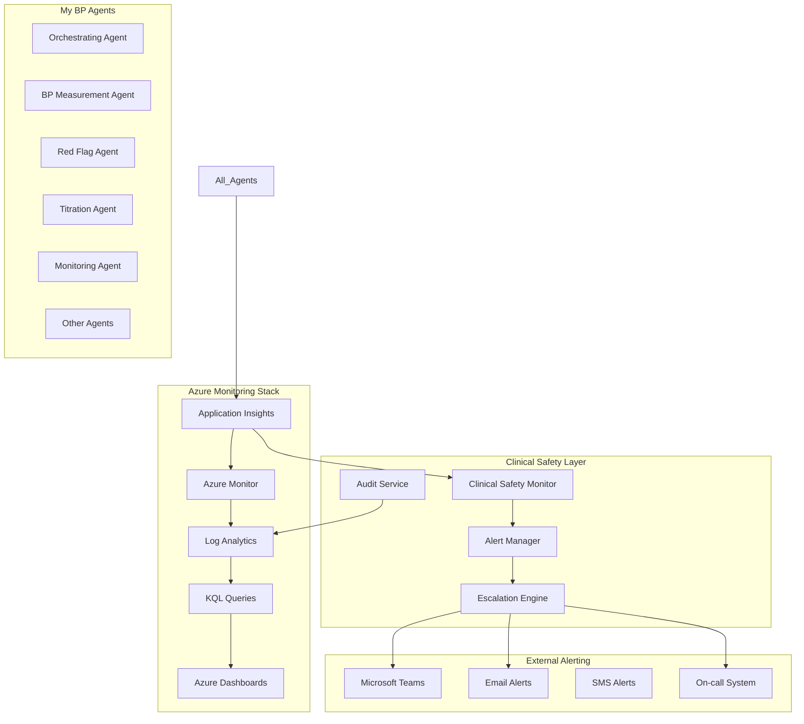

# My BP Monitoring, Logging, and Clinical Safety Architecture

**⚠️ SIMULATION ONLY - NOT FOR CLINICAL USE ⚠️**

*This document defines the comprehensive monitoring, logging, and clinical safety architecture for the My BP multi-agentic AI system using Azure monitoring services with dummy data.*

## Monitoring Architecture Overview

### Core Monitoring Components



### Monitoring Objectives

| Objective | Scope | Target |
|-----------|-------|--------|
| **Clinical Safety** | All patient interactions | 99.9% alert detection |
| **System Availability** | Agent uptime | 99.5% availability |
| **Response Time** | Agent communication | <5s for critical alerts |
| **Data Quality** | FHIR operations | <0.1% data validation errors |
| **Audit Compliance** | All clinical decisions | 100% audit trail |

## Application Insights Integration

### Custom Events and Metrics

```typescript
// Clinical safety events
interface ClinicalSafetyEvent {
  name: "ClinicalSafetyEvent";
  properties: {
    patient_id: string;           // Always DUMMY-prefixed
    event_type: string;           // "red_flag", "escalation", "safety_check"
    severity: "low" | "medium" | "high" | "critical";
    source_agent: string;
    triggered_by: string;
    resolution_status: "pending" | "resolved" | "escalated";
    is_dummy_data: "true";
    simulation_scenario?: string;
  };
  measurements: {
    response_time_ms: number;
    escalation_delay_ms?: number;
  };
}

// Agent execution tracking
interface AgentExecutionEvent {
  name: "AgentExecution";
  properties: {
    agent_name: string;
    action: string;
    success: "true" | "false";
    patient_category?: "A" | "B" | "C";
    error_code?: string;
    is_dummy_data: "true";
    environment: "demo";
  };
  measurements: {
    duration_ms: number;
    memory_usage_mb?: number;
    cpu_usage_percent?: number;
  };
}

// FHIR operation tracking
interface FHIROperationEvent {
  name: "FHIROperation";
  properties: {
    operation: "read" | "write" | "search" | "update" | "delete";
    resource_type: string;
    success: "true" | "false";
    agent_name: string;
    is_dummy_data: "true";
  };
  measurements: {
    duration_ms: number;
    resource_count: number;
    payload_size_kb?: number;
  };
}
```

### Telemetry Client Implementation

```python
from azure.monitor.opentelemetry import configure_azure_monitor
from azure.applicationinsights import TelemetryClient
from opentelemetry import trace, metrics
import logging
import time
from typing import Dict, Any, Optional

class MyBPTelemetryClient:
    def __init__(self, connection_string: str, agent_name: str):
        self.agent_name = agent_name
        self.telemetry_client = TelemetryClient(connection_string)
        
        # Configure OpenTelemetry for Azure Monitor
        configure_azure_monitor(connection_string=connection_string)
        
        self.tracer = trace.get_tracer(__name__)
        self.meter = metrics.get_meter(__name__)
        
        # Create custom metrics
        self.clinical_safety_counter = self.meter.create_counter(
            name="clinical_safety_events_total",
            description="Total clinical safety events detected"
        )
        
        self.agent_execution_histogram = self.meter.create_histogram(
            name="agent_execution_duration_ms",
            description="Agent execution duration in milliseconds"
        )
        
        self.fhir_operation_counter = self.meter.create_counter(
            name="fhir_operations_total",
            description="Total FHIR operations performed"
        )
    
    def track_clinical_safety_event(
        self,
        patient_id: str,
        event_type: str,
        severity: str,
        triggered_by: str,
        response_time_ms: float,
        simulation_scenario: Optional[str] = None
    ):
        """Track clinical safety events for monitoring and alerting"""
        
        # Ensure patient ID is marked as dummy data
        if not patient_id.startswith('DUMMY-'):
            patient_id = f"DUMMY-{patient_id}"
        
        properties = {
            'patient_id': patient_id,
            'event_type': event_type,
            'severity': severity,
            'source_agent': self.agent_name,
            'triggered_by': triggered_by,
            'is_dummy_data': 'true',
            'environment': 'demo'
        }
        
        if simulation_scenario:
            properties['simulation_scenario'] = simulation_scenario
        
        measurements = {
            'response_time_ms': response_time_ms
        }
        
        # Track in Application Insights
        self.telemetry_client.track_event(
            name="ClinicalSafetyEvent",
            properties=properties,
            measurements=measurements
        )
        
        # Track with OpenTelemetry metrics
        self.clinical_safety_counter.add(
            1,
            {
                "agent": self.agent_name,
                "event_type": event_type,
                "severity": severity
            }
        )
        
        # Log for audit trail
        logging.info(
            f"Clinical safety event: {event_type} for patient {patient_id} "
            f"(severity: {severity}, response: {response_time_ms}ms)"
        )
    
    def track_agent_execution(
        self,
        action: str,
        duration_ms: float,
        success: bool,
        patient_category: Optional[str] = None,
        error_code: Optional[str] = None
    ):
        """Track agent execution performance and success rates"""
        
        properties = {
            'agent_name': self.agent_name,
            'action': action,
            'success': str(success),
            'is_dummy_data': 'true',
            'environment': 'demo'
        }
        
        if patient_category:
            properties['patient_category'] = patient_category
        
        if error_code:
            properties['error_code'] = error_code
        
        measurements = {
            'duration_ms': duration_ms
        }
        
        self.telemetry_client.track_event(
            name="AgentExecution",
            properties=properties,
            measurements=measurements
        )
        
        # Track execution duration
        self.agent_execution_histogram.record(
            duration_ms,
            {
                "agent": self.agent_name,
                "action": action,
                "success": str(success)
            }
        )
    
    def track_fhir_operation(
        self,
        operation: str,
        resource_type: str,
        duration_ms: float,
        success: bool,
        resource_count: int = 1
    ):
        """Track FHIR operations for performance monitoring"""
        
        properties = {
            'operation': operation,
            'resource_type': resource_type,
            'success': str(success),
            'agent_name': self.agent_name,
            'is_dummy_data': 'true'
        }
        
        measurements = {
            'duration_ms': duration_ms,
            'resource_count': resource_count
        }
        
        self.telemetry_client.track_event(
            name="FHIROperation",
            properties=properties,
            measurements=measurements
        )
        
        self.fhir_operation_counter.add(
            1,
            {
                "operation": operation,
                "resource_type": resource_type,
                "agent": self.agent_name,
                "success": str(success)
            }
        )
    
    def track_custom_metric(self, name: str, value: float, properties: Dict[str, str]):
        """Track custom metrics with properties"""
        self.telemetry_client.track_metric(name, value, properties=properties)
    
    def start_operation(self, operation_name: str) -> 'OperationTracker':
        """Start tracking a long-running operation"""
        return OperationTracker(self.telemetry_client, operation_name, self.agent_name)

class OperationTracker:
    def __init__(self, telemetry_client: TelemetryClient, operation_name: str, agent_name: str):
        self.telemetry_client = telemetry_client
        self.operation_name = operation_name
        self.agent_name = agent_name
        self.start_time = time.time()
        self.properties = {"agent": agent_name, "is_dummy_data": "true"}
    
    def add_property(self, key: str, value: str):
        self.properties[key] = value
    
    def complete(self, success: bool = True):
        duration_ms = (time.time() - self.start_time) * 1000
        
        self.telemetry_client.track_event(
            name=f"Operation_{self.operation_name}",
            properties={**self.properties, "success": str(success)},
            measurements={"duration_ms": duration_ms}
        )
```

## Log Analytics and KQL Queries

### Clinical Safety Monitoring Queries

```kusto
// Critical clinical events in last 24 hours
ClinicalSafetyEvents
| where TimeGenerated > ago(24h)
| where severity == "critical"
| summarize 
    EventCount = count(),
    AvgResponseTime = avg(response_time_ms),
    PatientCount = dcount(patient_id)
    by event_type, source_agent
| order by EventCount desc

// Agent failure rate monitoring
AgentExecution
| where TimeGenerated > ago(1h)
| summarize 
    TotalExecutions = count(),
    FailureCount = countif(success == "false"),
    FailureRate = (countif(success == "false") * 100.0) / count(),
    AvgDuration = avg(duration_ms)
    by agent_name, bin(TimeGenerated, 5m)
| where FailureRate > 5  // Alert if failure rate > 5%

// Red flag detection performance
ClinicalSafetyEvents
| where event_type == "red_flag"
| where TimeGenerated > ago(6h)
| summarize 
    ResponseTime_P50 = percentile(response_time_ms, 50),
    ResponseTime_P95 = percentile(response_time_ms, 95),
    ResponseTime_P99 = percentile(response_time_ms, 99)
    by source_agent, bin(TimeGenerated, 10m)
| where ResponseTime_P95 > 5000  // Alert if P95 > 5 seconds

// FHIR operation health
FHIROperations
| where TimeGenerated > ago(30m)
| summarize 
    TotalOps = count(),
    FailedOps = countif(success == "false"),
    FailureRate = (countif(success == "false") * 100.0) / count(),
    AvgDuration = avg(duration_ms)
    by operation, resource_type, agent_name
| where FailureRate > 1  // Alert if FHIR failure rate > 1%

// Patient category distribution
AgentExecution
| where TimeGenerated > ago(24h)
| where patient_category != ""
| summarize PatientCount = dcount(patient_id) by patient_category
| render piechart

// System performance overview
union AgentExecution, FHIROperations, ClinicalSafetyEvents
| where TimeGenerated > ago(1h)
| summarize 
    TotalEvents = count(),
    ErrorRate = (countif(success == "false" or severity == "critical") * 100.0) / count(),
    AvgResponseTime = avg(duration_ms)
    by bin(TimeGenerated, 5m)
| render timechart
```

### Health Check Monitoring

```kusto
// Agent health status
Heartbeat
| where Computer contains "mybp-agent"
| summarize LastHeartbeat = max(TimeGenerated) by Computer
| extend HealthStatus = case(
    LastHeartbeat > ago(2m), "Healthy",
    LastHeartbeat > ago(5m), "Warning", 
    "Critical"
)
| project Computer, LastHeartbeat, HealthStatus

// Service dependency health
dependencies
| where name in ("FHIR-Service", "ServiceBus", "CosmosDB")
| where TimeGenerated > ago(15m)
| summarize 
    SuccessRate = (count() - countif(success == false)) * 100.0 / count(),
    AvgDuration = avg(duration),
    FailureCount = countif(success == false)
    by name, bin(TimeGenerated, 1m)
| where SuccessRate < 99  // Alert if dependency success rate < 99%
```

## Alert Rules and Escalation

### Azure Monitor Alert Rules

```yaml
alert_rules:
  - name: "CriticalClinicalEvent"
    description: "Critical clinical safety event detected"
    severity: 0  # Critical
    query: |
      ClinicalSafetyEvents
      | where severity == "critical"
      | where TimeGenerated > ago(5m)
    frequency: "PT1M"  # Check every minute
    time_window: "PT5M"  # Look back 5 minutes
    threshold: 1  # Alert if any critical events
    action_groups:
      - "clinical-safety-team"
      - "on-call-engineer"
  
  - name: "AgentHighFailureRate"
    description: "Agent experiencing high failure rate"
    severity: 2  # Warning
    query: |
      AgentExecution
      | where TimeGenerated > ago(10m)
      | summarize FailureRate = (countif(success == "false") * 100.0) / count() by agent_name
      | where FailureRate > 10
    frequency: "PT5M"
    time_window: "PT10M"
    threshold: 1
    action_groups:
      - "dev-team"
  
  - name: "FHIRServiceDown"
    description: "FHIR service experiencing issues"
    severity: 1  # Error
    query: |
      FHIROperations
      | where TimeGenerated > ago(5m)
      | summarize FailureRate = (countif(success == "false") * 100.0) / count()
      | where FailureRate > 5
    frequency: "PT2M"
    time_window: "PT5M"
    threshold: 1
    action_groups:
      - "infrastructure-team"
      - "on-call-engineer"
  
  - name: "RedFlagResponseSlow"
    description: "Red flag detection taking too long"
    severity: 2  # Warning
    query: |
      ClinicalSafetyEvents
      | where event_type == "red_flag"
      | where TimeGenerated > ago(10m)
      | summarize P95ResponseTime = percentile(response_time_ms, 95)
      | where P95ResponseTime > 5000
    frequency: "PT5M"
    time_window: "PT10M"
    threshold: 1
    action_groups:
      - "performance-team"

action_groups:
  - name: "clinical-safety-team"
    email_receivers:
      - "clinical-safety@mybp-demo.nhs.uk"
    sms_receivers:
      - "+44-DEMO-SAFETY"
    webhook_receivers:
      - "https://mybp-demo.webhook.office.com/safety-alerts"
  
  - name: "on-call-engineer"
    email_receivers:
      - "oncall@mybp-demo.nhs.uk"
    logic_app_receivers:
      - "mybp-demo-oncall-logic-app"
  
  - name: "dev-team"
    email_receivers:
      - "dev-team@mybp-demo.nhs.uk"
    teams_receivers:
      - "mybp-development-team"
```

### Escalation Procedures

```python
from enum import Enum
from dataclasses import dataclass
from typing import List, Optional
import asyncio

class AlertSeverity(Enum):
    LOW = "low"
    MEDIUM = "medium" 
    HIGH = "high"
    CRITICAL = "critical"

class EscalationLevel(Enum):
    TEAM = "team"
    MANAGER = "manager"
    DIRECTOR = "director"
    EMERGENCY = "emergency"

@dataclass
class EscalationRule:
    severity: AlertSeverity
    initial_level: EscalationLevel
    escalation_timeout_minutes: int
    max_escalation_level: EscalationLevel

class ClinicalSafetyEscalationEngine:
    def __init__(self):
        self.escalation_rules = {
            AlertSeverity.CRITICAL: EscalationRule(
                severity=AlertSeverity.CRITICAL,
                initial_level=EscalationLevel.EMERGENCY,
                escalation_timeout_minutes=5,
                max_escalation_level=EscalationLevel.DIRECTOR
            ),
            AlertSeverity.HIGH: EscalationRule(
                severity=AlertSeverity.HIGH,
                initial_level=EscalationLevel.MANAGER,
                escalation_timeout_minutes=15,
                max_escalation_level=EscalationLevel.DIRECTOR
            ),
            AlertSeverity.MEDIUM: EscalationRule(
                severity=AlertSeverity.MEDIUM,
                initial_level=EscalationLevel.TEAM,
                escalation_timeout_minutes=30,
                max_escalation_level=EscalationLevel.MANAGER
            ),
            AlertSeverity.LOW: EscalationRule(
                severity=AlertSeverity.LOW,
                initial_level=EscalationLevel.TEAM,
                escalation_timeout_minutes=60,
                max_escalation_level=EscalationLevel.TEAM
            )
        }
    
    async def handle_clinical_safety_alert(
        self,
        alert_id: str,
        patient_id: str,
        severity: AlertSeverity,
        description: str,
        triggering_agent: str
    ):
        """Handle clinical safety alert with appropriate escalation"""
        
        rule = self.escalation_rules[severity]
        current_level = rule.initial_level
        
        # Log the alert
        await self._log_safety_alert(alert_id, patient_id, severity, description, triggering_agent)
        
        # Initial notification
        await self._send_notification(
            level=current_level,
            alert_id=alert_id,
            patient_id=patient_id,
            severity=severity,
            description=description,
            urgent=(severity == AlertSeverity.CRITICAL)
        )
        
        # Start escalation timer if not critical (critical goes to emergency immediately)
        if severity != AlertSeverity.CRITICAL:
            await self._start_escalation_timer(alert_id, rule)
    
    async def _send_notification(
        self,
        level: EscalationLevel,
        alert_id: str,
        patient_id: str,
        severity: AlertSeverity,
        description: str,
        urgent: bool = False
    ):
        """Send notification to appropriate level"""
        
        notification_channels = self._get_notification_channels(level, urgent)
        
        message = {
            "alert_id": alert_id,
            "patient_id": patient_id,  # Already DUMMY-prefixed
            "severity": severity.value,
            "description": description,
            "escalation_level": level.value,
            "timestamp": datetime.utcnow().isoformat(),
            "urgent": urgent,
            "demo_data": True
        }
        
        # Send to all configured channels
        for channel in notification_channels:
            await channel.send(message)
    
    async def _log_safety_alert(
        self,
        alert_id: str,
        patient_id: str,
        severity: AlertSeverity,
        description: str,
        triggering_agent: str
    ):
        """Log safety alert for audit trail"""
        
        log_entry = {
            "timestamp": datetime.utcnow().isoformat(),
            "alert_id": alert_id,
            "patient_id": patient_id,
            "severity": severity.value,
            "description": description,
            "triggering_agent": triggering_agent,
            "escalation_initiated": True,
            "demo_data": True
        }
        
        # Log to Azure Monitor
        logging.critical(f"Clinical safety alert: {log_entry}")
        
        # Store in audit database
        await self._store_audit_record(log_entry)

# Notification channels
class TeamsNotificationChannel:
    async def send(self, message: Dict[str, Any]):
        """Send notification to Microsoft Teams"""
        teams_message = {
            "@type": "MessageCard",
            "@context": "http://schema.org/extensions",
            "themeColor": "FF0000" if message["urgent"] else "FFA500",
            "summary": f"Clinical Safety Alert - {message['severity'].upper()}",
            "sections": [{
                "activityTitle": "🚨 My BP Clinical Safety Alert",
                "activitySubtitle": f"Patient: {message['patient_id']} (DEMO DATA)",
                "facts": [
                    {"name": "Severity", "value": message["severity"].upper()},
                    {"name": "Description", "value": message["description"]},
                    {"name": "Escalation Level", "value": message["escalation_level"]},
                    {"name": "Time", "value": message["timestamp"]},
                    {"name": "Demo System", "value": "⚠️ SIMULATION ONLY"}
                ]
            }],
            "potentialAction": [{
                "@type": "ActionCard",
                "name": "Acknowledge Alert",
                "inputs": [{
                    "@type": "TextInput",
                    "id": "comment",
                    "title": "Add a comment",
                    "isMultiline": True
                }],
                "actions": [{
                    "@type": "HttpPOST",
                    "name": "Acknowledge",
                    "target": f"https://mybp-demo-api.azurewebsites.net/alerts/{message['alert_id']}/acknowledge"
                }]
            }]
        }
        
        # Send to Teams webhook (simulated in demo)
        await self._send_teams_webhook(teams_message)

class EmailNotificationChannel:
    async def send(self, message: Dict[str, Any]):
        """Send email notification"""
        
        subject = f"🚨 My BP Clinical Safety Alert - {message['severity'].upper()} - DEMO SYSTEM"
        
        body = f"""
        CLINICAL SAFETY ALERT - DEMONSTRATION SYSTEM ONLY
        
        ⚠️ THIS IS A SIMULATION USING DUMMY DATA ⚠️
        
        Alert ID: {message['alert_id']}
        Patient ID: {message['patient_id']} (DUMMY DATA)
        Severity: {message['severity'].upper()}
        Escalation Level: {message['escalation_level']}
        Time: {message['timestamp']}
        
        Description:
        {message['description']}
        
        This alert is from the My BP demonstration system using simulated patient data.
        No real patient safety concerns are indicated.
        
        To acknowledge this alert, visit:
        https://mybp-demo-dashboard.azurewebsites.net/alerts/{message['alert_id']}
        """
        
        # Send email (simulated in demo environment)
        await self._send_email(subject, body, message["urgent"])
```

## Dashboard and Visualization

### Azure Dashboard Configuration

```json
{
  "properties": {
    "lenses": {
      "0": {
        "order": 0,
        "parts": {
          "0": {
            "position": {"x": 0, "y": 0, "rowSpan": 4, "colSpan": 6},
            "metadata": {
              "inputs": [{
                "name": "ComponentId",
                "value": "/subscriptions/{subscription}/resourceGroups/rg-mybp-demo/providers/Microsoft.Insights/components/ai-mybp-demo"
              }],
              "type": "Extension/AppInsightsExtension/PartType/CuratedBladeFailuresPinnedPart",
              "settings": {
                "content": {
                  "configurationId": "ClinicalSafetyOverview"
                }
              }
            }
          },
          "1": {
            "position": {"x": 6, "y": 0, "rowSpan": 4, "colSpan": 6},
            "metadata": {
              "inputs": [{
                "name": "query",
                "value": "ClinicalSafetyEvents | where TimeGenerated > ago(24h) | summarize count() by severity | render piechart"
              }],
              "type": "Extension/Microsoft_OperationsManagementSuite_Workspace/PartType/LogsDashboardPart"
            }
          },
          "2": {
            "position": {"x": 0, "y": 4, "rowSpan": 4, "colSpan": 12},
            "metadata": {
              "inputs": [{
                "name": "query", 
                "value": "AgentExecution | where TimeGenerated > ago(6h) | summarize AvgDuration = avg(duration_ms), FailureRate = (countif(success == \"false\") * 100.0) / count() by agent_name, bin(TimeGenerated, 10m) | render timechart"
              }],
              "type": "Extension/Microsoft_OperationsManagementSuite_Workspace/PartType/LogsDashboardPart"
            }
          }
        }
      }
    }
  },
  "name": "My BP Clinical Safety Dashboard",
  "type": "Microsoft.Portal/dashboards",
  "tags": {
    "environment": "demo",
    "purpose": "clinical-safety-monitoring"
  }
}
```

### Real-time Monitoring Workbook

```json
{
  "version": "Notebook/1.0",
  "items": [
    {
      "type": 1,
      "content": {
        "json": "# My BP Real-time Clinical Safety Monitor\n\n⚠️ **DEMONSTRATION SYSTEM - DUMMY DATA ONLY** ⚠️\n\nThis workbook monitors the My BP multi-agentic AI system for clinical safety events and system health."
      }
    },
    {
      "type": 3,
      "content": {
        "version": "KqlItem/1.0",
        "query": "ClinicalSafetyEvents\n| where TimeGenerated > ago(1h)\n| where severity in (\"high\", \"critical\")\n| project TimeGenerated, patient_id, event_type, severity, source_agent, response_time_ms\n| order by TimeGenerated desc",
        "size": 0,
        "title": "Recent High-Severity Clinical Events"
      }
    },
    {
      "type": 3,
      "content": {
        "version": "KqlItem/1.0", 
        "query": "Heartbeat\n| where Computer contains \"mybp-agent\"\n| summarize LastHeartbeat = max(TimeGenerated) by Computer\n| extend Status = case(\n    LastHeartbeat > ago(2m), \"🟢 Healthy\",\n    LastHeartbeat > ago(5m), \"🟡 Warning\",\n    \"🔴 Critical\"\n)\n| project Agent = Computer, LastHeartbeat, Status",
        "size": 0,
        "title": "Agent Health Status"
      }
    },
    {
      "type": 3,
      "content": {
        "version": "KqlItem/1.0",
        "query": "union AgentExecution, FHIROperations\n| where TimeGenerated > ago(30m)\n| extend Success = case(success == \"true\", 1, 0)\n| summarize SuccessRate = avg(Success) * 100, TotalOps = count() by bin(TimeGenerated, 1m)\n| render timechart",
        "size": 0,
        "title": "System Success Rate (30min)"
      }
    }
  ],
  "styleSettings": {},
  "fallbackResourceIds": [
    "/subscriptions/{subscription}/resourceGroups/rg-mybp-demo/providers/Microsoft.OperationalInsights/workspaces/la-mybp-demo"
  ]
}
```

## Audit Trail and Compliance

### Audit Event Schema

```typescript
interface AuditEvent {
  timestamp: string;
  event_id: string;
  event_type: "clinical_decision" | "data_access" | "escalation" | "system_action";
  user_id: string;            // Agent or user identifier
  patient_id: string;         // Always DUMMY-prefixed
  resource_type: string;      // FHIR resource type
  resource_id: string;
  action: string;             // CREATE, READ, UPDATE, DELETE, EXECUTE
  outcome: "success" | "failure" | "partial";
  details: {
    description: string;
    input_data?: any;
    output_data?: any;
    error_details?: string;
    clinical_reasoning?: string;
  };
  metadata: {
    source_system: "mybp-demo";
    is_dummy_data: true;
    correlation_id: string;
    session_id?: string;
  };
}
```

### Audit Service Implementation

```python
class AuditService:
    def __init__(self, log_analytics_client, storage_client):
        self.log_analytics = log_analytics_client
        self.storage = storage_client
        self.logger = logging.getLogger("audit")
    
    async def log_clinical_decision(
        self,
        agent_name: str,
        patient_id: str,
        decision_type: str,
        reasoning: str,
        outcome: str,
        input_data: Optional[Dict] = None,
        output_data: Optional[Dict] = None
    ):
        """Log clinical decision for audit trail"""
        
        audit_event = {
            "timestamp": datetime.utcnow().isoformat(),
            "event_id": str(uuid.uuid4()),
            "event_type": "clinical_decision",
            "user_id": f"agent:{agent_name}",
            "patient_id": patient_id,
            "action": "CLINICAL_DECISION",
            "outcome": outcome,
            "details": {
                "description": f"Clinical decision made by {agent_name}",
                "decision_type": decision_type,
                "clinical_reasoning": reasoning,
                "input_data": input_data,
                "output_data": output_data
            },
            "metadata": {
                "source_system": "mybp-demo",
                "is_dummy_data": True,
                "correlation_id": str(uuid.uuid4())
            }
        }
        
        # Store in Log Analytics
        await self._send_to_log_analytics(audit_event)
        
        # Store in long-term storage
        await self._store_audit_event(audit_event)
        
        # Log for immediate access
        self.logger.info(f"Clinical decision audit: {audit_event}")
    
    async def log_data_access(
        self,
        agent_name: str,
        patient_id: str,
        resource_type: str,
        resource_id: str,
        action: str,
        outcome: str
    ):
        """Log data access for compliance"""
        
        audit_event = {
            "timestamp": datetime.utcnow().isoformat(),
            "event_id": str(uuid.uuid4()),
            "event_type": "data_access",
            "user_id": f"agent:{agent_name}",
            "patient_id": patient_id,
            "resource_type": resource_type,
            "resource_id": resource_id,
            "action": action,
            "outcome": outcome,
            "details": {
                "description": f"Data access by {agent_name}",
                "access_purpose": "clinical_care_demo"
            },
            "metadata": {
                "source_system": "mybp-demo",
                "is_dummy_data": True,
                "correlation_id": str(uuid.uuid4())
            }
        }
        
        await self._send_to_log_analytics(audit_event)
        await self._store_audit_event(audit_event)
    
    async def generate_audit_report(
        self,
        start_date: datetime,
        end_date: datetime,
        patient_id: Optional[str] = None
    ) -> Dict[str, Any]:
        """Generate comprehensive audit report"""
        
        query_filter = f"timestamp >= '{start_date.isoformat()}' and timestamp <= '{end_date.isoformat()}'"
        if patient_id:
            query_filter += f" and patient_id == '{patient_id}'"
        
        # Query audit events
        audit_events = await self._query_audit_events(query_filter)
        
        # Generate summary statistics
        report = {
            "report_id": str(uuid.uuid4()),
            "generated_at": datetime.utcnow().isoformat(),
            "period": {
                "start": start_date.isoformat(),
                "end": end_date.isoformat()
            },
            "patient_id": patient_id,
            "summary": {
                "total_events": len(audit_events),
                "event_types": self._count_by_field(audit_events, "event_type"),
                "outcomes": self._count_by_field(audit_events, "outcome"),
                "agents": self._count_by_field(audit_events, "user_id")
            },
            "events": audit_events,
            "metadata": {
                "report_type": "audit_trail",
                "is_dummy_data": True,
                "system": "mybp-demo"
            }
        }
        
        return report
```

## Performance Monitoring

### Key Performance Indicators

```yaml
performance_kpis:
  clinical_safety:
    - name: "Red Flag Detection Time"
      target: "< 1 second"
      measurement: "P95 response time for red flag evaluation"
      alert_threshold: "> 5 seconds"
    
    - name: "Escalation Response Time" 
      target: "< 15 minutes for critical alerts"
      measurement: "Time from alert creation to GP notification"
      alert_threshold: "> 20 minutes"
    
    - name: "Safety Alert Accuracy"
      target: "> 95% true positive rate"
      measurement: "Verified clinical alerts vs total alerts"
      alert_threshold: "< 90%"
  
  system_performance:
    - name: "Agent Availability"
      target: "> 99.5%"
      measurement: "Agent uptime percentage"
      alert_threshold: "< 99%"
    
    - name: "FHIR Operation Latency"
      target: "< 500ms P95"
      measurement: "FHIR API response times"
      alert_threshold: "> 2 seconds P95"
    
    - name: "Message Processing Rate"
      target: "> 1000 messages/minute"
      measurement: "Service Bus message throughput"
      alert_threshold: "< 500 messages/minute"
  
  data_quality:
    - name: "FHIR Validation Success Rate"
      target: "> 99.9%"
      measurement: "Successful FHIR resource validations"
      alert_threshold: "< 99%"
    
    - name: "Dummy Data Compliance"
      target: "100%"
      measurement: "All patient data properly marked as dummy"
      alert_threshold: "< 100%"
```

### Performance Dashboard Queries

```kusto
// Agent response time monitoring
AgentExecution
| where TimeGenerated > ago(24h)
| summarize 
    P50 = percentile(duration_ms, 50),
    P95 = percentile(duration_ms, 95),
    P99 = percentile(duration_ms, 99)
    by agent_name, bin(TimeGenerated, 1h)
| render timechart

// Clinical safety metrics
ClinicalSafetyEvents
| where TimeGenerated > ago(7d)
| summarize 
    TotalAlerts = count(),
    CriticalAlerts = countif(severity == "critical"),
    AvgResponseTime = avg(response_time_ms),
    P95ResponseTime = percentile(response_time_ms, 95)
    by event_type, bin(TimeGenerated, 1d)
| render columnchart

// System health score
let HealthScore = 
AgentExecution
| where TimeGenerated > ago(5m)
| summarize 
    TotalOps = count(),
    SuccessfulOps = countif(success == "true"),
    SuccessRate = (countif(success == "true") * 100.0) / count()
| extend HealthScore = case(
    SuccessRate >= 99, "Excellent",
    SuccessRate >= 95, "Good", 
    SuccessRate >= 90, "Fair",
    "Poor"
);
HealthScore
```

---

**This monitoring and logging architecture provides comprehensive oversight of the My BP system's clinical safety, performance, and compliance requirements using Azure monitoring services with dummy data for demonstration purposes only.**