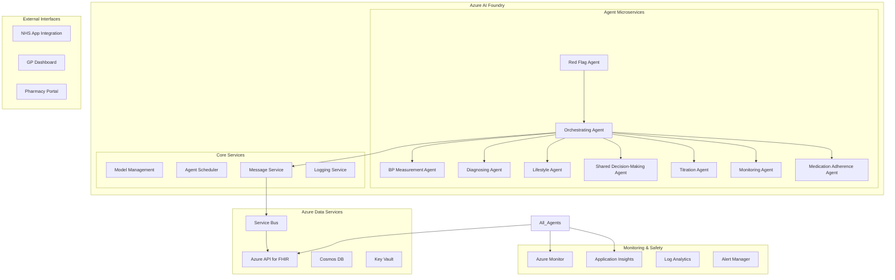

# My BP - Technical Architecture for Azure AI Foundry

**⚠️ SIMULATION ONLY - NOT FOR CLINICAL USE ⚠️**

*This document outlines the technical architecture for the My BP multi-agentic AI hypertension management system using Azure AI Foundry and dummy data for demonstration purposes only.*

## Executive Summary

This technical architecture defines how the My BP system's 9 specialized agents will be deployed as Azure-hosted microservices, orchestrated through Azure AI Foundry, with dummy patient data managed via Azure API for FHIR. The design prioritizes clinical safety, scalability, and maintainable agent coordination while supporting comprehensive hypertension care workflows.

## Architecture Overview

### System Components



### Core Technology Stack

| Component | Azure Service | Purpose |
|-----------|---------------|---------|
| **Agent Runtime** | Azure AI Foundry | Host and orchestrate AI agents |
| **Data Backend** | Azure API for FHIR | Store dummy patient/clinical data |
| **Message Queue** | Azure Service Bus | Agent-to-agent communication |
| **Database** | Azure Cosmos DB | Application state and metadata |
| **Secret Management** | Azure Key Vault | Secure configuration storage |
| **Monitoring** | Azure Monitor + Application Insights | System health and performance |
| **Container Registry** | Azure Container Registry | Agent deployment artifacts |
| **API Gateway** | Azure API Management | External API access and security |

## Agent Architecture

### Microservice Design Pattern

Each agent is deployed as an independent microservice with:

- **Container-based deployment** using Azure Container Instances
- **Auto-scaling** based on message queue depth and resource utilization
- **Independent versioning** and deployment cycles
- **Circuit breaker patterns** for fault tolerance
- **Health check endpoints** for monitoring

### Agent Communication Protocol

```json
{
  "messageSchema": {
    "messageId": "uuid",
    "timestamp": "ISO8601",
    "sourceAgent": "string",
    "targetAgent": "string", 
    "messageType": "REQUEST|RESPONSE|EVENT|ALERT",
    "priority": "LOW|NORMAL|HIGH|CRITICAL",
    "payload": {
      "patientId": "string",
      "action": "string",
      "data": "object",
      "metadata": "object"
    },
    "traceId": "string",
    "retryCount": "number",
    "expiresAt": "ISO8601"
  }
}
```

### Service Bus Topics and Subscriptions

| Topic | Description | Subscribers |
|-------|-------------|-------------|
| `agent-coordination` | Inter-agent communication | All agents |
| `patient-events` | Patient state changes | Orchestrating, Red Flag |
| `clinical-alerts` | Safety and escalation events | Red Flag, GP Dashboard |
| `monitoring-data` | System health metrics | Monitoring service |
| `audit-trail` | Clinical governance logging | Audit service |

## Azure AI Foundry Deployment

### Resource Group Structure

```yaml
Resource Group: rg-mybp-prod-uksouth
├── Azure AI Foundry Workspace: aifw-mybp-prod
├── Azure Container Registry: acrmybpprod
├── Azure API for FHIR: fhir-mybp-prod
├── Azure Service Bus: sb-mybp-prod  
├── Azure Cosmos DB: cosmos-mybp-prod
├── Azure Key Vault: kv-mybp-prod
├── Azure Monitor: mon-mybp-prod
└── Azure API Management: apim-mybp-prod
```

### Agent Deployment Configuration

```yaml
# Agent deployment template (per agent)
apiVersion: apps/v1
kind: Deployment
metadata:
  name: {agent-name}-deployment
spec:
  replicas: 2
  selector:
    matchLabels:
      app: {agent-name}
  template:
    spec:
      containers:
      - name: {agent-name}
        image: acrmybpprod.azurecr.io/{agent-name}:latest
        ports:
        - containerPort: 8000
        env:
        - name: FHIR_ENDPOINT
          valueFrom:
            secretKeyRef:
              name: fhir-config
              key: endpoint
        - name: SERVICE_BUS_CONNECTION
          valueFrom:
            secretKeyRef:
              name: servicebus-config  
              key: connection-string
        resources:
          requests:
            memory: "512Mi"
            cpu: "250m"
          limits:
            memory: "1Gi"
            cpu: "500m"
        livenessProbe:
          httpGet:
            path: /health
            port: 8000
          initialDelaySeconds: 30
          periodSeconds: 10
        readinessProbe:
          httpGet:
            path: /ready
            port: 8000
          initialDelaySeconds: 5
          periodSeconds: 5
```

### Auto-scaling Configuration

```yaml
# Horizontal Pod Autoscaler
apiVersion: autoscaling/v2
kind: HorizontalPodAutoscaler
metadata:
  name: {agent-name}-hpa
spec:
  scaleTargetRef:
    apiVersion: apps/v1
    kind: Deployment
    name: {agent-name}-deployment
  minReplicas: 2
  maxReplicas: 10
  metrics:
  - type: Resource
    resource:
      name: cpu
      target:
        type: Utilization
        averageUtilization: 70
  - type: Resource
    resource:
      name: memory
      target:
        type: Utilization
        averageUtilization: 80
```

## Azure API for FHIR Integration

### Dummy Data Architecture

#### FHIR Resource Structure for Dummy Data

```json
{
  "patientResources": {
    "Patient": {
      "id": "patient-001",
      "identifier": [{"value": "DUMMY-NHS-123456789"}],
      "name": [{"family": "TestPatient", "given": ["Demo"]}],
      "birthDate": "1970-01-01",
      "extension": [
        {
          "url": "http://mybp.nhs.uk/demo-marker",
          "valueBoolean": true
        }
      ]
    },
    "Observation": {
      "id": "bp-001",
      "status": "final",
      "category": "vital-signs",
      "code": {"coding": [{"code": "85354-9", "display": "Blood pressure"}]},
      "subject": {"reference": "Patient/patient-001"},
      "effectiveDateTime": "2024-01-15T10:30:00Z",
      "component": [
        {
          "code": {"coding": [{"code": "8480-6", "display": "Systolic"}]},
          "valueQuantity": {"value": 140, "unit": "mmHg"}
        },
        {
          "code": {"coding": [{"code": "8462-4", "display": "Diastolic"}]},
          "valueQuantity": {"value": 90, "unit": "mmHg"}
        }
      ]
    }
  }
}
```

#### Data Access Patterns

```typescript
// Agent data access interface
interface FHIRDataService {
  // Patient management
  getPatient(patientId: string): Promise<Patient>;
  getPatientsByCategory(category: PatientCategory): Promise<Patient[]>;
  
  // BP measurements
  getLatestBPReading(patientId: string): Promise<Observation>;
  getBPHistory(patientId: string, days: number): Promise<Observation[]>;
  recordBPMeasurement(patientId: string, reading: BPReading): Promise<string>;
  
  // Medication management
  getCurrentMedications(patientId: string): Promise<MedicationStatement[]>;
  recordMedicationChange(patientId: string, medication: MedicationRequest): Promise<string>;
  
  // Care plans and pathways
  getCarePlan(patientId: string): Promise<CarePlan>;
  updateCarePlan(patientId: string, updates: CarePlanUpdate): Promise<void>;
  
  // Clinical alerts and flags
  recordClinicalAlert(patientId: string, alert: ClinicalAlert): Promise<string>;
  getActiveAlerts(patientId: string): Promise<ClinicalAlert[]>;
}
```

### FHIR Security and Access Control

```yaml
# FHIR service configuration
fhir_config:
  authentication:
    type: "azure_ad"
    tenant_id: "${AZURE_TENANT_ID}"
    client_id: "${AZURE_CLIENT_ID}"
    scope: "https://fhir.azurehealthcareapis.com/.default"
  
  authorization:
    rbac_enabled: true
    roles:
      - name: "agent-reader"
        permissions: ["read"]
        resources: ["Patient", "Observation", "CarePlan"]
      - name: "agent-writer" 
        permissions: ["read", "write"]
        resources: ["Observation", "CarePlan", "ClinicalImpression"]
      - name: "admin"
        permissions: ["read", "write", "delete"]
        resources: ["*"]
  
  data_governance:
    audit_enabled: true
    encryption_at_rest: true
    encryption_in_transit: true
    dummy_data_markers: true
```

## Safety and Monitoring Architecture

### Clinical Safety Framework

```yaml
safety_protocols:
  circuit_breakers:
    - name: "fhir_timeout"
      timeout: "5s"
      failure_threshold: 3
      recovery_time: "30s"
    
    - name: "agent_response_timeout"
      timeout: "10s" 
      failure_threshold: 5
      recovery_time: "60s"
  
  escalation_timeouts:
    critical_alert: "15_minutes"
    urgent_alert: "2_hours"
    routine_alert: "24_hours"
    
  failsafe_actions:
    - condition: "red_flag_agent_unavailable"
      action: "direct_gp_notification"
    - condition: "orchestrator_failure"
      action: "activate_backup_orchestrator"
    - condition: "fhir_service_down"
      action: "readonly_mode_local_cache"
```

### Monitoring and Alerting

#### Application Insights Telemetry

```typescript
// Telemetry tracking for agents
class AgentTelemetry {
  trackAgentExecution(agentName: string, action: string, duration: number, success: boolean) {
    this.telemetryClient.trackEvent({
      name: 'AgentExecution',
      properties: {
        agentName,
        action,
        success: success.toString(),
        environment: 'demo'
      },
      measurements: {
        duration
      }
    });
  }
  
  trackClinicalEvent(patientId: string, eventType: string, severity: string) {
    this.telemetryClient.trackEvent({
      name: 'ClinicalEvent',
      properties: {
        patientId: `DUMMY-${patientId}`, // Mark as dummy data
        eventType,
        severity,
        timestamp: new Date().toISOString()
      }
    });
  }
  
  trackSafetyAlert(alertType: string, urgency: string, resolved: boolean) {
    this.telemetryClient.trackEvent({
      name: 'SafetyAlert',
      properties: {
        alertType,
        urgency,
        resolved: resolved.toString(),
        demoData: 'true'
      }
    });
  }
}
```

#### Azure Monitor Queries

```kusto
// Critical safety alerts dashboard
ClinicalEvents
| where EventType == "SafetyAlert"
| where Urgency in ("critical", "urgent")
| summarize AlertCount = count() by bin(TimeGenerated, 1h), AlertType
| render timechart

// Agent performance monitoring  
AgentExecution
| where Success == "false"
| summarize FailureCount = count() by AgentName, bin(TimeGenerated, 5m)
| where FailureCount > 3
| project TimeGenerated, AgentName, FailureCount

// System health overview
Heartbeat
| where Computer contains "mybp-agent"
| summarize LastHeartbeat = max(TimeGenerated) by Computer
| where LastHeartbeat < ago(5m)
| project Computer, LastHeartbeat, Status = "Unhealthy"
```

## Development and Deployment Pipeline

### CI/CD Architecture

```yaml
# Azure DevOps Pipeline
trigger:
  branches:
    include:
    - main
    - develop
  paths:
    include:
    - agents/*
    - infrastructure/*

variables:
  - group: mybp-demo-variables
  - name: containerRegistry
    value: 'acrmybpprod.azurecr.io'

stages:
- stage: Build
  jobs:
  - job: BuildAgents
    steps:
    - task: Docker@2
      displayName: 'Build Agent Images'
      inputs:
        containerRegistry: $(containerRegistry)
        repository: 'mybp/agents'
        command: 'buildAndPush'
        Dockerfile: 'agents/*/Dockerfile'
        tags: |
          $(Build.BuildId)
          latest

- stage: DeployDev
  dependsOn: Build
  jobs:
  - deployment: DeployToAIF
    environment: 'mybp-dev'
    strategy:
      runOnce:
        deploy:
          steps:
          - task: AzureAIFoundryDeploy@1
            inputs:
              azureSubscription: $(azureSubscription)
              aiFoundryWorkspace: 'aifw-mybp-dev'
              agentManifests: 'azure/ai-foundry/*.yaml'
```

### Infrastructure as Code

```terraform
# Main infrastructure configuration
terraform {
  required_providers {
    azurerm = {
      source  = "hashicorp/azurerm"
      version = "~>3.0"
    }
  }
}

# Resource Group
resource "azurerm_resource_group" "mybp" {
  name     = "rg-mybp-${var.environment}-${var.location}"
  location = var.location
  
  tags = {
    Environment = var.environment
    Project     = "MyBP"
    Purpose     = "Demo"
  }
}

# Azure AI Foundry Workspace
resource "azurerm_machine_learning_workspace" "ai_foundry" {
  name                = "aifw-mybp-${var.environment}"
  location            = azurerm_resource_group.mybp.location
  resource_group_name = azurerm_resource_group.mybp.name
  application_insights_id = azurerm_application_insights.mybp.id
  key_vault_id        = azurerm_key_vault.mybp.id
  storage_account_id  = azurerm_storage_account.mybp.id
  
  identity {
    type = "SystemAssigned"
  }
  
  tags = {
    Environment = var.environment
    Purpose     = "Demo"
  }
}

# Azure API for FHIR
resource "azurerm_healthcare_service" "fhir" {
  name                = "fhir-mybp-${var.environment}"
  resource_group_name = azurerm_resource_group.mybp.name
  location            = azurerm_resource_group.mybp.location
  
  tags = {
    Environment = var.environment
    DataType    = "Demo"
  }
}
```

## Security Architecture

### Zero Trust Security Model

```yaml
security_model:
  identity_and_access:
    - azure_ad_integration: true
    - managed_identity: true
    - rbac_enabled: true
    - least_privilege: true
  
  network_security:
    - private_endpoints: true
    - network_security_groups: true
    - application_gateway_waf: true
    - ddos_protection: true
  
  data_protection:
    - encryption_at_rest: true
    - encryption_in_transit: true
    - key_vault_integration: true
    - data_classification: "demo_only"
  
  monitoring:
    - security_center: true
    - sentinel_integration: true
    - audit_logging: true
    - threat_detection: true
```

### Key Vault Configuration

```json
{
  "secrets": {
    "fhir-connection-string": {
      "description": "Azure API for FHIR connection details",
      "contentType": "application/json"
    },
    "servicebus-connection-string": {
      "description": "Service Bus namespace connection",
      "contentType": "text/plain"
    },
    "cosmos-connection-string": {
      "description": "Cosmos DB connection details", 
      "contentType": "application/json"
    }
  },
  "access_policies": {
    "agents": {
      "permissions": ["get"],
      "secrets": ["fhir-connection-string", "servicebus-connection-string"]
    },
    "monitoring": {
      "permissions": ["get", "list"],
      "secrets": ["*"]
    }
  }
}
```

## Performance and Scalability

### Capacity Planning

| Component | Initial Size | Max Scale | Scale Trigger |
|-----------|-------------|-----------|---------------|
| **Orchestrating Agent** | 2 instances | 10 instances | CPU > 70% |
| **BP Measurement Agent** | 2 instances | 8 instances | Queue depth > 100 |
| **Red Flag Agent** | 3 instances | 15 instances | Message latency > 5s |
| **Other Agents** | 1 instance | 5 instances | CPU > 80% |
| **Azure API for FHIR** | Standard | Premium | TPS > 1000 |
| **Service Bus** | Standard | Premium | Queue depth > 1000 |

### Performance Benchmarks (Dummy Data)

```yaml
performance_targets:
  agent_response_time:
    orchestrator: "< 2s"
    specialist_agents: "< 5s"
    red_flag: "< 1s"
  
  system_throughput:
    concurrent_patients: 10000
    messages_per_second: 1000
    bp_readings_per_day: 50000
  
  availability:
    uptime_target: "99.9%"
    rto: "15_minutes"
    rpo: "5_minutes"
```

## Conclusion

This technical architecture provides a comprehensive foundation for deploying the My BP multi-agentic AI system on Azure AI Foundry using dummy data. The design prioritizes clinical safety, scalability, and maintainability while providing clear implementation guidelines for development teams.

The architecture supports the full scope of hypertension management workflows defined in the MVP specification while ensuring appropriate separation of concerns, fault tolerance, and monitoring capabilities required for a healthcare demonstration system.

---

*This architecture document supports demonstration purposes only. All references to patient data refer to dummy/simulated data for testing and development purposes.*