# Blood Pressure Module Screenshots

Complete collection of iPhone-formatted screenshots (393x852 pixels) for all screens in the blood pressure management prototype.

## Patient Onboarding & Consent Flow (8 screens)

### Updated Main Dashboard
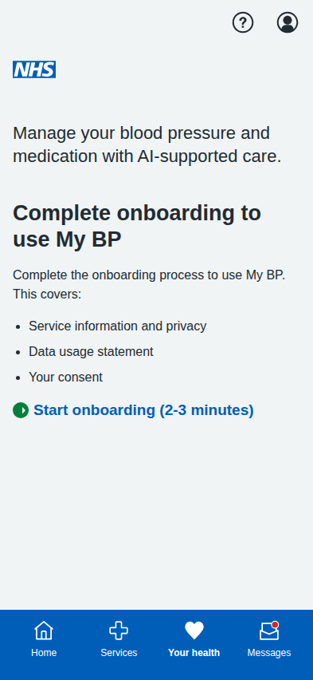
**My BP Dashboard with Onboarding Prompt** - Updated landing page showing the streamlined onboarding requirement. Changes include: removed full stop from heading, updated description to "Complete the onboarding process to use My BP", removed simulation disclaimer from list, and removed My BP features section for non-consented users to avoid giving premature choice of options.

### 1. Welcome Page
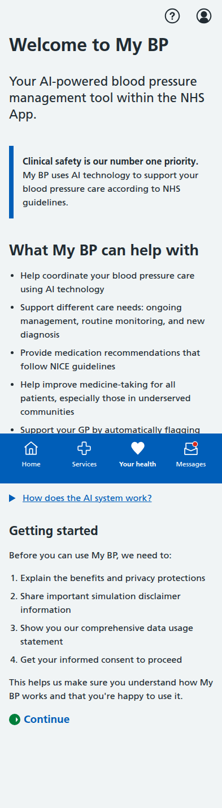
**Welcome to My BP** - Introduction to the multi-agentic AI hypertension management tool, explaining the 9 specialized agents, patient categories, and clinical safety priority according to MVP documentation.

### 2. Benefits & Privacy
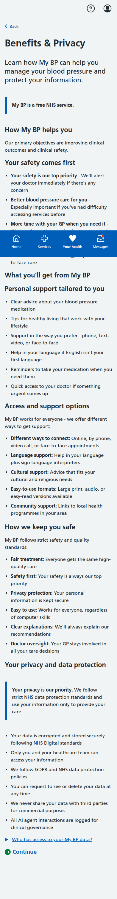
**Benefits & Privacy** - Comprehensive explanation of primary objectives including health inequality reduction, trustworthy AI principles, accessibility features, and NHS data protection standards.

### 3. Simulation Disclaimer
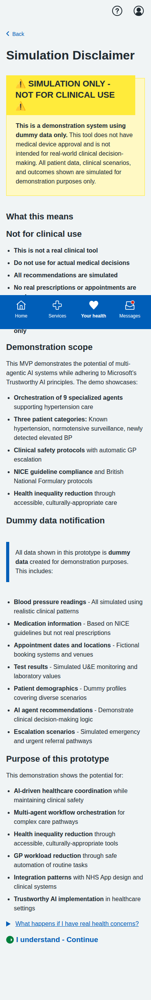
**Simulation Disclaimer** - Enhanced warning emphasizing this is demonstration only, with detailed explanation of multi-agentic system scope, dummy data types, and clinical safety protocols.

### 4. Data Usage Statement
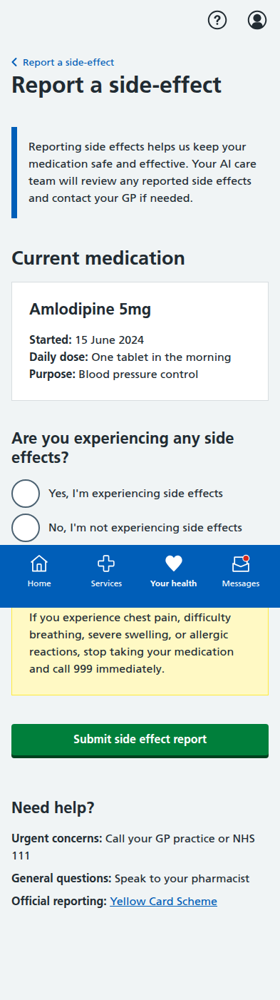
**Data Usage Statement** - Detailed table showing data collection by each of the 9 AI agents, patient category management, clinical governance, and comprehensive privacy rights.

### 5. Consent Form
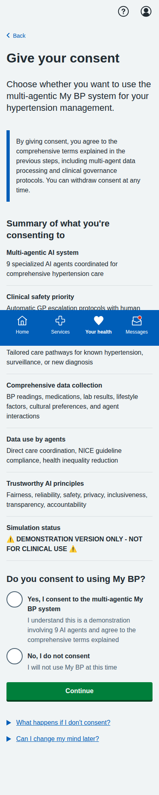
**Give Your Consent** - Enhanced consent interface for multi-agentic system with comprehensive summary of trustworthy AI principles, clinical safety protocols, and demonstration status.

### 6. Onboarding Complete (Consent Given)
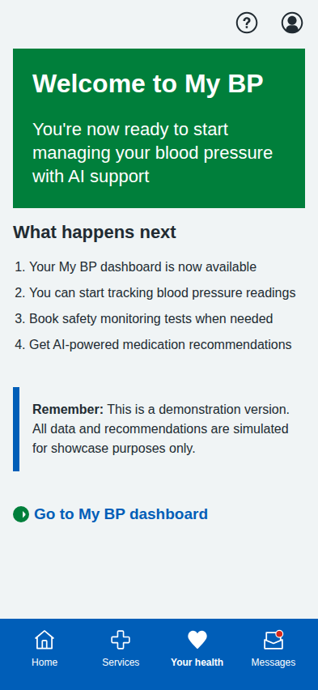
**Onboarding Complete - Consent Given** - Success screen when user consents, providing next steps and dashboard access.

### 7. Onboarding Complete (Consent Declined)
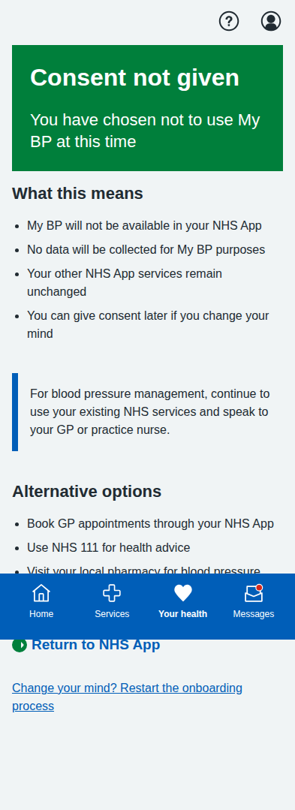
**Onboarding Complete - Consent Declined** - Alternative completion screen when user declines, offering alternative NHS services and option to restart.

---

## Main Dashboard (Original)

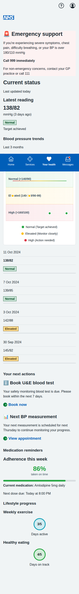
**Main Dashboard** - Landing page showing all three patient journey options: dose titration, BP measurement, and blood test booking.

---

## Dose Titration Journey (5 screens)

### 1. Landing Page
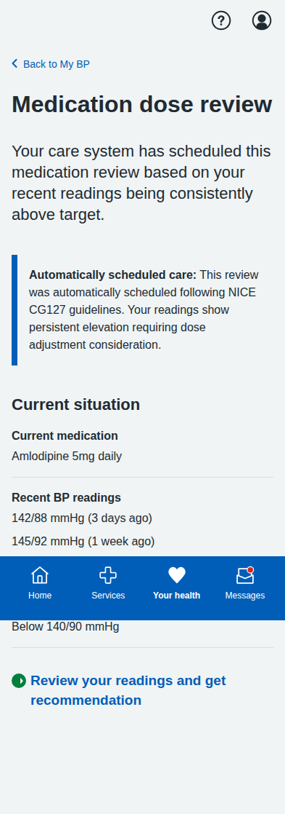
**Dose Titration Landing** - Shows current medication status and recent BP readings with option to start review process.

### 2. Readings Review
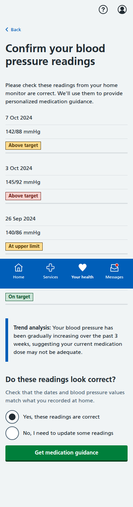
**Confirm Blood Pressure Readings** - Patient-friendly interface for confirming home BP readings with clear status labels and helpful guidance.

### 3. AI Recommendation

**AI Medication Recommendation** - Comprehensive recommendation screen with clinical rationale, NICE guidelines reference, side effects, and monitoring plan.

### 4. Confirmation
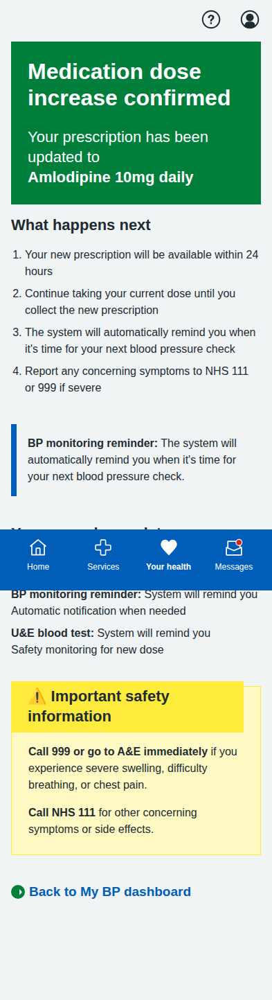
**Dose Increase Confirmed** - Confirmation screen with next steps, care plan updates, and important safety information.

---

## BP Measurement Journey (5 screens)

### 1. Introduction
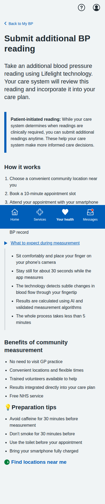
**Lifelight Technology Introduction** - Comprehensive overview of contactless BP measurement, process explanation, and preparation tips.

### 2. Location Selection
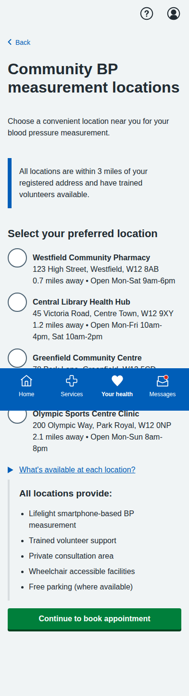
**Community Location Selection** - List of available venues with distances, opening hours, and facility information.

### 3. Appointment Booking
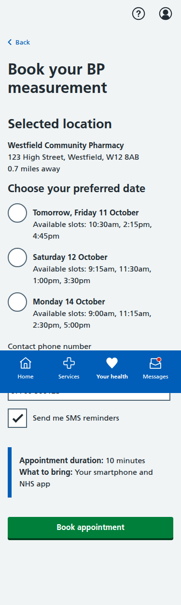
**Appointment Booking** - Date/time selection with contact details and SMS reminder options.

### 4. Booking Confirmation
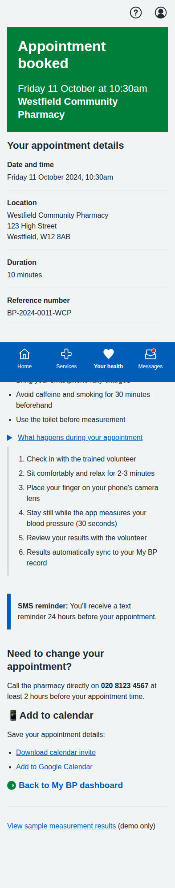
**Appointment Confirmed** - Complete booking details with preparation instructions, calendar integration, and contact information.

### 5. Sample Results
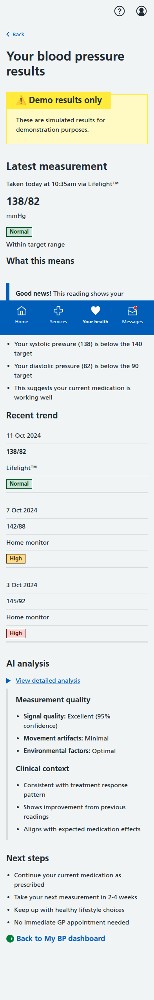
**Sample Measurement Results** - Demo results showing measurement analysis, trend data, AI insights, and next steps.

---

## Blood Test Journey (5 screens)

### 1. Test Overview
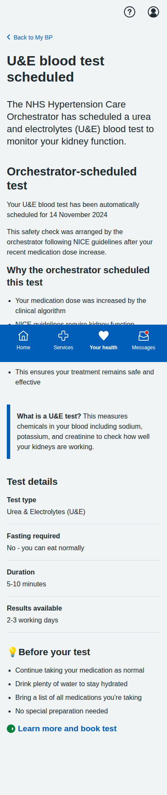
**U&E Test Overview** - Explanation of why the test is needed, test details, and preparation information.

### 2. Educational Information
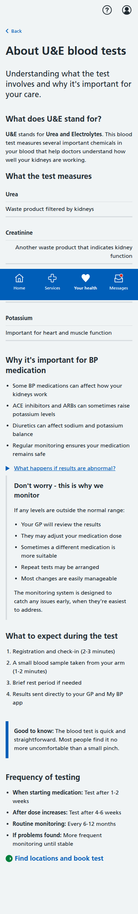
**Detailed U&E Information** - Comprehensive educational content about what the test measures and its importance for BP medication safety.

### 3. Location Selection
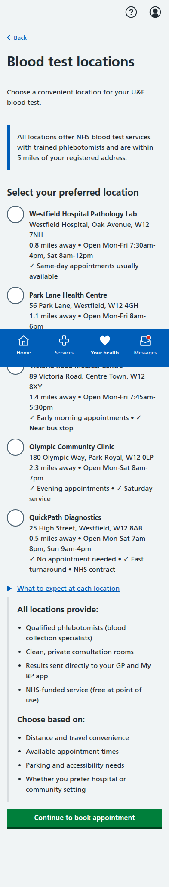
**Healthcare Facility Selection** - Various testing locations including hospitals, health centres, and private labs with detailed facility information.

### 4. Appointment Booking
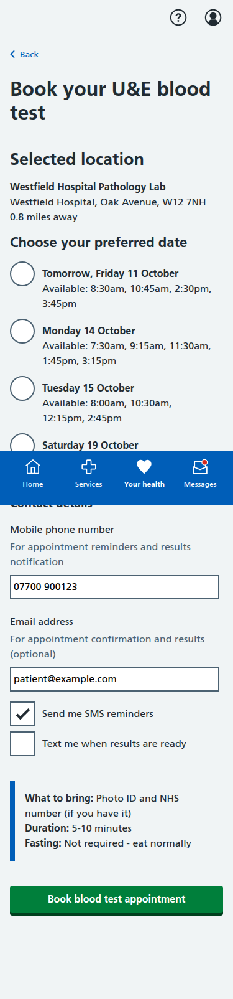
**Appointment Booking Form** - Date/time selection with contact details, notification preferences, and preparation reminders.

### 5. Final Confirmation
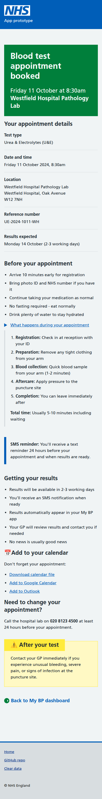
**Appointment Confirmation** - Complete appointment details, step-by-step process explanation, results information, and calendar integration.

---

## Key Features Demonstrated

- **Enhanced Multi-Agentic Architecture**: Complete 9-agent system with specialized roles per MVP documentation
- **Clinical Safety Priority**: Emphasized throughout with GP escalation protocols and human oversight
- **Trustworthy AI Principles**: Microsoft's six principles integrated into consent and data protection
- **Health Inequality Focus**: Accessibility features, cultural sensitivity, and marginalized community support
- **Patient Category Management**: Clear explanation of three care pathways (A, B, C)
- **Comprehensive Data Governance**: Agent-specific data collection with clinical governance oversight
- **Enhanced Simulation Warnings**: Stronger clinical safety disclaimers per MVP requirements
- **Session-Based Consent Tracking**: Intelligent dashboard display based on user consent status
- **Privacy & Security Focus**: NHS Digital standards and comprehensive user rights
- **Patient-Centered Language**: Clear, jargon-free communication throughout all screens
- **Interactive Navigation**: Working forms, radio buttons, and user input handling
- **Mobile-Responsive Design**: NHS App-appropriate layout optimized for mobile devices
- **Accessibility**: Proper semantic HTML structure and NHS design system compliance
- **Realistic Data**: Authentic medical scenarios, dates, locations, and contact information
- **Full User Journeys**: Complete end-to-end workflows for all patient pathways

All screenshots captured at iPhone resolution (393x852 pixels) with full-page scrolling where needed to show complete content.