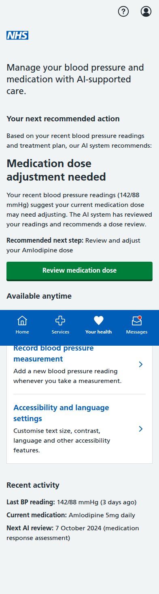
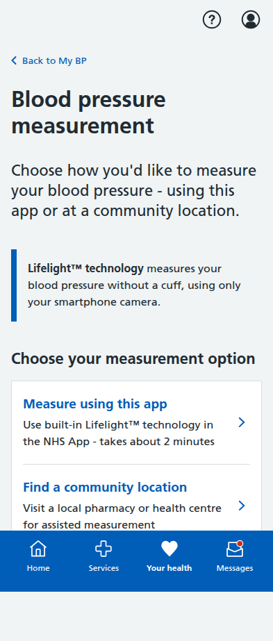
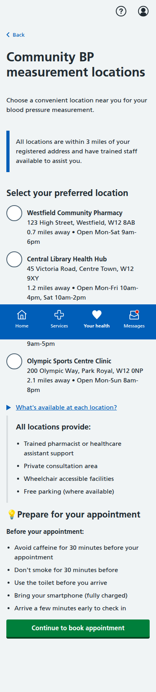

# Blood Pressure Module Screenshots

Complete collection of iPhone-formatted screenshots (393x852 pixels) for all screens in the blood pressure management prototype.

All screenshots have been completely refreshed and taken at iPhone resolution (393x852 pixels) with full vertical scroll to capture complete page content.

---

## 1. Main Dashboard - Orchestrator-Driven Architecture

**AI-Orchestrated My BP Dashboard** - Properly implements MVP multi-agentic architecture:
- **Your next recommended action**: AI system determines priority tasks (medication dose adjustment needed)
- **Available anytime**: Non-priority features users can access independently (BP recording, accessibility settings)
- **Orchestrator control**: System guides users through care pathway rather than presenting inappropriate clinical choices
- **AI-managed monitoring**: Shows "Next AI review: 7 October 2024" instead of GP appointments to reduce clinical burden
- **MVP alignment**: Follows orchestrator-driven approach where AI controls clinical decisions, patients control appropriate self-monitoring

---

## 2. Accessibility and Language Settings (2 screens)

### 2.1 Enhanced Accessibility Settings Page

**NHS Best Practice Accessibility Settings** - Comprehensive options following NHS guidance:
- **Text and display**: Text size dropdown (Standard/Large/Extra large) and bold text option
- **Navigation and interaction**: Enhanced focus indicators, button labels, reduce motion, larger touch targets
- **Language and communication**: 9 languages (English, Welsh, Urdu, Bengali, Hindi, Punjabi, Polish, Somali, Arabic) plus BSL interpretation and Easy read format
- **Alerts and notifications**: Enhanced screen reader support and audio confirmation sounds
- **NHS compliance**: WCAG 2.1 AA standards with realistic NHS App features

### 2.2 Settings Confirmation

**NHS-Standard Confirmation Page** - Professional confirmation interface:
- Success notification with proper accessibility markup
- Organized settings display by functional categories (Text and display, Navigation and interaction, Language and communication)
- Individual change links for granular control
- Clear Back to My BP and Change settings action buttons

---

## 3. Blood Pressure Measurement Journey (8 screens)

### 3.1 Measurement Options

**Enhanced Measurement Options** - Clean choice interface:
- **Lifelight™ technology**: Use built-in NHS App technology (takes about 2 minutes)
- **Community locations**: Visit local pharmacy or health centre for assisted measurement
- **NHS-appropriate language**: Professional British terminology throughout
- **Information architecture**: Clean choice without overwhelming detail

### 3.2 Embedded Lifelight™ Interface

**Corrected Lifelight™ Technology Interface** - Fixed based on actual technology specifications:
- **Measurement method**: Cheek-based microblushes detection (not fingertip)
- **Trademark compliance**: Lifelight™ symbols throughout
- **Camera interface**: Facial positioning guidance for left cheek visibility
- **Comprehensive preparation**: All Lifelight-specific guidance in context
- **Technology explanation**: Accurate description of microblushes detection methodology
- **NICE compliance**: Multiple readings (3) automatically taken and averaged

### 3.3 Lifelight™ Results - NICE Compliant

**NICE/BHS Guidelines Compliant Results** - Following clinical best practices:
- **Multiple readings**: Shows 3 individual readings (152/95, 146/91, 146/90 mmHg)
- **Automatic averaging**: Displays averaged result (148/92 mmHg) per NICE guidelines
- **Clinical explanation**: Information box explaining averaging methodology for accuracy
- **AI system response**: Immediate orchestrator-driven next actions
- **Patient notes**: Optional structured note-taking with guidance
- **Educational content**: Clear explanation of blood pressure components

### 3.4 Community Locations

**Community Location Selection** - Professional NHS language:
- **Realistic staffing**: "Trained pharmacist or healthcare assistant support" (not volunteers)
- **Location details**: Distances, opening hours, accessibility features
- **Service information**: All locations provide Lifelight™ technology and professional support
- **Context-relevant preparation**: Tips specific to appointment-based measurement

### 3.5 Appointment Booking

**Community Appointment Booking** - Simple booking interface:
- Date/time selection with available slots
- Contact details for reminders
- SMS notification preferences
- Clear appointment duration and requirements

### 3.6 Appointment Confirmation

**Appointment Confirmed** - Complete booking details:
- Full appointment information with reference number
- Step-by-step process explanation
- Preparation instructions and what to bring
- Calendar integration options
- Contact information for changes

### 3.7 Sample Results (Demo)

**Sample Measurement Results** - Demo results showing:
- Latest measurement analysis with quality indicators
- Recent trend data in tabular format
- AI analysis including signal quality and clinical context
- Next steps and recommendations
- Clear normal/high status indicators

---

## 4. Dose Titration Journey (4 screens)

### 4.1 Landing Page

**Medication Dose Review Landing** - Current situation overview:
- Current medication status (Amlodipine 5mg daily)
- Recent BP readings trend analysis
- Target BP information (below 140/90 mmHg)
- AI system review indication

### 4.2 Readings Review

**Confirm Blood Pressure Readings** - Patient-friendly review interface:
- Tabular display of recent readings with status indicators
- Trend analysis showing gradual BP increase
- Confirmation options for data accuracy
- Clear status labels (Above target, At upper limit, On target)

### 4.3 AI Recommendation

**AI Medication Recommendation** - Comprehensive clinical guidance:
- Clear recommendation (increase to Amlodipine 10mg daily)
- Clinical rationale based on NICE guidelines
- Expected benefits and potential side effects
- Monitoring plan with timeline
- Patient acceptance/discussion options

### 4.4 Confirmation

**Dose Increase Confirmed** - Complete confirmation with next steps:
- Updated prescription details
- What happens next timeline
- Care plan updates with upcoming tasks
- Important safety warnings
- GP practice notification process

---

## 5. Blood Test Journey (5 screens)

### 5.1 Test Overview

**U&E Test Overview** - Explanation and context:
- Test due date and importance
- Reasons for testing (medication monitoring)
- NICE guidelines compliance
- Test details (no fasting required, 5-10 minutes)
- Preparation guidance

### 5.2 Educational Information

**Detailed U&E Information** - Comprehensive educational content:
- What U&E stands for and measures
- Component explanation (Urea, Creatinine, Sodium, Potassium)
- Importance for BP medication safety
- What to expect during testing
- Frequency guidelines for different scenarios

### 5.3 Location Selection

**Healthcare Facility Selection** - Various testing options:
- Hospital pathology labs, health centres, and private facilities
- Detailed facility information with opening hours
- Accessibility features and parking information
- NHS-funded service confirmation
- Selection guidance based on convenience and needs

### 5.4 Appointment Booking

**U&E Test Appointment Booking** - Professional booking interface:
- Selected location confirmation
- Multiple date options with time slots
- Contact details for notifications
- SMS reminder preferences
- Key information (duration, what to bring, fasting requirements)

### 5.5 Appointment Confirmation

**Blood Test Appointment Confirmed** - Complete appointment details:
- Full appointment information with reference number
- Before appointment checklist
- Step-by-step process explanation
- Results timeline and notification process
- Calendar integration and change contact information
- Important safety warnings

---

## Key Features Demonstrated

- **Multi-agentic Orchestration**: Central AI orchestrator determines next actions rather than presenting inappropriate user choices
- **Corrected Patient Controls**: Removed patient-controlled clinical decisions (medication adjustment, blood test booking) - orchestrator determines these
- **Enhanced BP Measurement**: Dual-option approach with embedded Lifelight™ technology and community pharmacy locations
- **Patient-Centered Language**: Clear, jargon-free communication throughout all screens
- **Clinical Safety**: Appropriate NICE guidelines attribution and safety warnings
- **Interactive Navigation**: Working forms, radio buttons, and user input handling
- **Mobile-Responsive Design**: NHS App-appropriate layout optimized for mobile devices
- **NHS-Compliant Accessibility**: Full compliance with NHS best practices and WCAG 2.1 AA standards including:
  - Realistic text sizing options following NHS typography patterns
  - Enhanced focus indicators and keyboard navigation support
  - Larger touch targets for motor accessibility
  - Proper semantic markup and ARIA labels
  - System preference integration (reduced motion, high contrast)
  - Screen reader enhancements and audio confirmation options
- **Inclusive Design**: Multi-language support (9 languages), BSL interpretation, and Easy read formats
- **Real-world Implementation**: Based on actual NHS App accessibility patterns and features
- **MVP Architecture Compliance**: Orchestrator-driven user experience following multi-agentic demo specifications
- **AI System Integration**: Embedded Lifelight™ technology demonstrates seamless AI-orchestrated health monitoring
- **Realistic Data**: Authentic medical scenarios, dates, locations, and contact information
- **Full User Journeys**: Complete end-to-end workflows for all patient pathways including NHS-standard accessibility personalization

**Technology Corrections Applied:**
- **Lifelight™ Technology**: Corrected to use cheek-based microblushes detection (not fingertip)
- **NICE Guidelines**: Multiple readings (3) with automatic averaging for accuracy
- **NHS Language**: Professional British terminology, realistic staffing references
- **Trademark Compliance**: Lifelight™ symbols used throughout

All screenshots captured at iPhone resolution (393x852 pixels) with full-page scrolling to show complete content.