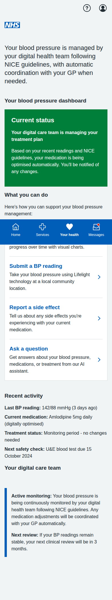
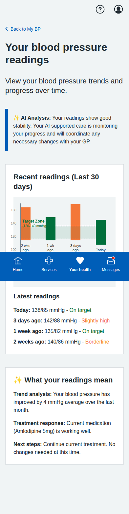
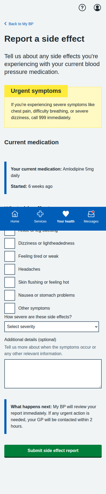
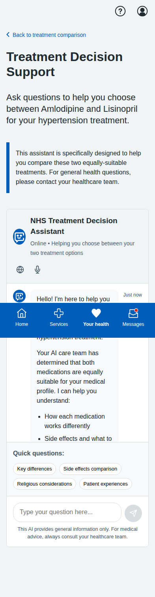
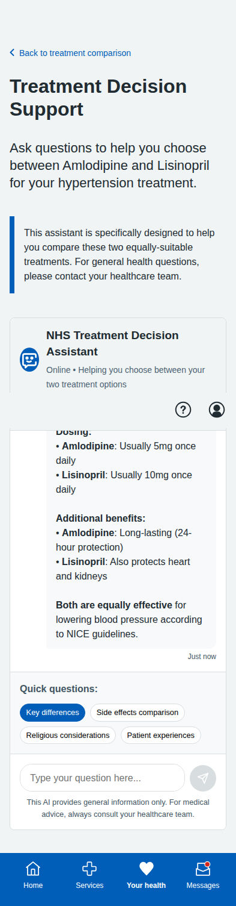
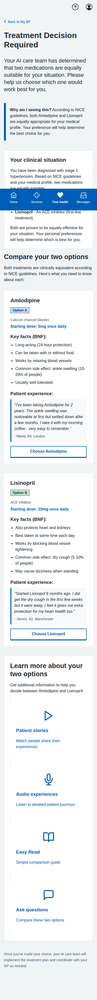
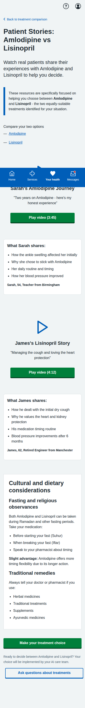

# Multiagentic Blood Pressure Management Screenshots

Complete collection of iPhone-formatted screenshots (393x852 pixels) for the multiagentic blood pressure management system prototype.

## Main Dashboard

**Multiagentic Main Dashboard** - Patient-friendly digital health team interface showing care management status. Updated with user-friendly language using "digital health team" instead of technical "AI agents" terminology. Features British English spelling throughout.

---

## Patient Dashboard

**Your BP Readings Dashboard** - Comprehensive view of blood pressure trends with visual chart mockup showing actual BP data over time with target zones. Features improved color coding where "Slightly high" readings use amber instead of red, and patient-friendly "What your readings mean" section instead of technical terminology.

---

## Side Effect Reporting

**Report Side Effects** - Patient-centered form for reporting medication side effects with immediate AI care team review and automatic GP escalation protocols when needed.

---

## AI Chatbot Support - Equipoise Decision Context

**Treatment Decision Support** - Contextual AI assistant specifically designed to help patients choose between two equally-suitable treatments (Amlodipine vs Lisinopril) when NICE guidelines indicate clinical equipoise.

**Equipoise AI Response** - Intelligent comparison between the two medications in equipoise, providing evidence-based information from BNF to support informed patient choice in clinical decision-making.

---

## Shared Decision-Making - Clinical Equipoise Context

**Treatment Decision Required** - Interface only appears when AI orchestrator determines clinical equipoise exists. Shows two equally-suitable treatments (Amlodipine vs Lisinopril) with BNF-based facts and real patient testimonials.

**Patient Experience Resources** - Personalized multimedia content focused on the specific drugs in equipoise, featuring real patient stories and experiences to support treatment choice rather than generic educational content.

---

## BP Measurement Journey (5 screens)

### 1. Introduction

**Lifelight Technology Introduction** - Comprehensive overview of contactless BP measurement, process explanation, and preparation tips.

### 2. Location Selection

**Community Location Selection** - List of available venues with distances, opening hours, and facility information.

### 3. Appointment Booking

**Appointment Booking** - Date/time selection with contact details and SMS reminder options.

### 4. Booking Confirmation

**Appointment Confirmed** - Complete booking details with preparation instructions, calendar integration, and contact information.

### 5. Sample Results

**Sample Measurement Results** - Demo results showing measurement analysis, trend data, AI insights, and next steps.

---

## Key Features of Multiagentic System

- **AI Orchestration**: Central Hypertension Care Orchestration Agent coordinates all treatment decisions following NICE guidelines
- **Clinical Equipoise Handling**: Shared decision-making tools only triggered when NICE guidelines indicate multiple equally-valid treatments
- **Evidence-Based Content**: All treatment information sourced from BNF with real patient testimonials rather than generic content
- **Patient-Focused Interface**: Users can view data, submit readings, and report issues - but treatment decisions are made by AI agents
- **Contextual Decision Support**: AI assistants provide specific comparisons only when choice between equivalent treatments is required
- **Automatic Care Coordination**: AI agents manage medication adjustments and GP consultations without user intervention
- **Safety Monitoring**: Continuous monitoring with automatic escalation to GP when needed
- **Patient Dashboard**: Comprehensive view of BP trends with AI analysis and insights
- **Side Effect Management**: Immediate reporting to AI care team with automatic review protocols
- **Cultural Sensitivity**: Multi-language support and cultural considerations maintained
- **Clinical Safety**: Appropriate NICE guidelines compliance with equipoise-based decision protocols
- **Mobile-Responsive Design**: NHS App-appropriate layout optimized for mobile devices

The system demonstrates how AI agents can manage complex healthcare decisions while engaging patients appropriately only when clinical equipoise requires their input for treatment selection.

All screenshots captured at iPhone resolution (393x852 pixels) with full-page scrolling where needed to show complete content.