# My BP NHS App Prototype Screenshots

Complete collection of iPhone-formatted screenshots (393x852 pixels) documenting the patient journeys in the Multi-Agentic Hypertension Management (MAHM) system.

This prototype demonstrates AI-supported blood pressure care through three distinct patient pathways, following NICE guidelines and NHS design standards.

## Patient Journeys Overview

The My BP system supports three main patient categories as defined in the MVP document:

- **Category A**: Known hypertension patients requiring ongoing treatment management
- **Category B**: Normotensive surveillance patients needing routine monitoring  
- **Category C**: Newly detected elevated BP patients requiring diagnostic assessment
- **Emergency Protocol**: Red Flag escalation flow (applies to all categories)

All journeys demonstrate the multi-agentic approach where AI agents coordinate care while maintaining clinical safety and GP oversight.

---

## Journey 1: Red Flag Emergency Action Flow (5 screens)

**Patient Scenario**: Any category patient experiencing hypertensive emergency requiring immediate medical attention.

### 1. Emergency Dashboard

**Hypertensive Emergency Alert** - Main dashboard showing emergency status with BP reading of 195/115 mmHg. System automatically hides routine functions and displays only emergency protocol. Clear guidance to follow emergency protocol with red alert styling following NHS design standards.

### 2. Symptom Confirmation  
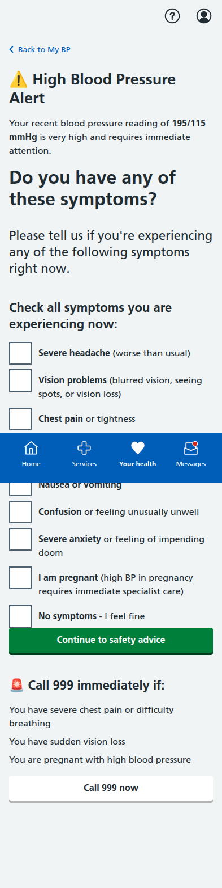
**Emergency Symptom Assessment** - Comprehensive symptom checklist including severe headache, vision problems, chest pain, difficulty breathing, and pregnancy considerations. Follows NICE CG127 emergency guidelines with immediate 999 call options for critical symptoms.

### 3. Immediate Action Guidance
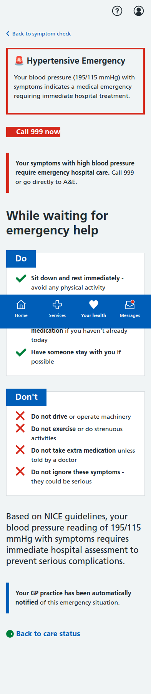
**Emergency Safety Instructions** - Clear do's and don'ts while waiting for emergency help. Primary action "Call 999 now" with structured safety guidance including rest, medication management, and activity restrictions. Automatic GP notification confirmed.

### 4. Escalation Status
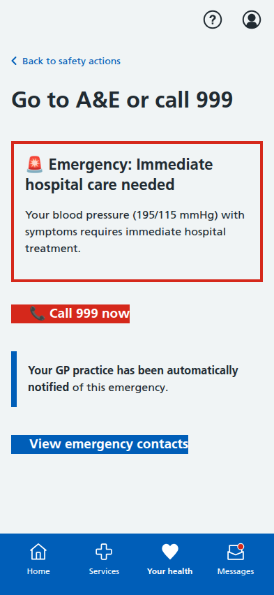
**Emergency Care Status** - Simple, focused interface showing "Go to A&E or call 999" with confirmation that GP practice has been automatically notified. No over-promising of coordination - clear emergency pathway only.

### 5. Emergency Contacts
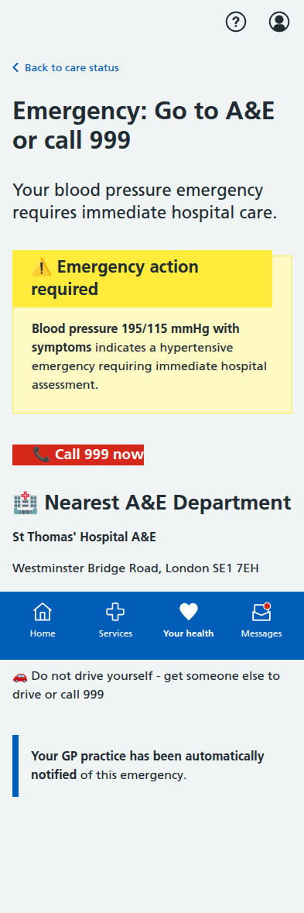
**Emergency Contact Information** - Contextual emergency contacts showing 999 and nearest A&E details (St Thomas' Hospital). Includes direct phone links using `tel:` protocol for immediate calling capability. Clear warning against self-driving during emergency.

---

## Journey 2: Category A - Known Hypertension Patient Treatment Management

**Patient Scenario**: Sarah Thompson, established hypertension patient requiring medication optimization and ongoing monitoring.

### Main Dashboard (Normal State)
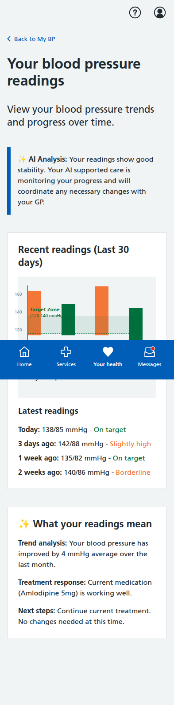
**Treatment Management Dashboard** - Normal dashboard state showing BP trends over time with AI analysis. Features traffic light color coding (green for normal readings), medication adherence tracking, and AI-supported care coordination. Shows treatment response patterns and next steps guidance.

### Blood Pressure Measurement Journey

#### 1. Measurement Introduction
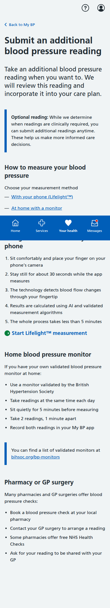
**Patient-Initiated Additional Readings** - Clear explanation that while the care system determines clinically required readings, patients can submit additional readings anytime. Features Lifelight™ technology options, home monitoring guidance, and pharmacy/GP surgery alternatives.

#### 2. Location Selection
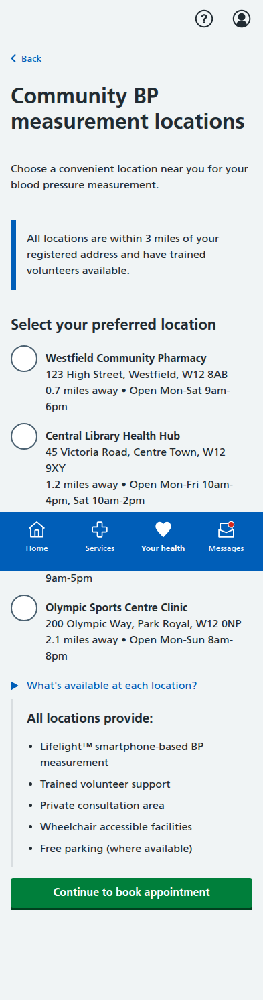
**Community Measurement Locations** - List of available venues within 3 miles showing distances, opening hours, and accessibility features. All locations provide Lifelight™ smartphone-based measurement with trained volunteer support.

#### 3. Appointment Booking
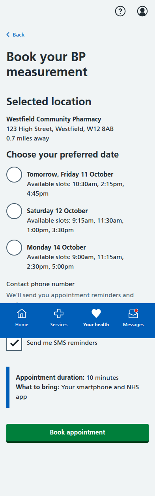
**Appointment Scheduling** - Date and time selection with contact details and SMS reminder preferences. Shows available slots across multiple days with clear booking requirements and preparation information.

#### 4. Booking Confirmation

**Appointment Confirmed** - Complete booking details with reference number, preparation instructions, and step-by-step process explanation. Includes calendar integration options and contact information for changes.

#### 5. Sample Results
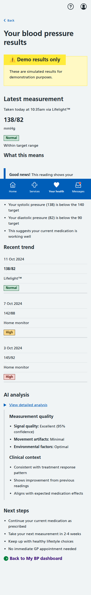
**Measurement Results & AI Analysis** - Comprehensive results display showing reading (138/82 mmHg), clinical interpretation, trend analysis, and AI quality assessment. Includes measurement confidence scores and next steps guidance.

### Dose Titration & Medication Management Journey

#### 1. Medication Review Landing
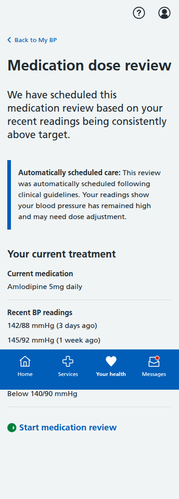
**Automatically Scheduled Medication Review** - System-initiated review triggered by consistently elevated readings. Shows current treatment status and clinical rationale for dose adjustment following NICE guidelines.

#### 2. Reading Review & Confirmation

**Blood Pressure Reading Validation** - Patient confirmation of home monitoring readings with trend analysis. Shows pattern of elevated readings (142/88, 145/92, 140/86 mmHg) indicating treatment optimization needed.

#### 3. AI-Generated Recommendation
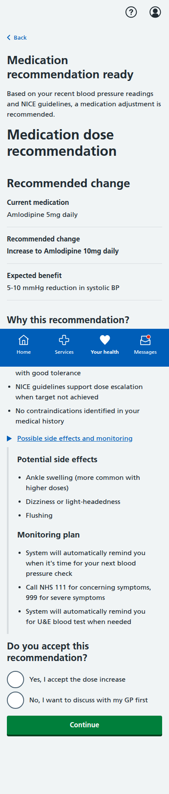
**Medication Dose Recommendation** - NICE guideline-based recommendation to increase Amlodipine from 5mg to 10mg daily. Includes clinical rationale, expected benefits, potential side effects, and monitoring plan with patient choice to accept or discuss with GP.

#### 4. Treatment Confirmation
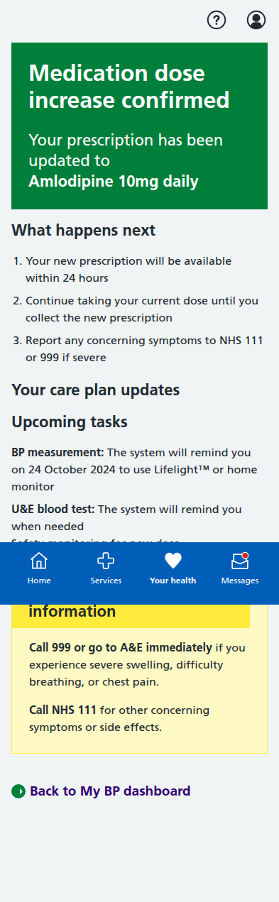
**Dose Increase Confirmed** - Successful medication update with care plan modifications. System automatically schedules future BP monitoring and U&E blood test reminders. Clear safety warnings for emergency symptoms with 999/NHS 111 guidance.

### Safety Monitoring - Blood Test Journey

#### Blood Test Overview
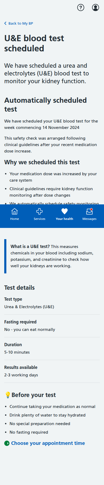
**U&E Blood Test Scheduled** - Automatically arranged safety monitoring following medication dose increase. Shows clinical rationale, test details (no fasting required), and preparation guidance. Patient can choose appointment time while system ensures clinical safety protocols.

---

## Journey 3: Category C - Newly Detected Elevated BP Patient Diagnostic Pathway

**Patient Scenario**: Emma Clarke, 38, elevated reading during community screening requiring diagnostic workup.

### ABPM Results & Diagnostic Journey

#### 1. 24-Hour ABPM Results
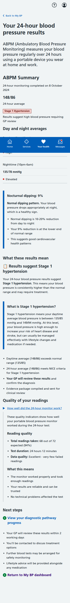
**Comprehensive ABPM Analysis** - Complete 24-hour blood pressure monitoring results showing daytime (148/86 mmHg) and nighttime (135/78 mmHg) averages. Features nocturnal dipping analysis (9%), quality indicators, and Stage 1 hypertension diagnosis. Includes GP review scheduling and treatment pathway activation.

#### 2. Diagnostic Pathway Tracker
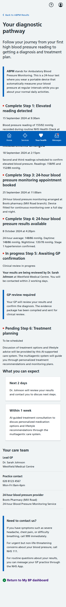
**Category C Patient Journey Progress** - Step-by-step tracking from initial elevated reading (155/92 mmHg) through repeat measurements, ABPM completion, to GP confirmation. Shows NHS-compliant status progression with care team information and next steps. Demonstrates seamless transition preparation to Category A management.

---

## Journey 4: Patient Onboarding & Consent Flow (6 screens)

**Essential onboarding process required for all patient categories before accessing My BP services.**

### 1. Welcome to My BP
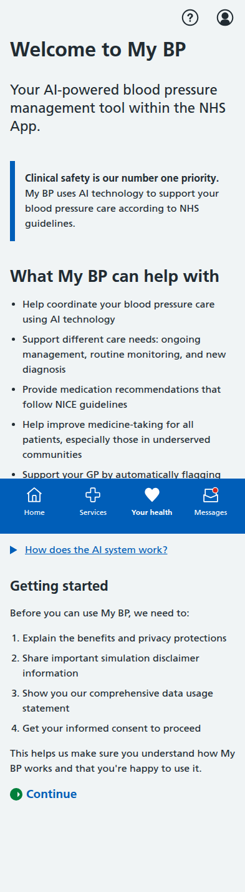
**AI-Powered BP Management Introduction** - Patient-friendly introduction explaining clinical safety priority and AI technology benefits. Simplified language removing technical jargon, emphasizing different care needs support and community access improvements.

### 2. Benefits & Privacy Information
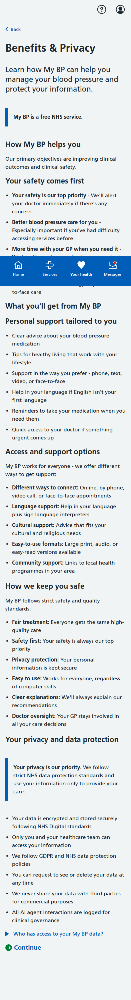
**Comprehensive Benefits & Privacy Explanation** - Detailed explanation of safety-first approach, personalized care benefits, cultural and accessibility support options. Excellent privacy section demonstrating NHS Digital standards and GDPR compliance with clear data protection commitments.

### 3. Simulation Disclaimer
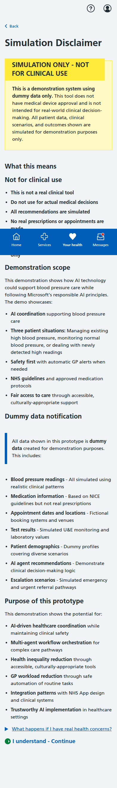
**Demonstration System Disclaimer** - Clear warnings that this is demonstration-only system using dummy data. Explains scope of AI coordination showcase, responsible AI implementation, and dummy data types including BP readings, medications, and agent recommendations.

### 4. Data Usage Statement
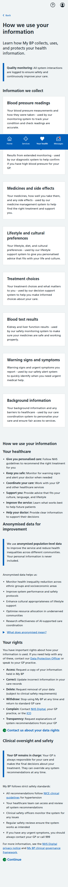
**Comprehensive Data Collection & Usage Information** - Detailed breakdown of information collected (BP readings, medications, lifestyle preferences, warning signs) and how each is used by different AI agents. Includes anonymised data usage for service improvement and clear patient rights section with actionable links.

### 5. Consent Form
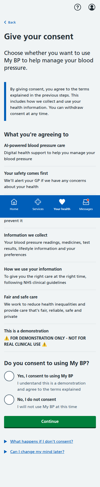
**Informed Consent Interface** - Plain English consent form removing technical jargon. Clear "What you're agreeing to" summary covering AI-powered care, safety prioritization, personalised treatment, and demonstration disclaimer. Simple yes/no consent options with clear understanding confirmation.

---

## Key Features Demonstrated Across All Journeys

### Multi-Agentic Care Coordination
- **Orchestrating Agent**: Determines care pathways and coordinates specialist agents
- **BP Measurement Agent**: Manages monitoring data and quality assessment  
- **Diagnostic Agent**: Handles ABPM arrangements and results interpretation
- **Treatment Management Agent**: Oversees medication optimization and safety
- **Red Flag Agent**: Continuous emergency monitoring with priority escalation
- **Lifestyle Agent**: Provides culturally-appropriate lifestyle support
- **Monitoring Agent**: Ensures clinical safety through systematic oversight

### Clinical Safety & NHS Compliance
- **NICE Guidelines**: All recommendations follow clinical guidelines (CG127, NG136)
- **GP Oversight**: Healthcare professional remains responsible for all clinical decisions
- **Emergency Protocols**: Clear escalation pathways with automatic notifications
- **Patient Safety**: Comprehensive warning systems and safety monitoring
- **NHS Design System**: Proper styling, accessibility, and interaction patterns

### Patient-Centered Design
- **Cultural Appropriateness**: Support for diverse communities and languages
- **Accessibility**: Screen reader compatible with clear navigation
- **Mobile Responsive**: Optimized for NHS App mobile experience (393px width)
- **Clear Communication**: Patient-friendly language throughout all interactions
- **Choice Architecture**: Appropriate patient agency within clinical protocols

### Technology Integration
- **Lifelight™ Technology**: Smartphone-based BP measurement capability
- **Real-time Data**: Automatic sync between community services and GP systems
- **Calendar Integration**: Appointment scheduling with external calendar support
- **Phone Integration**: Direct calling capability using `tel:` links
- **Quality Assurance**: AI confidence scoring and measurement validation

### Health Equity Focus
- **Community Access**: Multiple measurement locations within 3 miles
- **Cultural Support**: Multilingual and culturally-adapted interventions  
- **Accessibility Features**: Various format options and support methods
- **Barrier Reduction**: Simplified processes and clear communication
- **Fair Care Distribution**: Automated resource allocation to underserved areas

All screenshots captured at iPhone resolution (393x852 pixels) with full-page scrolling to show complete content. Implementation demonstrates responsible AI in healthcare with clinical safety prioritization, NHS design compliance, and comprehensive patient journey support across the three main hypertension management categories.