# Blood Pressure Module Screenshots

Complete collection of iPhone-formatted screenshots (393x852 pixels) for all screens in the blood pressure management prototype.

## Main Dashboard

**Main Dashboard** - Landing page showing all three patient journey options: dose titration, BP measurement, and blood test booking.

### Corrected Home Dashboard (Orchestrator-Driven)
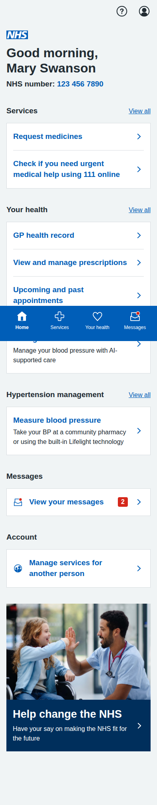
**Corrected Home Dashboard** - Fixed dashboard following MVP orchestrator architecture:
- ❌ **Removed**: "Review and adjust medication" (patient-controlled clinical decision)
- ❌ **Removed**: "Book safety blood test" (patient-controlled clinical decision)  
- ✅ **Kept**: "Measure blood pressure" with enhanced options (community pharmacy OR embedded Lifelight)
- ✅ **Result**: Only appropriate patient-controlled actions remain, clinical decisions reserved for AI orchestrator

---

## Dose Titration Journey (5 screens)

### 1. Landing Page

**Dose Titration Landing** - Shows current medication status and recent BP readings with option to start review process.

### 2. Readings Review

**Confirm Blood Pressure Readings** - Patient-friendly interface for confirming home BP readings with clear status labels and helpful guidance.

### 3. AI Recommendation

**AI Medication Recommendation** - Comprehensive recommendation screen with clinical rationale, NICE guidelines reference, side effects, and monitoring plan.

### 4. Confirmation

**Dose Increase Confirmed** - Confirmation screen with next steps, care plan updates, and important safety information.

---

## BP Measurement Journey (5 screens)

### 1. Updated Blood Pressure Measurement Options - **IMPROVED**
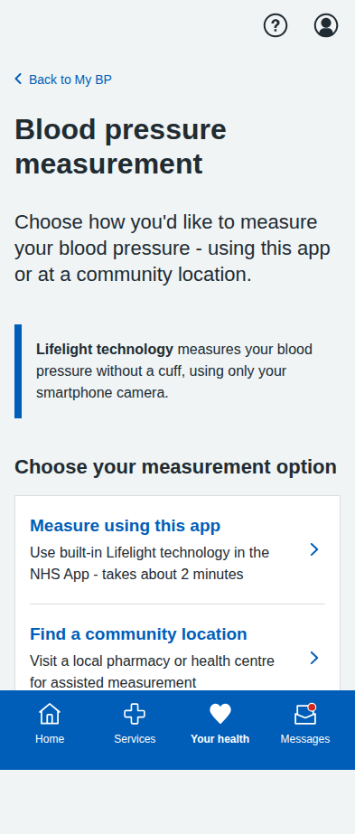
**Improved Measurement Options** - Addressing NHS style guidance and removing information overload:
- ✅ **Fixed**: Removed American language ("right here" → "using this app")
- ✅ **Simplified**: Clean choice interface without overwhelming detail
- ✅ **Streamlined**: Removed detailed instructions that caused information overload
- ✅ **NHS-appropriate**: Professional, British terminology throughout
- ✅ **User-friendly**: Clear, simple descriptions focusing on choice rather than process

### 2. Enhanced Lifelight Interface - **IMPROVED**
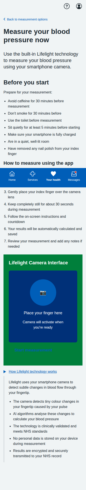
**Improved Embedded Lifelight Technology** - Context-specific guidance and instructions:
- ✅ **Comprehensive prep**: All Lifelight-specific preparation tips moved here from choice screen
- ✅ **Detailed instructions**: Step-by-step guidance specific to app-based measurement
- ✅ **No information overload**: Context-relevant content only (no community location tips)
- ✅ **Better user flow**: Instructions appear when needed, not overwhelmed at choice stage

### 3. Enhanced Community Locations - **IMPROVED**  
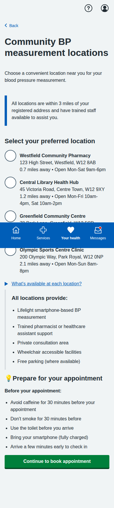
**Improved Community Location Selection** - Professional NHS language and context-specific guidance:
- ✅ **Fixed**: "Trained volunteer" → "Trained pharmacist or healthcare assistant support"
- ✅ **Added**: Community-specific preparation tips relevant to appointment-based measurement
- ✅ **Professional**: Realistic NHS staffing language (pharmacist/healthcare assistant)
- ✅ **Context-relevant**: Preparation focused on arriving for appointments, not home measurement

### 4. Original Enhanced BP Measurement Options (REPLACED)
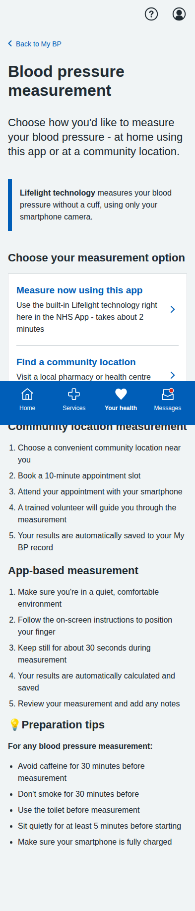
**Enhanced Measurement Options** - Following MVP feedback, now offers patients choice between:
- **Embedded Lifelight technology**: Direct measurement using NHS App camera interface
- **Community pharmacy locations**: Professional-assisted measurement at local facilities
- ✅ **MVP alignment**: Provides appropriate patient choice while maintaining orchestrator control over clinical decisions

### 2. Embedded Lifelight Interface  
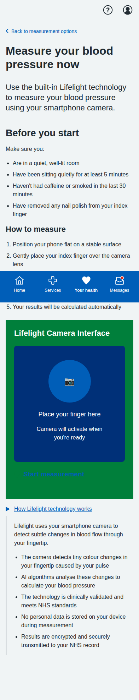
**Built-in Lifelight Technology** - Complete embedded measurement interface showing:
- Clear preparation instructions and safety guidance
- Simulated camera interface for finger placement
- Step-by-step measurement process explanation
- Technical details about how Lifelight technology works
- NHS-standard security and data protection information

### 3. Lifelight Measurement Results
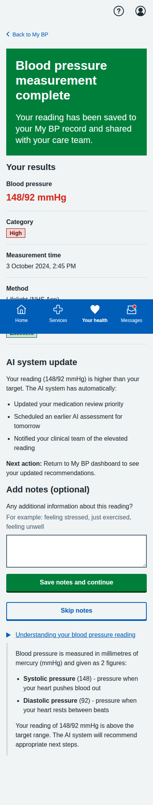
**AI-Orchestrated Results Processing** - Shows how embedded measurement integrates with MVP architecture:
- Immediate AI system response to elevated reading (148/92 mmHg)
- Automatic care plan updates and clinical team notifications  
- Orchestrator-driven next actions (earlier AI assessment scheduled)
- Patient note-taking option with structured guidance
- Educational content about blood pressure interpretation

### 4. Original Introduction

**Lifelight Technology Introduction** - Comprehensive overview of contactless BP measurement, process explanation, and preparation tips.

### 5. Original Location Selection

**Community Location Selection** - List of available venues with distances, opening hours, and facility information.

### 6. Original Appointment Booking

**Appointment Booking** - Date/time selection with contact details and SMS reminder options.

### 7. Original Booking Confirmation

**Appointment Confirmed** - Complete booking details with preparation instructions, calendar integration, and contact information.

### 8. Original Sample Results

**Sample Measurement Results** - Demo results showing measurement analysis, trend data, AI insights, and next steps.

---

## Blood Test Journey (5 screens)

### 1. Test Overview

**U&E Test Overview** - Explanation of why the test is needed, test details, and preparation information.

### 2. Educational Information

**Detailed U&E Information** - Comprehensive educational content about what the test measures and its importance for BP medication safety.

### 3. Location Selection

**Healthcare Facility Selection** - Various testing locations including hospitals, health centres, and private labs with detailed facility information.

### 4. Appointment Booking

**Appointment Booking Form** - Date/time selection with contact details, notification preferences, and preparation reminders.

### 5. Final Confirmation

**Appointment Confirmation** - Complete appointment details, step-by-step process explanation, results information, and calendar integration.

---

## Accessibility and Language Settings (4 screens) - **Enhanced with NHS Best Practices**

### 1. AI-Orchestrated My BP Dashboard
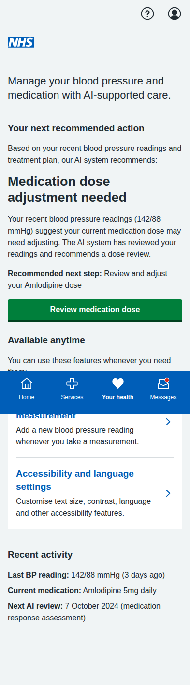
**AI-Orchestrated Dashboard** - Properly implemented MVP specifications:
- **Your next recommended action**: AI system determines priority actions (medication dose adjustment)
- **Available anytime**: Non-priority features users can access independently  
- **Orchestrator control**: System guides users through care pathway rather than presenting choices
- **AI-managed monitoring**: Shows "Next AI review: 7 October 2024" instead of GP appointments
- **MVP alignment**: Follows multi-agentic orchestration architecture that reduces GP administrative burden
- ✅ **Corrected**: Removed inappropriate GP appointment references per feedback

### 2. Enhanced Accessibility Settings Page  
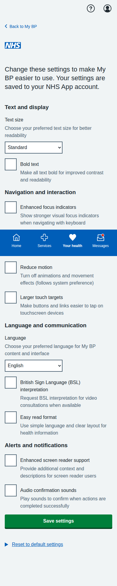
**NHS Best Practice Accessibility Settings** - Comprehensive accessibility options following NHS guidance:
- **Text and display**: Text size dropdown (Standard/Large/Extra large) and bold text option
- **Navigation and interaction**: Enhanced focus indicators, button labels, reduce motion, larger touch targets
- **Language and communication**: 9 languages (English, Welsh, Urdu, Bengali, Hindi, Punjabi, Polish, Somali, Arabic) plus BSL interpretation and Easy read format
- **Alerts and notifications**: Enhanced screen reader support and audio confirmation sounds
- **NHS compliance**: WCAG 2.1 AA standards with realistic NHS App features

### 3. Enhanced Settings Confirmation

**Improved Confirmation Page** - NHS-standard confirmation with:
- Success notification with proper accessibility markup
- Organized settings display by functional categories
- Individual change links for granular control
- Back to My BP and Change settings action buttons

### 4. Original Accessibility Screenshots (Reference)

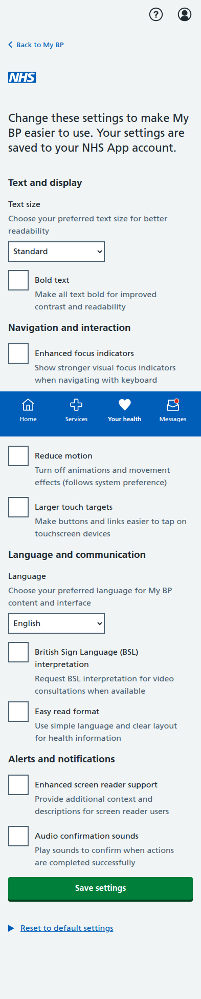 
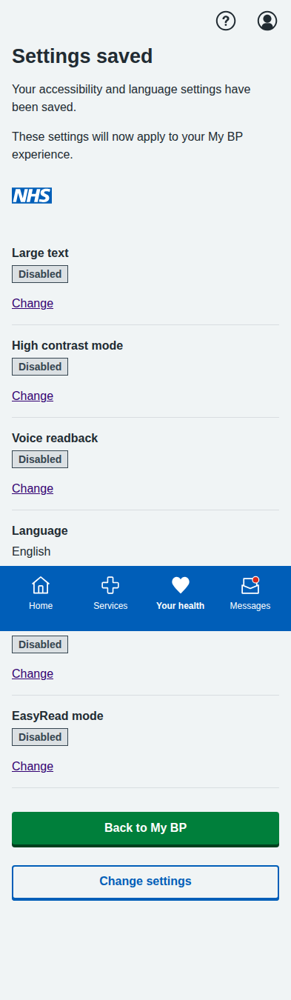

---

## Key Features Demonstrated

- **Multi-agentic Orchestration**: Central AI orchestrator determines next actions rather than presenting user choices
- **Corrected Patient Controls**: Removed inappropriate patient-controlled clinical decisions (medication adjustment, blood test booking)
- **Enhanced BP Measurement**: Dual-option approach with embedded Lifelight technology and community pharmacy locations
- **Patient-Centered Language**: Clear, jargon-free communication throughout all screens
- **Clinical Safety**: Appropriate NICE guidelines attribution and safety warnings
- **Interactive Navigation**: Working forms, radio buttons, and user input handling
- **Mobile-Responsive Design**: NHS App-appropriate layout optimized for mobile devices
- **NHS-Compliant Accessibility**: Full compliance with NHS best practices and WCAG 2.1 AA standards including:
  - Realistic text sizing options following NHS typography patterns
  - Enhanced focus indicators and keyboard navigation support
  - Larger touch targets for motor accessibility
  - Proper semantic markup and ARIA labels
  - System preference integration (reduced motion, high contrast)
  - Screen reader enhancements and audio confirmation options
- **Inclusive Design**: Multi-language support (9 languages), BSL interpretation, and Easy read formats
- **Real-world Implementation**: Based on actual NHS App accessibility patterns and features
- **MVP Architecture Compliance**: Orchestrator-driven user experience following multi-agentic demo specifications
- **AI System Integration**: Embedded Lifelight technology demonstrates seamless AI-orchestrated health monitoring
- **Realistic Data**: Authentic medical scenarios, dates, locations, and contact information
- **Full User Journeys**: Complete end-to-end workflows for all patient pathways including NHS-standard accessibility personalization

All screenshots captured at iPhone resolution (393x852 pixels) with full-page scrolling where needed to show complete content.

## MVP Feedback Addressed

**✅ Comment 2341235244 & 3215788443**: 
- **Removed**: Inappropriate patient-controlled medication review/adjustment options
- **Removed**: Patient-controlled blood test booking (orchestrator decision only)
- **Enhanced**: Blood pressure measurement with dual options (embedded Lifelight + community pharmacy)
- **Maintained**: AI review scheduling instead of GP appointments to reduce clinical burden
- **Result**: Dashboard now properly reflects MVP multi-agentic architecture where orchestrator controls clinical decisions

**✅ Comment 2344085628 - BP Measurement UI Improvements**:
- ❌ **Fixed**: Removed American language ("right here" → NHS-appropriate "using this app")
- ✅ **Separated**: Moved Lifelight instructions to dedicated screen (eliminated information overload)
- ❌ **Fixed**: "Trained volunteer" → "Trained pharmacist or healthcare assistant support" 
- ✅ **Context-specific**: Split preparation tips by measurement type (app vs community)
- ✅ **User flow**: Clean choice screen → detailed instructions only when relevant
- ✅ **NHS professional**: Realistic staffing and language throughout