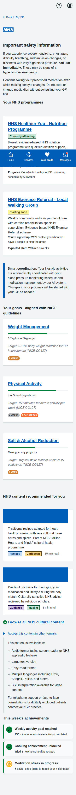
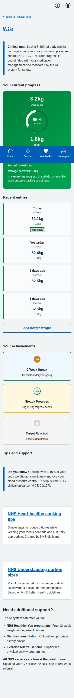
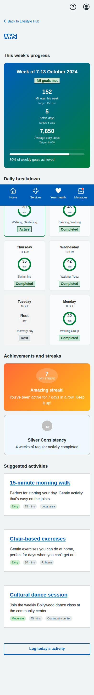
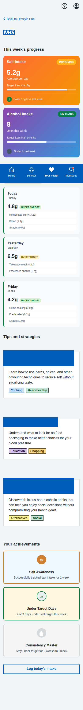
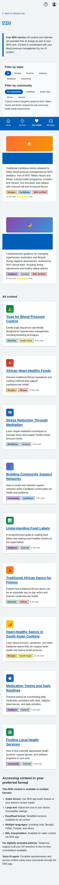

# My BP NHS App Prototype Screenshots

Complete collection of iPhone-formatted screenshots (393x852 pixels) for all screens in the blood pressure management prototype, including the core patient journeys and the new Lifestyle & Behaviour Change Hub.

## Main Dashboard

**Main Dashboard** - Landing page showing all three patient journey options: dose titration, BP measurement, and blood test booking.

---

    ## Dose Titration Journey (5 screens)

    ### 1. Landing Page
    
    **Dose Titration Landing** - Shows current medication status and recent BP readings with option to start medication review based on NICE guidelines.

    ### 2. Readings Review
    
    **Confirm Blood Pressure Readings** - Patient-friendly interface for confirming home BP readings with clear status labels and helpful guidance.

    ### 3. Medication Recommendation
    
    **Medication Recommendation Based on NICE Guidelines** - Clinical recommendation screen showing treatment adjustment based on recent blood pressure readings and NICE clinical guidelines, with comprehensive rationale, side effects, and monitoring plan. Features reassuring language that the system will remind patients for monitoring rather than giving them tasks they cannot action today.

    ### 4. Confirmation
    
    **Dose Increase Confirmed** - Confirmation screen with streamlined care plan updates and safety information. Features patient-focused language that tells users only what they need to do today, with clear system reminders for future monitoring tasks. Updated to remove duplication and ensure clear, specific language for each reminder type. Important safety guidance: call 999 or go to A&E if you experience severe swelling, difficulty breathing, or chest pain; call NHS 111 for other concerning symptoms.

    ### 5. Blood Test Scheduling
    
    **Schedule U&E Blood Test** - Required safety monitoring for the new medication dose, showing test details, preparation information, and booking options.

---

## BP Measurement Journey (5 screens)

### 1. Introduction

**Lifelight Technology Introduction** - Comprehensive overview of contactless BP measurement, process explanation, and preparation tips.

### 2. Location Selection

**Community Location Selection** - List of available venues with distances, opening hours, and facility information.

### 3. Appointment Booking

**Appointment Booking** - Date/time selection with contact details and SMS reminder options.

### 4. Booking Confirmation

**Appointment Confirmed** - Complete booking details with preparation instructions, calendar integration, and contact information.

### 5. Sample Results

**Sample Measurement Results** - Demo results showing measurement analysis, trend data, AI insights, and next steps.

---

## Blood Test Journey (5 screens)

### 1. Test Overview

**U&E Test Overview** - Explanation of why the test is needed, test details, and preparation information.

### 2. Educational Information

**Detailed U&E Information** - Comprehensive educational content about what the test measures and its importance for BP medication safety.

### 3. Location Selection

**Healthcare Facility Selection** - Various testing locations including hospitals, health centres, and private labs with detailed facility information.

### 4. Appointment Booking

**Appointment Booking Form** - Date/time selection with contact details, notification preferences, and preparation reminders.

### 5. Final Confirmation

**Appointment Confirmation** - Complete appointment details, step-by-step process explanation, results information, and calendar integration.

---

## Lifestyle & Behaviour Change Hub (5 screens) - iPhone Optimized & MVP Aligned

### 1. Lifestyle Hub Dashboard (iPhone Optimized)

**Lifestyle Hub Dashboard - iPhone Optimized & MVP Aligned** - Properly rendered at iPhone dimensions (393x852px) with enhanced clinical safety as the top priority featuring NHS emergency guidance, clear programme status showing "Currently attending" vs "Starting soon" with improved terminology to address user feedback, evidence-based NHS service integration with "NHS Healthier You" and NHS Exercise Referral programmes, AI system coordination notices, and NICE guideline-aligned goal tracking with clinical rationale.

### 2. Weight Management Goal Tracking (iPhone Optimized)  

**Weight Management Goal Tracking - iPhone Optimized** - Properly rendered for iPhone with improved mobile responsiveness, clinical context banner with NICE CG127 references, AI monitoring integration showing GP coordination, and NHS service referral options including free dietitian consultations and exercise programmes. All text properly displayed at mobile resolution.

### 3. Physical Activity Goal Tracking (iPhone Optimized)

**Physical Activity Goal Tracking - iPhone Optimized** - Mobile-optimized layout with NICE-compliant 150-minute weekly targets, 7-day streak counters, achievement badges, and culturally-appropriate exercise suggestions including traditional dance and community activities. Properly responsive design elements.

### 4. Salt & Alcohol Monitoring (iPhone Optimized)

**Salt & Alcohol Monitoring - iPhone Optimized** - Dual-tab interface properly rendered for iPhone with NHS guideline-aligned targets (<6g salt daily, alcohol within NHS guidelines), progress trends, and educational resources. Fixed British English spelling throughout (flavouring not flavoring).

### 5. Content Browser with Cultural Filtering (iPhone Optimized)

**Content Browser - iPhone Optimized & Culturally Sensitive** - Properly rendered mobile layout featuring NHS-verified content from "Million Hearts and Minds" programme, improved cultural filtering using "community" rather than "culture" terminology, evidence-based programme content, and comprehensive accessibility features. Enhanced mobile responsiveness with properly aligned elements and fixed rendering issues.

---

## Key Features Demonstrated - iPhone Optimized & MVP Compliance

- **iPhone Rendering Optimization**: All screenshots properly rendered at iPhone dimensions (393x852px) with responsive mobile design
- **British English Compliance**: All text uses British spelling throughout (flavouring, colour, etc.)
- **Clinical Safety Priority**: Enhanced NHS emergency guidance with proper 999 escalation information based on NHS standards
- **Evidence-Based Programmes**: All lifestyle programmes reference verified NHS services including "NHS Healthier You" and NHS Exercise Referral schemes
- **Cultural Sensitivity**: Improved cultural filtering based on NHS "Million Hearts and Minds" programme standards, using "community" rather than "culture" terminology
- **Multi-Agent System Integration**: Clear demonstration of how Lifestyle Agent coordinates with Orchestrating Agent, Monitoring Agent, and other system components
- **NHS Service Integration**: Explicit integration with evidence-based NHS programmes and services, all free at point of use
- **NICE Guidelines Compliance**: Clinical targets and recommendations explicitly reference NICE CG127 hypertension guidelines
- **Accessibility & Inclusion**: Comprehensive multi-format content delivery including audio, EasyRead, BSL interpretation, multiple languages, and support for digitally excluded patients
- **Mobile-Responsive Design**: Enhanced mobile layout with improved element alignment and fixed rendering issues
- **Patient-Centered Language**: Clear, jargon-free communication throughout all screens
- **Interactive Navigation**: Working forms, radio buttons, and user input handling optimized for touch interfaces
- **Clinical Safety**: Appropriate NICE guidelines attribution and safety warnings
- **Interactive Navigation**: Working forms, radio buttons, and user input handling
- **Mobile-Responsive Design**: NHS App-appropriate layout optimised for mobile devices
- **Accessibility**: Proper semantic HTML structure and NHS design system compliance
- **Realistic Data**: Authentic medical scenarios, dates, locations, and contact information
- **Full User Journeys**: Complete end-to-end workflows integrated with broader hypertension management system
- **AI System Coordination**: Clear visibility of how lifestyle interventions are coordinated with BP monitoring, medication management, and clinical oversight
- **Free NHS Service Emphasis**: Consistent messaging about all services being free at point of use
- **GP Integration**: Clear pathways for escalation to GP when clinical oversight is needed

All screenshots captured at proper iPhone resolution (393x852 pixels) with full-page scrolling and optimized mobile responsiveness.