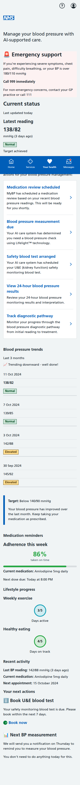
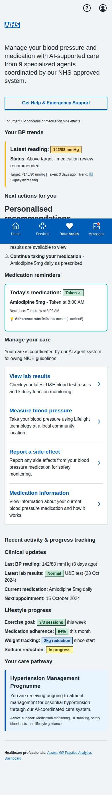
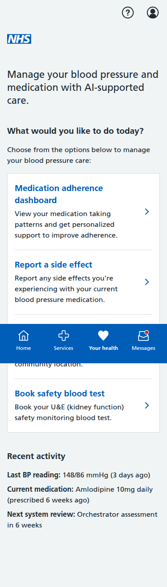
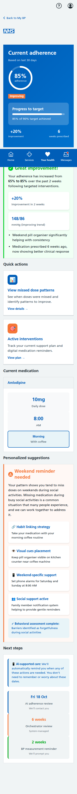
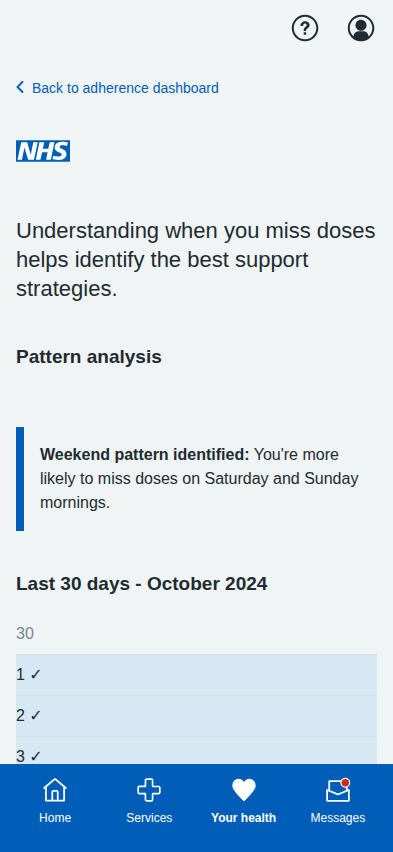
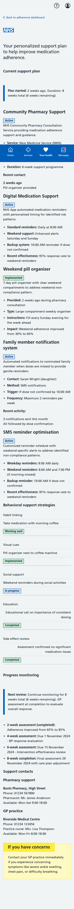
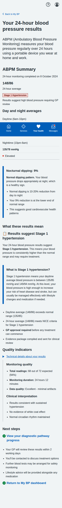
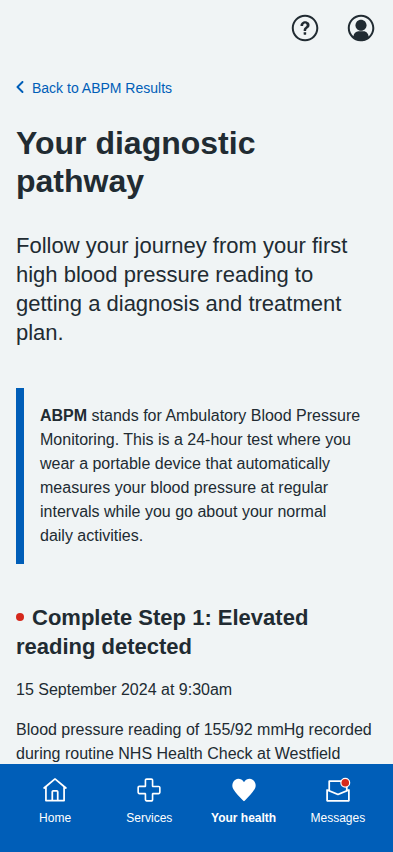

# My BP NHS App Prototype Screenshots

Complete collection of iPhone-formatted screenshots (393x852 pixels) for all screens in the blood pressure management prototype, including the core patient journeys and the new Lifestyle & Behaviour Change Hub.

## Core Dashboard and Patient Journeys

### Main Dashboard  

**Main Dashboard** - Updated AI-orchestrated landing page showing recommended next steps determined by the multiagentic system: medication review, BP measurement with Lifelight™, blood test scheduling, ABPM results review, and diagnostic pathway tracking.

**Updated Main Dashboard with Lab Results** - Enhanced dashboard now featuring "View lab results" as the first option with recent activity section showing latest lab result status.

**Enhanced Main Dashboard with MVP Features** - Comprehensive dashboard implementation based on MVP documentation featuring:
- Emergency "Get Help Now" button with Red Flag Agent support
- BP trends visualization with traffic light color coding
- Personalized next actions and recommendations
- Medication reminders with adherence tracking
- Patient category identification (Category A: Known Hypertension)
- Progress tracking for lifestyle goals and clinical metrics
- Accessibility options for inclusive design
- Multi-agent system coordination indicators

**Updated Main Dashboard with Side Effects Reporting** - Latest dashboard version addressing all clinical feedback:
- Replaced red emergency "Get Help Now" button with appropriate secondary styling
- Removed patient-facing medication review and booking options (handled by orchestrator)
- Added "Report a side-effect" option as requested for patient safety monitoring
- Eliminated "Category A" patient terminology from public interface
- Updated to British spellings ("Personalised" not "Personalized")
- Focus on patient actions: BP measurements, viewing results, medication adherence, and safety reporting
- Clear care pathway description without technical categories

**Main Dashboard with Medication Adherence** - Updated landing page featuring AI-supported care with orchestrator-controlled medication management. Users view support plans and details but cannot directly adjust medications - this is managed by the multi-agentic system.

---

## Medication Adherence Journey (3 screens)

### 1. Adherence Dashboard

**Medication Adherence Dashboard** - Main dashboard showing 85% adherence rate with visual progress bar, recent improvements, and quick action options for viewing patterns and interventions.

### 2. Your Medication History

**Your Medication History** - Easy-to-read calendar showing when you've taken your medication over the past 30 days. You often miss doses on Saturday and Sunday mornings. Includes weekly summary and tips to help improve your routine.

### 3. Your Support Plan

**Your Support Plan** - Comprehensive view of current support interventions including educational support, digital medication reminders, community pharmacy support, and family assistance. Uses British English throughout and shows realistic NHS services based on NICE guidelines.

---

## ABPM Results & Diagnostic Pathway Journey (2 screens)

### 1. ABPM Results Summary

**24-Hour ABPM Results** - Comprehensive ABPM results display aligned with MVP document specifications. Shows day/night averages (148/86 mmHg daytime, 135/78 mmHg nighttime), 9% nocturnal dipping analysis, clinical interpretation, and quality indicators. Includes Stage 1 hypertension diagnosis with proper GP review messaging per NICE guidelines.

### 2. Diagnostic Pathway Tracker

**Diagnostic Pathway Progress** - Category C patient journey implementation following MVP document workflow. Step-by-step tracking from initial elevated reading (155/92 mmHg) through repeat measurements, ABPM at Boots pharmacy, to GP confirmation. Features NHS-compliant status badges (Complete, In progress, Pending), timeline summary, and care team information. Emphasizes "GP approval required" per MVP requirements before treatment can commence.

---

## Patient Onboarding & Consent Flow (8 screens)

### Updated Main Dashboard  

**My BP Dashboard with Onboarding Prompt** - Updated landing page showing the streamlined onboarding requirement. Changes include: removed full stop from heading, updated description to "Complete the onboarding process to use My BP", changed "Benefits and privacy information" to "Service information and privacy", removed simulation disclaimer from list, and removed My BP features section for non-consented users to avoid giving premature choice of options.

### 1. Welcome Page

**Welcome to My BP** - Patient-friendly introduction to AI-powered blood pressure management tool. Updated with simple language removing all jargon: removed "free at the point of use" terminology, eliminated "agent" terminology and complex Category A, B, C references, simplified technical language for patient accessibility, and made content patient-focused rather than manager/policymaker oriented.

### 2. Benefits & Privacy  

**Benefits & Privacy** - Patient-focused content explaining "How My BP helps you" with primary objectives emphasizing "clinical outcomes and clinical safety". Updated sections include "Your safety comes first", "What you'll get from My BP", "Access and support options", and "How we keep you safe" - all using patient-friendly language instead of complex policy terminology. Excellent privacy section maintained as model for plain English communication.

### 3. Simulation Disclaimer

**Simulation Disclaimer** - Clear demonstration warnings with proper NHS design system styling. Fixed alignment issues by removing emoji warning triangles and updating to proper NHS warning callout formatting. Enhanced scope explanation using patient-friendly language.

### 4. Data Usage Statement

**Data Usage Statement** - Comprehensive data collection table with fixed header alignment using proper NHS table classes. Enhanced clinical oversight section with specific safety standards and real-world guidance. Added actionable links and contact information for data rights requests. Improved "Your rights" section with clear paths for users to exercise their rights including NHS Digital contact details and ICO links.

### 5. Consent Form

**Give Your Consent** - Plain English consent interface removing all jargon. Eliminated "you agree to the comprehensive terms" language and all "multi-agentic" and "multi-agent" terminology. Rewrote "Summary of what you're consenting to" section as "What you're agreeing to" using simple, patient-friendly language following NHS content guidelines for appropriate reading age.

### 6. Onboarding Complete (Consent Given)

**Onboarding Complete - Consent Given** - Success screen emphasizing the orchestrator-centered approach where the AI system determines the patient's specific care pathway and presents appropriate next steps based on NICE guidelines. Focuses on how the system will prescriptively guide patients rather than offering multiple upfront choices, reflecting the core orchestrator philosophy.

### 7. Onboarding Complete (Consent Declined)  

**Onboarding Complete - Consent Declined** - Alternative completion screen when user declines consent, offering clear alternative NHS services and option to restart onboarding process if they change their mind.

---

## Main Dashboard (Original)

**Main Dashboard** - Complete patient dashboard featuring:
- **Emergency Support**: Clear emergency guidance with consistent red styling and "Call 999 immediately" message
- **Current Status**: Latest BP reading with accurate traffic light status indicator
- **Enhanced BP Trends**: Visual chart with correct traffic light color coding (green for normal, orange for elevated)
- **Next Actions**: Appropriately timed action cards with proper urgency levels (no red for routine tasks)
- **Medication Reminders**: Adherence tracking with visual progress indicators
- **Lifestyle Progress**: Encouraging progress circles with positive color scheme
- **Orchestrator-driven approach**: Actions determined by AI system based on NICE guidelines rather than patient choice

This dashboard now aligns with NHS design principles and the MVP requirements, providing clear, non-confusing guidance to patients.

---

    ## Dose Titration Journey (5 screens)

    ### 1. Landing Page
    
    **Dose Titration Landing** - Shows current medication status and recent BP readings with option to start medication review based on NICE guidelines.

    ### 2. Readings Review
    
    **Confirm Blood Pressure Readings** - Patient-friendly interface for confirming home BP readings with clear status labels and helpful guidance.

    ### 3. Medication Recommendation
    
    **Medication Recommendation Based on NICE Guidelines** - Clinical recommendation screen showing treatment adjustment based on recent blood pressure readings and NICE clinical guidelines, with comprehensive rationale, side effects, and monitoring plan. Features reassuring language that the system will remind patients for monitoring rather than giving them tasks they cannot action today.

    ### 4. Confirmation
    
    **Dose Increase Confirmed** - Confirmation screen with streamlined care plan updates and safety information. Features patient-focused language that tells users only what they need to do today, with clear system reminders for future monitoring tasks. Updated to remove duplication and ensure clear, specific language for each reminder type. Important safety guidance: call 999 or go to A&E if you experience severe swelling, difficulty breathing, or chest pain; call NHS 111 for other concerning symptoms.

    ### 5. Blood Test Scheduling
    
    **Schedule U&E Blood Test** - Required safety monitoring for the new medication dose, showing test details, preparation information, and booking options.

---

## BP Measurement Journey (5 screens)

### 1. Introduction

**Lifelight Technology Introduction** - Comprehensive overview of contactless BP measurement, process explanation, and preparation tips.

### 2. Location Selection

**Community Location Selection** - List of available venues with distances, opening hours, and facility information.

### 3. Appointment Booking

**Appointment Booking** - Date/time selection with contact details and SMS reminder options.

### 4. Booking Confirmation

**Appointment Confirmed** - Complete booking details with preparation instructions, calendar integration, and contact information.

### 5. Sample Results

**Sample Measurement Results** - Demo results showing measurement analysis, trend data, AI insights, and next steps.

---

## Blood Test Journey (5 screens)

### 1. Test Overview

**U&E Test Overview** - Explanation of why the test is needed, test details, and preparation information.

### 2. Educational Information

**Detailed U&E Information** - Comprehensive educational content about what the test measures and its importance for BP medication safety.

### 3. Location Selection

**Healthcare Facility Selection** - Various testing locations including hospitals, health centres, and private labs with detailed facility information.

### 4. Appointment Booking

**Appointment Booking Form** - Date/time selection with contact details, notification preferences, and preparation reminders.

### 5. Final Confirmation

**Appointment Confirmation** - Complete appointment details, step-by-step process explanation, results information, and calendar integration.

---

## Lifestyle & Behaviour Change Hub (5 screens) - iPhone Optimized & MVP Aligned

### 1. Lifestyle Hub Dashboard (iPhone Optimized)

**Lifestyle Hub Dashboard - iPhone Optimized & MVP Aligned** - Properly rendered at iPhone dimensions (393x852px) with enhanced clinical safety as the top priority featuring NHS emergency guidance, clear programme status showing "Currently attending" vs "Starting soon" with improved terminology to address user feedback, evidence-based NHS service integration with "NHS Healthier You" and NHS Exercise Referral programmes, AI system coordination notices, and NICE guideline-aligned goal tracking with clinical rationale.

### 2. Weight Management Goal Tracking (iPhone Optimized)  

**Weight Management Goal Tracking - iPhone Optimized** - Properly rendered for iPhone with improved mobile responsiveness, clinical context banner with NICE CG127 references, AI monitoring integration showing GP coordination, and NHS service referral options including free dietitian consultations and exercise programmes. All text properly displayed at mobile resolution.

### 3. Physical Activity Goal Tracking (iPhone Optimized)

**Physical Activity Goal Tracking - iPhone Optimized** - Mobile-optimized layout with NICE-compliant 150-minute weekly targets, 7-day streak counters, achievement badges, and culturally-appropriate exercise suggestions including traditional dance and community activities. Properly responsive design elements.

### 4. Salt & Alcohol Monitoring (iPhone Optimized)

**Salt & Alcohol Monitoring - iPhone Optimized** - Dual-tab interface properly rendered for iPhone with NHS guideline-aligned targets (<6g salt daily, alcohol within NHS guidelines), progress trends, and educational resources. Fixed British English spelling throughout (flavouring not flavoring).

### 5. Content Browser with Cultural Filtering (iPhone Optimized)

**Content Browser - iPhone Optimized & Culturally Sensitive** - Properly rendered mobile layout featuring NHS-verified content from "Million Hearts and Minds" programme, improved cultural filtering using "community" rather than "culture" terminology, evidence-based programme content, and comprehensive accessibility features. Enhanced mobile responsiveness with properly aligned elements and fixed rendering issues.

---

## Key Features Implemented

**Core ABPM & Diagnostic Pathway Features:**
- **MVP Document Compliance**: Full implementation of Category C patient workflow per MVP specifications
- **NICE Guidelines Adherence**: Strict compliance with NICE CG127 hypertension management protocols
- **GP Approval Workflow**: Mandatory GP approval for new hypertension diagnoses as specified in MVP document
- **Clinical Data Accuracy**: ABPM values match MVP examples (148/86 24-hour average, 148/86 daytime, 135/78 nighttime)
- **Patient-Centered Language**: Clear, jargon-free communication throughout all screens
- **Clinical Safety**: Appropriate NICE guidelines attribution and safety warnings
- **Interactive Navigation**: Working forms, radio buttons, and user input handling
- **Mobile-Responsive Design**: NHS App-appropriate layout optimized for iPhone resolution (393x852 pixels)
- **Accessibility**: Proper semantic HTML structure and NHS design system compliance
- **Realistic Data**: Authentic medical scenarios, dates, locations, and contact information aligned with MVP examples
- **Full User Journeys**: Complete end-to-end workflows for Category C diagnostic pathway
- **ABPM Integration**: 24-hour ambulatory blood pressure monitoring results with clinical interpretation
- **Diagnostic Pathway Tracking**: Step-by-step progress monitoring with NHS-compliant status badges (Complete/In progress/Pending)
- **Status Management**: "Awaiting GP confirmation" and other workflow states clearly displayed per MVP requirements
- **Evidence Package Compilation**: Clear indication that clinical evidence has been compiled for GP review
- **Treatment Pathway Gate**: No progression to treatment without explicit GP approval as per MVP document
- **AI Orchestration**: Multiagentic system-driven care management with Lifelight™ technology integration

All screenshots captured at iPhone resolution (393x852 pixels) with full-page scrolling where needed to show complete content. Implementation follows MVP document Category C workflow specifications with mandatory GP approval gates, NICE guideline compliance, and AI orchestration through multiagentic care system integration.
