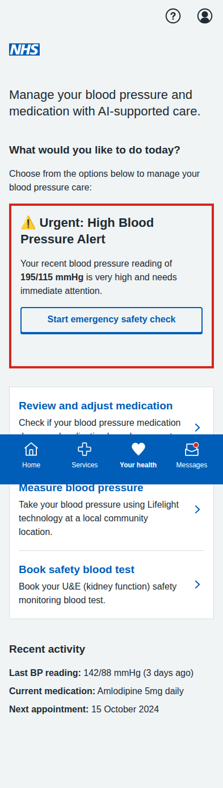
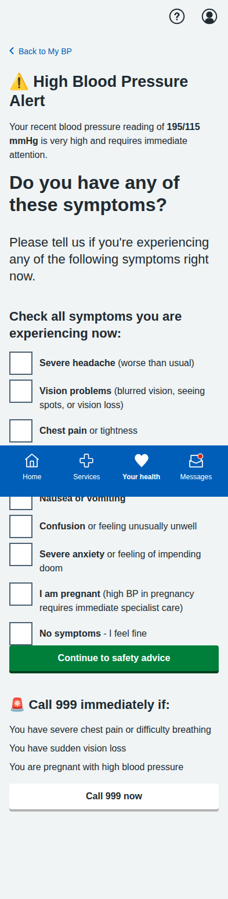
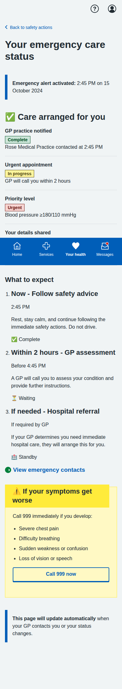
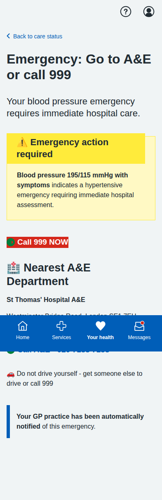

# Blood Pressure Module Screenshots

Complete collection of iPhone-formatted screenshots (393x852 pixels) for all screens in the blood pressure management prototype.

## Main Dashboard

**Main Dashboard** - Orchestrator-driven care plan showing automatically arranged care based on NICE guidelines. No longer shows user choice options - the NHS Hypertension Care Orchestrator determines required actions.

---

## Dose Titration Journey (5 screens)

### 1. Landing Page

**Orchestrator-Scheduled Medication Review** - Shows that the NHS Hypertension Care Orchestrator has automatically scheduled this review based on persistent elevated readings above target, following NICE CG127 guidelines.

### 2. Readings Review

**Confirm Blood Pressure Readings** - Patient-friendly interface for confirming home BP readings with clear status labels and helpful guidance.

### 3. AI Recommendation

**AI Medication Recommendation** - Comprehensive recommendation screen with clinical rationale, NICE guidelines reference, side effects, and monitoring plan.

### 4. Confirmation

**Dose Increase Confirmed** - Confirmation screen with next steps, care plan updates, and important safety information.

---

## BP Measurement Journey (5 screens)

### 1. Introduction

**Patient-Initiated Additional Readings** - Clear explanation that while the orchestrator determines when readings are clinically required, patients can submit additional readings anytime to help the orchestrator make more informed care decisions.

### 2. Location Selection

**Community Location Selection** - List of available venues with distances, opening hours, and facility information.

### 3. Appointment Booking

**Appointment Booking** - Date/time selection with contact details and SMS reminder options.

### 4. Booking Confirmation

**Appointment Confirmed** - Complete booking details with preparation instructions, calendar integration, and contact information.

### 5. Sample Results

**Sample Measurement Results** - Demo results showing measurement analysis, trend data, AI insights, and next steps.

---

## Blood Test Journey (5 screens)

### 1. Test Overview

**Orchestrator-Scheduled Blood Test** - Shows that the NHS Hypertension Care Orchestrator has automatically scheduled a U&E blood test following NICE guidelines after medication dose increase. Emphasizes this is orchestrator-determined care, not patient choice.

### 2. Educational Information

**Detailed U&E Information** - Comprehensive educational content about what the test measures and its importance for BP medication safety.

### 3. Location Selection

**Healthcare Facility Selection** - Various testing locations including hospitals, health centres, and private labs with detailed facility information.

### 4. Appointment Booking

**Appointment Booking Form** - Date/time selection with contact details, notification preferences, and preparation reminders.

### 5. Final Confirmation

**Appointment Confirmation** - Complete appointment details, step-by-step process explanation, results information, and calendar integration.

---

## Red Flag Emergency Action Flow (5 screens)

### 1. Dashboard with Red Flag Alert

**Orchestrator-Driven Care Dashboard** - The main blood pressure dashboard showing the NHS Hypertension Care Orchestrator's automatic care arrangement based on NICE guidelines. Features clear distinction between orchestrator-scheduled care (medication review) and patient-initiated actions (additional BP readings). Red flag alert shows hypertensive emergency requiring immediate hospital treatment.

### 2. Symptom Confirmation Screen

**Emergency Symptom Assessment** - Comprehensive symptom checker for hypertensive emergencies including severe headache, vision problems, chest pain, breathing difficulties, and neurological symptoms, with direct 999 emergency access for life-threatening situations.

### 3. Immediate Action Guidance

**Critical Safety Instructions** - Clear, actionable safety guidance following clinical best practices with "Do" and "Don't" lists, including immediate rest instructions, medication guidance, and automatic GP practice notification with 2-hour response guarantee.

### 4. Escalation Status Tracking

**Emergency Care Coordination** - Real-time status dashboard showing GP practice notification (✅ Complete), urgent appointment scheduling (⏳ In progress), priority level indicators (🚨 Urgent), and timeline with expected GP contact within 2 hours.

### 5. Emergency Contacts and Help

**Comprehensive Emergency Support** - Complete emergency contact management including 999 emergency services, GP practice details with direct calling, NHS 111 out-of-hours care, automated family contact notifications, and Blood Pressure UK helpline support.

---

## Key Features Demonstrated

- **Orchestrator-Driven Care**: The NHS Hypertension Care Orchestrator makes all clinical decisions based on NICE guidelines - patients no longer choose their care options
- **Clear Role Separation**: 
  - Orchestrator determines: medication reviews, dose adjustments, blood test scheduling, clinical monitoring
  - Patients can initiate: additional BP readings only (orchestrator still reviews and incorporates these)
- **Clinical Safety**: Appropriate NICE guidelines attribution and safety warnings
- **Multiagent Architecture**: System reflects that the orchestrator agent makes clinical decisions, not the patient
- **Patient-Centered Language**: Clear explanation of orchestrator vs patient roles throughout all screens
- **Interactive Navigation**: Working forms, radio buttons, and user input handling for patient-initiated actions only
- **Mobile-Responsive Design**: NHS App-appropriate layout optimized for mobile devices
- **Accessibility**: Proper semantic HTML structure and NHS design system compliance
- **Realistic Data**: Authentic medical scenarios, dates, locations, and contact information
- **Full User Journeys**: Complete end-to-end workflows respecting orchestrator vs patient boundaries
- **Emergency Management**: Red Flag Alert system with comprehensive emergency action flow following NICE CG127 guidelines
- **Clinical Compliance**: Hypertensive emergency protocols with proper escalation pathways
- **Direct Phone Integration**: `tel:` links for immediate calling capability (999, GP practice, NHS 111)
- **Real-Time Status Tracking**: Emergency care coordination with live updates and timeline management
- **Automated Care Arrangement**: Orchestrator automatically schedules care based on clinical protocols without patient choice

All screenshots captured at iPhone resolution (393x852 pixels) with full-page scrolling where needed to show complete content.