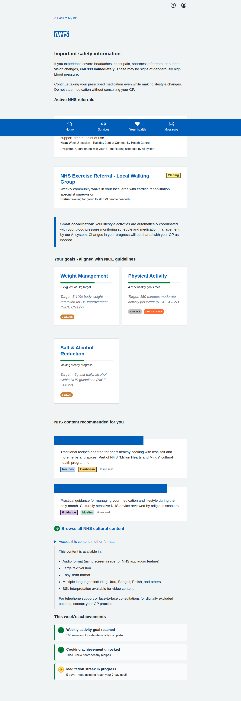
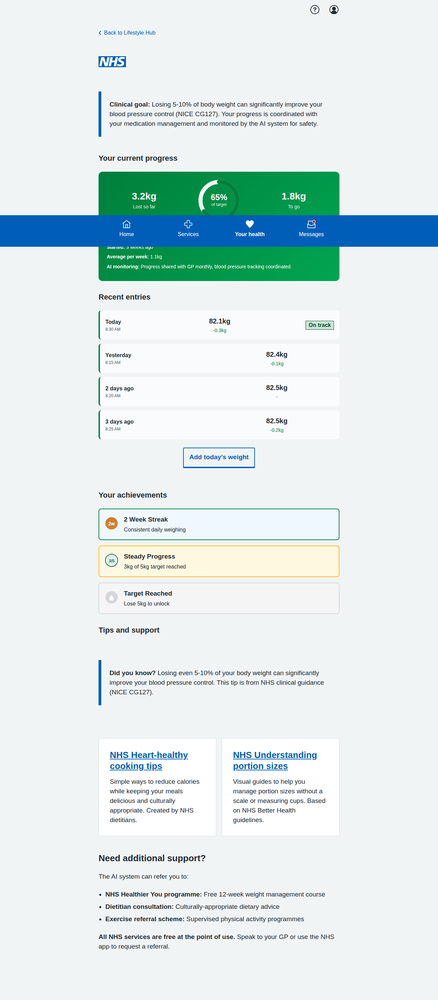
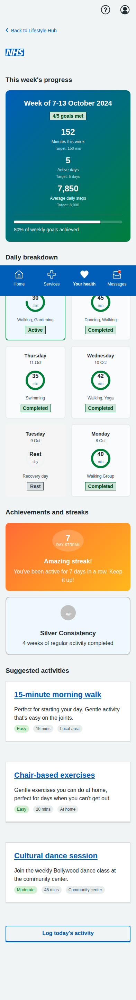
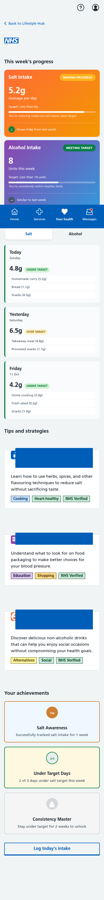
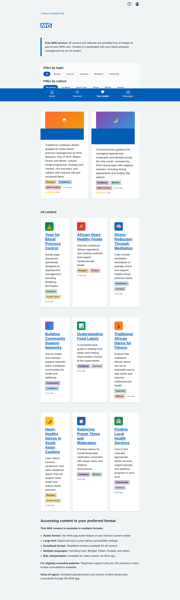

# My BP NHS App Prototype Screenshots

Complete collection of iPhone-formatted screenshots (393x852 pixels) for all screens in the blood pressure management prototype, including the core patient journeys and the new Lifestyle & Behaviour Change Hub.

## Main Dashboard

**Main Dashboard** - Landing page showing all three patient journey options: dose titration, BP measurement, and blood test booking.

---

## Dose Titration Journey (5 screens)

### 1. Landing Page

**Dose Titration Landing** - Shows current medication status and recent BP readings with option to start review process.

### 2. Readings Review

**Confirm Blood Pressure Readings** - Patient-friendly interface for confirming home BP readings with clear status labels and helpful guidance.

### 3. AI Recommendation

**AI Medication Recommendation** - Comprehensive recommendation screen with clinical rationale, NICE guidelines reference, side effects, and monitoring plan.

### 4. Confirmation

**Dose Increase Confirmed** - Confirmation screen with next steps, care plan updates, and important safety information.

---

## BP Measurement Journey (5 screens)

### 1. Introduction

**Lifelight Technology Introduction** - Comprehensive overview of contactless BP measurement, process explanation, and preparation tips.

### 2. Location Selection

**Community Location Selection** - List of available venues with distances, opening hours, and facility information.

### 3. Appointment Booking

**Appointment Booking** - Date/time selection with contact details and SMS reminder options.

### 4. Booking Confirmation

**Appointment Confirmed** - Complete booking details with preparation instructions, calendar integration, and contact information.

### 5. Sample Results

**Sample Measurement Results** - Demo results showing measurement analysis, trend data, AI insights, and next steps.

---

## Blood Test Journey (5 screens)

### 1. Test Overview

**U&E Test Overview** - Explanation of why the test is needed, test details, and preparation information.

### 2. Educational Information

**Detailed U&E Information** - Comprehensive educational content about what the test measures and its importance for BP medication safety.

### 3. Location Selection

**Healthcare Facility Selection** - Various testing locations including hospitals, health centres, and private labs with detailed facility information.

### 4. Appointment Booking

**Appointment Booking Form** - Date/time selection with contact details, notification preferences, and preparation reminders.

### 5. Final Confirmation

**Appointment Confirmation** - Complete appointment details, step-by-step process explanation, results information, and calendar integration.

---

## Lifestyle & Behaviour Change Hub (5 screens) - MVP Aligned

### 1. Lifestyle Hub Dashboard (MVP Updated)

**Lifestyle Hub Dashboard - MVP Aligned** - Main dashboard now emphasizing clinical safety as the top priority with urgent safety banner, NHS service integration showing active referrals to "NHS Healthier You" programme and NHS Exercise Referral schemes, AI system coordination notice explaining how lifestyle activities are coordinated with BP monitoring and medication management, and NICE guideline-aligned goal tracking with clinical rationale for each target.

### 2. Weight Management Goal Tracking (MVP Updated)

**Weight Management Goal Tracking - MVP Enhanced** - Updated with clinical context banner explaining 5-10% weight loss targets from NICE CG127, AI monitoring integration showing progress shared with GP monthly, enhanced target information referencing NICE guidelines, and NHS service referral options including NHS Healthier You programme, dietitian consultations, and exercise referral schemes - all free at point of use.

### 3. Physical Activity Goal Tracking

**Physical Activity Goal Tracking** - Weekly breakdown with daily activity tracking, streak counters (7-day streak), achievement badges for consistency, and culturally-appropriate exercise suggestions including traditional dance and community-based activities.

### 4. Salt & Alcohol Monitoring

**Salt & Alcohol Monitoring** - Dual-tab interface for tracking daily salt and alcohol intake, progress trends showing improvement over time, educational resources for low-salt cooking techniques and healthy alternatives, and achievement tracking for meeting targets.

### 5. Content Browser with Cultural Filtering (MVP Updated)

**Content Browser - MVP Enhanced** - Now prominently featuring NHS "Million Hearts and Minds" programme content, NHS verification badges for clinical content, enhanced accessibility information with multiple format options (audio, EasyRead, BSL interpretation, multiple languages), and clear messaging about free NHS service provision. Includes comprehensive accessibility support notice for digitally excluded patients with telephone and face-to-face consultation options.

---

## Key Features Demonstrated - MVP Compliance

- **Clinical Safety Priority**: Prominent safety warnings and escalation pathways throughout all screens
- **Multi-Agent System Integration**: Clear demonstration of how Lifestyle Agent coordinates with Orchestrating Agent, Monitoring Agent, and other system components
- **NHS Service Integration**: Explicit integration with NHS Healthier You programme, NHS exercise referral schemes, NHS Stop Smoking Service, and NHS "Million Hearts and Minds" cultural health programme
- **NICE Guidelines Compliance**: Clinical targets and recommendations explicitly reference NICE CG127 hypertension guidelines
- **Accessibility & Cultural Sensitivity**: Comprehensive multi-format content delivery including audio, EasyRead, BSL interpretation, multiple languages, and support for digitally excluded patients
- **Patient-Centered Language**: Clear, jargon-free communication throughout all screens
- **Interactive Navigation**: Working forms, radio buttons, and user input handling
- **Mobile-Responsive Design**: NHS App-appropriate layout optimized for mobile devices
- **Accessibility**: Proper semantic HTML structure and NHS design system compliance
- **Realistic Data**: Authentic medical scenarios, dates, locations, and contact information
- **Full User Journeys**: Complete end-to-end workflows integrated with broader hypertension management system
- **AI System Coordination**: Clear visibility of how lifestyle interventions are coordinated with BP monitoring, medication management, and clinical oversight
- **Free NHS Service Emphasis**: Consistent messaging about all services being free at point of use
- **GP Integration**: Clear pathways for escalation to GP when clinical oversight is needed

All screenshots captured at iPhone resolution (393x852 pixels) with full-page scrolling where needed to show complete content.