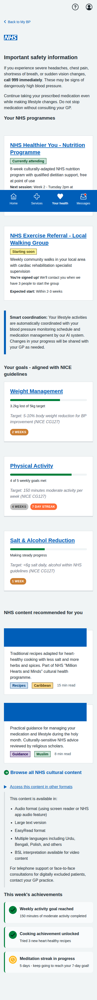
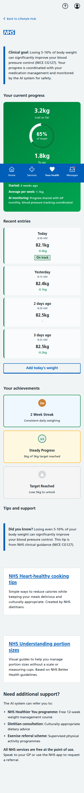
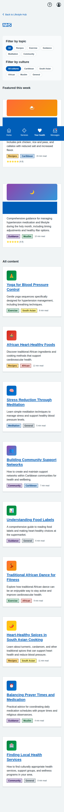

# My BP NHS App Prototype Screenshots

Complete collection of iPhone-formatted screenshots (393x852 pixels) for all screens in the blood pressure management prototype, including the core patient journeys and the new Lifestyle & Behaviour Change Hub.

## Main Dashboard

**Main Dashboard** - Landing page showing all three patient journey options: dose titration, BP measurement, and blood test booking.

---

## Dose Titration Journey (5 screens)

### 1. Landing Page

**Dose Titration Landing** - Shows current medication status and recent BP readings with option to start review process.

### 2. Readings Review

**Confirm Blood Pressure Readings** - Patient-friendly interface for confirming home BP readings with clear status labels and helpful guidance.

### 3. AI Recommendation

**AI Medication Recommendation** - Comprehensive recommendation screen with clinical rationale, NICE guidelines reference, side effects, and monitoring plan.

### 4. Confirmation

**Dose Increase Confirmed** - Confirmation screen with next steps, care plan updates, and important safety information.

---

## BP Measurement Journey (5 screens)

### 1. Introduction

**Lifelight Technology Introduction** - Comprehensive overview of contactless BP measurement, process explanation, and preparation tips.

### 2. Location Selection

**Community Location Selection** - List of available venues with distances, opening hours, and facility information.

### 3. Appointment Booking

**Appointment Booking** - Date/time selection with contact details and SMS reminder options.

### 4. Booking Confirmation

**Appointment Confirmed** - Complete booking details with preparation instructions, calendar integration, and contact information.

### 5. Sample Results

**Sample Measurement Results** - Demo results showing measurement analysis, trend data, AI insights, and next steps.

---

## Blood Test Journey (5 screens)

### 1. Test Overview

**U&E Test Overview** - Explanation of why the test is needed, test details, and preparation information.

### 2. Educational Information

**Detailed U&E Information** - Comprehensive educational content about what the test measures and its importance for BP medication safety.

### 3. Location Selection

**Healthcare Facility Selection** - Various testing locations including hospitals, health centres, and private labs with detailed facility information.

### 4. Appointment Booking

**Appointment Booking Form** - Date/time selection with contact details, notification preferences, and preparation reminders.

### 5. Final Confirmation

**Appointment Confirmation** - Complete appointment details, step-by-step process explanation, results information, and calendar integration.

---

## Lifestyle & Behaviour Change Hub (5 screens)

### 1. Lifestyle Hub Dashboard

**Lifestyle Hub Dashboard** - Main dashboard showing active referrals (Community Nutrition Program, Local Walking Group), goal tracking overview (weight, activity, salt & alcohol), culturally-tailored content recommendations, and weekly achievements with progress badges.

### 2. Weight Management Goal Tracking

**Weight Management Goal Tracking** - Circular progress visualization showing 3.2kg lost of 5kg target (65% complete), recent weight entries with daily tracking, achievement badges for consistency streaks, and heart-healthy cooking tips and support resources.

### 3. Physical Activity Goal Tracking

**Physical Activity Goal Tracking** - Weekly breakdown with daily activity tracking, streak counters (7-day streak), achievement badges for consistency, and culturally-appropriate exercise suggestions including traditional dance and community-based activities.

### 4. Salt & Alcohol Monitoring

**Salt & Alcohol Monitoring** - Dual-tab interface for tracking daily salt and alcohol intake, progress trends showing improvement over time, educational resources for low-salt cooking techniques and healthy alternatives, and achievement tracking for meeting targets.

### 5. Content Browser with Cultural Filtering

**Content Browser with Cultural Filtering** - Interactive filtering system with topic categories (Recipes, Exercise, Guidance, Meditation, Community) and cultural filters (Caribbean, South Asian, African, Muslim, General), featured content with ratings and reading time estimates, and comprehensive health content library.

---

## Key Features Demonstrated

- **Patient-Centered Language**: Clear, jargon-free communication throughout all screens
- **Clinical Safety**: Appropriate NICE guidelines attribution and safety warnings
- **Interactive Navigation**: Working forms, radio buttons, and user input handling
- **Mobile-Responsive Design**: NHS App-appropriate layout optimized for mobile devices
- **Accessibility**: Proper semantic HTML structure and NHS design system compliance
- **Realistic Data**: Authentic medical scenarios, dates, locations, and contact information
- **Full User Journeys**: Complete end-to-end workflows for all three patient pathways
- **Cultural Adaptation**: Content and features tailored for diverse cultural backgrounds
- **Goal Tracking**: Visual progress indicators and achievement systems for health goals
- **Lifestyle Integration**: Comprehensive tools for tracking and improving lifestyle factors affecting blood pressure

All screenshots captured at iPhone resolution (393x852 pixels) with full-page scrolling where needed to show complete content.