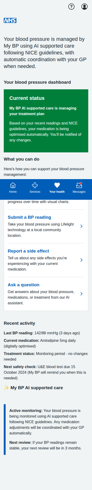
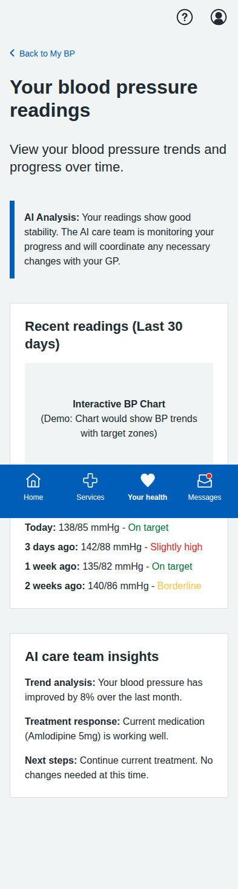
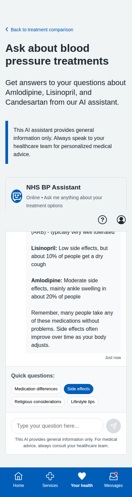

# Multiagentic Blood Pressure Management Screenshots

Complete collection of iPhone-formatted screenshots (393x852 pixels) for the multiagentic blood pressure management system prototype.

## Main Dashboard

**Multiagentic Main Dashboard** - AI-powered care management interface showing patient's current status with orchestrated care team. Users can view their BP dashboard, submit readings, report side effects, and ask questions. Treatment decisions are made by AI agents following NICE guidelines.

---

## Patient Dashboard

**Your BP Readings Dashboard** - Comprehensive view of blood pressure trends with AI analysis and care team insights. Shows recent readings with color-coded status and treatment response monitoring.

---

## Side Effect Reporting

**Report Side Effects** - Patient-centered form for reporting medication side effects with immediate AI care team review and automatic GP escalation protocols when needed.

---

## AI Chatbot Support

**AI Assistant** - Interactive chat interface with NHS BP Assistant for answering questions about treatments, with quick question buttons and voice input support.

**AI Response Example** - Demonstration of intelligent responses about medication side effects with contextual information and professional medical advice reminders.

---

## BP Measurement Journey (5 screens)

### 1. Introduction

**Lifelight Technology Introduction** - Comprehensive overview of contactless BP measurement, process explanation, and preparation tips.

### 2. Location Selection

**Community Location Selection** - List of available venues with distances, opening hours, and facility information.

### 3. Appointment Booking

**Appointment Booking** - Date/time selection with contact details and SMS reminder options.

### 4. Booking Confirmation

**Appointment Confirmed** - Complete booking details with preparation instructions, calendar integration, and contact information.

### 5. Sample Results

**Sample Measurement Results** - Demo results showing measurement analysis, trend data, AI insights, and next steps.

---

## Key Features of Multiagentic System

- **AI Orchestration**: Central Hypertension Care Orchestration Agent coordinates all treatment decisions following NICE guidelines
- **Patient-Focused Interface**: Users can view data, submit readings, and report issues - but treatment decisions are made by AI agents
- **Automatic Care Coordination**: AI agents manage medication adjustments and GP consultations without user intervention
- **Safety Monitoring**: Continuous monitoring with automatic escalation to GP when needed
- **Patient Dashboard**: Comprehensive view of BP trends with AI analysis and insights
- **Side Effect Management**: Immediate reporting to AI care team with automatic review protocols
- **Cultural Sensitivity**: Multi-language support and cultural considerations maintained
- **AI Chatbot Support**: Intelligent assistant for patient questions and education
- **Clinical Safety**: Appropriate NICE guidelines compliance and safety protocols
- **Mobile-Responsive Design**: NHS App-appropriate layout optimized for mobile devices

The system demonstrates how AI agents can manage complex healthcare decisions while maintaining patient engagement through appropriate information sharing and feedback mechanisms.

All screenshots captured at iPhone resolution (393x852 pixels) with full-page scrolling where needed to show complete content.