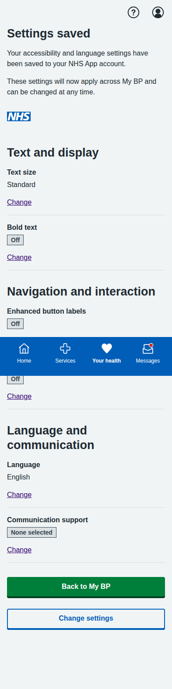

# Blood Pressure Module Screenshots

Complete collection of iPhone-formatted screenshots (393x852 pixels) for all screens in the blood pressure management prototype.

## Main Dashboard

**Main Dashboard** - Landing page showing all three patient journey options: dose titration, BP measurement, and blood test booking.

---

## Dose Titration Journey (5 screens)

### 1. Landing Page

**Dose Titration Landing** - Shows current medication status and recent BP readings with option to start review process.

### 2. Readings Review

**Confirm Blood Pressure Readings** - Patient-friendly interface for confirming home BP readings with clear status labels and helpful guidance.

### 3. AI Recommendation

**AI Medication Recommendation** - Comprehensive recommendation screen with clinical rationale, NICE guidelines reference, side effects, and monitoring plan.

### 4. Confirmation

**Dose Increase Confirmed** - Confirmation screen with next steps, care plan updates, and important safety information.

---

## BP Measurement Journey (5 screens)

### 1. Introduction

**Lifelight Technology Introduction** - Comprehensive overview of contactless BP measurement, process explanation, and preparation tips.

### 2. Location Selection

**Community Location Selection** - List of available venues with distances, opening hours, and facility information.

### 3. Appointment Booking

**Appointment Booking** - Date/time selection with contact details and SMS reminder options.

### 4. Booking Confirmation

**Appointment Confirmed** - Complete booking details with preparation instructions, calendar integration, and contact information.

### 5. Sample Results

**Sample Measurement Results** - Demo results showing measurement analysis, trend data, AI insights, and next steps.

---

## Blood Test Journey (5 screens)

### 1. Test Overview

**U&E Test Overview** - Explanation of why the test is needed, test details, and preparation information.

### 2. Educational Information

**Detailed U&E Information** - Comprehensive educational content about what the test measures and its importance for BP medication safety.

### 3. Location Selection

**Healthcare Facility Selection** - Various testing locations including hospitals, health centres, and private labs with detailed facility information.

### 4. Appointment Booking

**Appointment Booking Form** - Date/time selection with contact details, notification preferences, and preparation reminders.

### 5. Final Confirmation

**Appointment Confirmation** - Complete appointment details, step-by-step process explanation, results information, and calendar integration.

---

## Accessibility and Language Settings (3 screens) - **Updated with NHS Standards**

### 1. Updated My BP Dashboard

**Updated My BP Dashboard** - Main dashboard includes the "Accessibility and language settings" option, enabling users to customize their experience according to NHS accessibility standards.

### 2. Improved Accessibility Settings Page  

**NHS-Compliant Accessibility Settings** - Redesigned settings page following NHS style guidance with:
- **Text and display**: Text size options (Standard/Large/Extra large) and bold text toggle
- **Navigation and interaction**: Enhanced button labels and reduce motion options
- **Language and communication**: 9 language options plus BSL interpretation and Easy read format
- **Improved UX**: Better grouping, clearer labels, and collapsible reset section

### 3. Enhanced Settings Confirmation

**Improved Confirmation Page** - NHS-standard confirmation page with:
- Clear success banner with proper ARIA labels
- Organized settings display by category
- Individual change links for each setting
- Better visual hierarchy and accessibility compliance

---

## Key Features Demonstrated

- **Patient-Centered Language**: Clear, jargon-free communication throughout all screens
- **Clinical Safety**: Appropriate NICE guidelines attribution and safety warnings
- **Interactive Navigation**: Working forms, radio buttons, and user input handling
- **Mobile-Responsive Design**: NHS App-appropriate layout optimized for mobile devices
- **NHS-Compliant Accessibility**: Full compliance with NHS style guidance and WCAG 2.1 AA standards including:
  - Realistic text sizing options following NHS typography patterns
  - Proper focus management and keyboard navigation
  - Enhanced semantic markup and ARIA labels
  - System preference integration (reduced motion, high contrast)
  - Simplified, user-friendly accessibility options
- **Inclusive Design**: Multi-language support (9 languages), BSL interpretation, and Easy read formats
- **Real-world Implementation**: Based on actual NHS App accessibility patterns and features
- **Realistic Data**: Authentic medical scenarios, dates, locations, and contact information
- **Full User Journeys**: Complete end-to-end workflows for all patient pathways including NHS-standard accessibility personalization

All screenshots captured at iPhone resolution (393x852 pixels) with full-page scrolling where needed to show complete content.