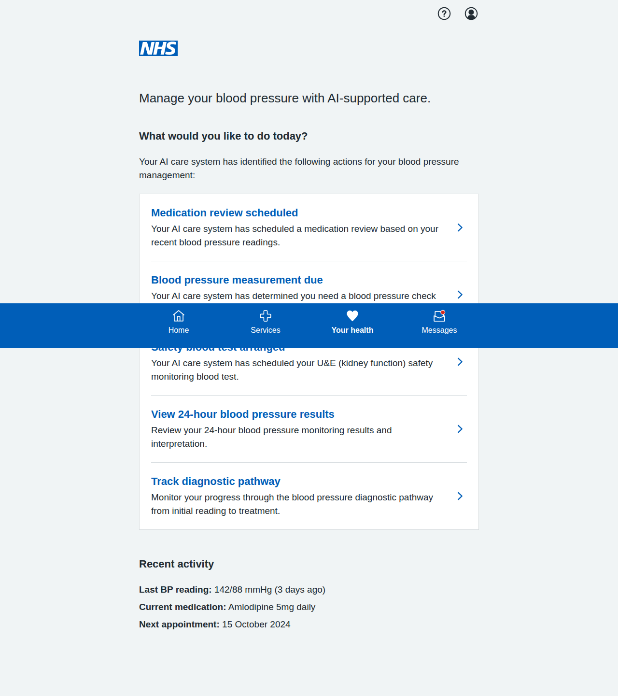
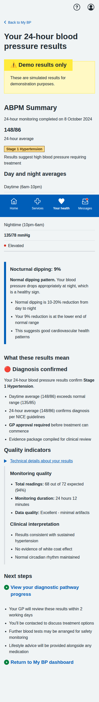

# Blood Pressure Module Screenshots

Complete collection of iPhone-formatted screenshots (393x852 pixels) for all screens in the blood pressure management prototype.

## Main Dashboard

**Main Dashboard** - Updated landing page showing all five patient journey options: dose titration, BP measurement, blood test booking, ABPM results, and diagnostic pathway tracking.

---

## ABPM Results & Diagnostic Pathway Journey (2 screens)

### 1. ABPM Results Summary

**24-Hour ABPM Results** - Comprehensive ABPM results display aligned with MVP document specifications. Shows day/night averages (148/86 mmHg daytime, 135/78 mmHg nighttime), 9% nocturnal dipping analysis, clinical interpretation, and quality indicators. Includes Stage 1 hypertension diagnosis confirmation with mandatory **GP approval required** messaging per NICE guidelines.

### 2. Diagnostic Pathway Tracker

**Diagnostic Pathway Progress** - Category C patient journey implementation following MVP document workflow. Step-by-step tracking from initial elevated reading (155/92 mmHg) through repeat measurements, ABPM at Boots pharmacy, to GP confirmation. Features status badges (Complete, In progress, Pending), timeline summary, and care team information. Emphasizes "GP approval required" per MVP requirements before treatment can commence.

---

## Dose Titration Journey (5 screens)

### 1. Landing Page

**Dose Titration Landing** - Shows current medication status and recent BP readings with option to start review process.

### 2. Readings Review

**Confirm Blood Pressure Readings** - Patient-friendly interface for confirming home BP readings with clear status labels and helpful guidance.

### 3. AI Recommendation

**AI Medication Recommendation** - Comprehensive recommendation screen with clinical rationale, NICE guidelines reference, side effects, and monitoring plan.

### 4. Confirmation

**Dose Increase Confirmed** - Confirmation screen with next steps, care plan updates, and important safety information.

---

## BP Measurement Journey (5 screens)

### 1. Introduction

**Lifelight Technology Introduction** - Comprehensive overview of contactless BP measurement, process explanation, and preparation tips.

### 2. Location Selection

**Community Location Selection** - List of available venues with distances, opening hours, and facility information.

### 3. Appointment Booking

**Appointment Booking** - Date/time selection with contact details and SMS reminder options.

### 4. Booking Confirmation

**Appointment Confirmed** - Complete booking details with preparation instructions, calendar integration, and contact information.

### 5. Sample Results

**Sample Measurement Results** - Demo results showing measurement analysis, trend data, AI insights, and next steps.

---

## Blood Test Journey (5 screens)

### 1. Test Overview

**U&E Test Overview** - Explanation of why the test is needed, test details, and preparation information.

### 2. Educational Information

**Detailed U&E Information** - Comprehensive educational content about what the test measures and its importance for BP medication safety.

### 3. Location Selection

**Healthcare Facility Selection** - Various testing locations including hospitals, health centres, and private labs with detailed facility information.

### 4. Appointment Booking

**Appointment Booking Form** - Date/time selection with contact details, notification preferences, and preparation reminders.

### 5. Final Confirmation

**Appointment Confirmation** - Complete appointment details, step-by-step process explanation, results information, and calendar integration.

---

## Key Features Demonstrated

- **MVP Document Compliance**: Full implementation of Category C patient workflow per MVP specifications
- **NICE Guidelines Adherence**: Strict compliance with NICE CG127 hypertension management protocols
- **GP Approval Workflow**: Mandatory GP approval for new hypertension diagnoses as specified in MVP document
- **Clinical Data Accuracy**: ABPM values match MVP examples (148/86 24-hour average, 148/86 daytime, 135/78 nighttime)
- **Patient-Centered Language**: Clear, jargon-free communication throughout all screens
- **Clinical Safety**: Appropriate NICE guidelines attribution and safety warnings
- **Interactive Navigation**: Working forms, radio buttons, and user input handling
- **Mobile-Responsive Design**: NHS App-appropriate layout optimized for iPhone resolution (393x852 pixels)
- **Accessibility**: Proper semantic HTML structure and NHS design system compliance
- **Realistic Data**: Authentic medical scenarios, dates, locations, and contact information aligned with MVP examples
- **Full User Journeys**: Complete end-to-end workflows for Category C diagnostic pathway
- **ABPM Integration**: 24-hour ambulatory blood pressure monitoring results with clinical interpretation
- **Diagnostic Pathway Tracking**: Step-by-step progress monitoring with status badges (Complete/In progress/Pending)
- **Status Management**: "Awaiting GP confirmation" and other workflow states clearly displayed per MVP requirements
- **Evidence Package Compilation**: Clear indication that clinical evidence has been compiled for GP review
- **Treatment Pathway Gate**: No progression to treatment without explicit GP approval as per MVP document

All screenshots captured at iPhone resolution (393x852 pixels) with full-page scrolling where needed to show complete content. Implementation follows MVP document Category C workflow specifications with mandatory GP approval gates and NICE guideline compliance.