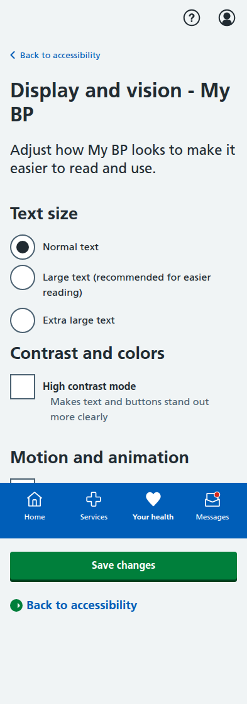

# Blood Pressure Module Screenshots

Complete collection of iPhone-formatted screenshots (393x852 pixels) for all screens in the blood pressure management prototype.

## Main Dashboard

**Main Dashboard** - Landing page showing all three patient journey options: dose titration, BP measurement, and blood test booking.

**Updated Main Dashboard with Lab Results** - Enhanced dashboard now featuring "View lab results" as the first option with recent activity section showing latest lab result status.

**Enhanced Main Dashboard with MVP Features** - Comprehensive dashboard implementation based on MVP documentation featuring:
- Emergency "Get Help Now" button with Red Flag Agent support
- BP trends visualization with traffic light color coding
- Personalized next actions and recommendations
- Medication reminders with adherence tracking
- Patient category identification (Category A: Known Hypertension)
- Progress tracking for lifestyle goals and clinical metrics
- Accessibility options for inclusive design
- Multi-agent system coordination indicators

**Updated Main Dashboard - Final Version** - Corrected dashboard addressing clinical feedback:
- Replaced red emergency "Get Help Now" button with appropriate secondary styling
- Removed patient-facing medication review and booking options (handled by orchestrator)
- Eliminated "Category A" patient terminology from public interface
- Updated to British spellings ("Personalised" not "Personalized")
- Focus on patient actions: BP measurements, viewing results, medication adherence
- Clear care pathway description without technical categories

---

## Dose Titration Journey (5 screens)

### 1. Landing Page

**Dose Titration Landing** - Shows current medication status and recent BP readings with option to start review process.

### 2. Readings Review

**Confirm Blood Pressure Readings** - Patient-friendly interface for confirming home BP readings with clear status labels and helpful guidance.

### 3. AI Recommendation

**AI Medication Recommendation** - Comprehensive recommendation screen with clinical rationale, NICE guidelines reference, side effects, and monitoring plan.

### 4. Confirmation

**Dose Increase Confirmed** - Confirmation screen with next steps, care plan updates, and important safety information.

---

## BP Measurement Journey (5 screens)

### 1. Introduction

**Lifelight Technology Introduction** - Comprehensive overview of contactless BP measurement, process explanation, and preparation tips.

### 2. Location Selection

**Community Location Selection** - List of available venues with distances, opening hours, and facility information.

### 3. Appointment Booking

**Appointment Booking** - Date/time selection with contact details and SMS reminder options.

### 4. Booking Confirmation

**Appointment Confirmed** - Complete booking details with preparation instructions, calendar integration, and contact information.

### 5. Sample Results

**Sample Measurement Results** - Demo results showing measurement analysis, trend data, AI insights, and next steps.

---

## Blood Test Journey (5 screens)

### 1. Test Overview

**U&E Test Overview** - Explanation of why the test is needed, test details, and preparation information.

### 2. Educational Information

**Detailed U&E Information** - Comprehensive educational content about what the test measures and its importance for BP medication safety.

### 3. Location Selection

**Healthcare Facility Selection** - Various testing locations including hospitals, health centres, and private labs with detailed facility information.

### 4. Appointment Booking

**Appointment Booking Form** - Date/time selection with contact details, notification preferences, and preparation reminders.

### 5. Final Confirmation

**Appointment Confirmation** - Complete appointment details, step-by-step process explanation, results information, and calendar integration.

---

## Lab Results Journey (2 screens)

### 1. Normal Lab Results

**Normal U&E Test Results** - Comprehensive display of normal blood test results with color-coded status indicators, baseline comparisons, clinical explanations, and reassuring "Good news" messaging. Shows all five key parameters (Creatinine, eGFR, Sodium, Potassium, Urea) with reference ranges and trend analysis.

### 2. Abnormal Lab Results with Simplified Clinical Actions

**Abnormal U&E Test Results with Simplified Urgent Actions** - Critical results display featuring:
- Prominent "Important" alert banner with clear abnormal results notification
- Elevated creatinine (135 μmol/L) and potassium (5.8 mmol/L) with color-coded visual indicators
- Simplified "Urgent action needed" section with clear patient instructions:
  - GP contact within 24 hours (by end of tomorrow)
  - Clear fail-safe mechanism if GP hasn't contacted by 5pm tomorrow
  - Specific symptoms requiring immediate GP practice contact
- Separation of clinical explanation from actionable patient instructions
- Clinically appropriate timeframes aligned with NICE/BNF guidelines for moderate potassium elevation

### 3. AI Treatment Decision Results (Split into Two Pages)

**AI Treatment Decision - Results Summary** - First page of the split AI decision interface featuring:
- Updated terminology: "AI system assessment" instead of "Healthcare professional's comment" 
- Clear "AI-supported care" terminology throughout (not "AI care team")
- Test results summary with visual indicators for creatinine and potassium levels
- Concise AI decision summary card with link to detailed rationale
- Improved NHS design system compliance with proper card components
- Reduced page length for better mobile experience

**AI Treatment Decision - Detailed Rationale** - Second page with comprehensive details:
- Original plan vs. AI decision comparison using NHS card components
- NICE guideline rationale with safety factors and treatment principles
- Detailed medication plan table with clear new medication highlighting
- Monitoring and follow-up schedule with visual card layout
- Modern NHS design patterns with proper spacing and typography
- Expandable section explaining AI-supported care decision process
- Focus on AI-supported care terminology rather than confusing "care team" language

---

## Healthcare Professional Interface (3 screens)

### 1. GP Practice Analytics Dashboard

**GP Practice Analytics Dashboard** - Professional desktop interface for healthcare providers (not patient-facing) featuring:
- Practice-wide NICE guidelines adherence monitoring (78% compliance rate vs 85% target)
- Health inequality tracking across demographic groups (IMD quintiles, ethnicity, age, digital exclusion)
- Multi-agent system performance metrics with 99.2% uptime and 100% Red Flag response rate
- Practice workload impact analysis showing 41 hours/week time savings (equivalent to 1 FTE clinician)
- EHR integration status for EMIS Web, TPP SystmOne, QOF Reporting, and NHS App
- Clear indication this is a professional desktop tool, not part of the patient-facing NHS App

### 2. Accessibility Hub (Redesigned)

**Accessibility Hub** - Redesigned accessibility interface following NHS best practices:
- Organized into focused categories instead of one overwhelming page
- Card-based navigation for easier cognitive load management
- Quick settings for Display & Vision, Audio & Sound, Navigation & Motor, Language & Communication
- Prominent "Get help" section for digital inclusion support
- Progressive disclosure with collapsible screen reader compatibility info
- Link to comprehensive options for users who need all settings

### 3. Display and Vision Settings

**Display and Vision Settings** - Focused sub-page for visual accessibility:
- Radio button selection for text size (Normal, Large, Extra Large)
- High contrast mode toggle with clear benefits explanation
- Motion reduction settings for users with vestibular disorders
- Clear navigation back to accessibility hub

### 4. All Accessibility Options (Comprehensive)

**All Accessibility Options** - Complete list for users who need comprehensive control:
- Updated with tip directing users to the organized accessibility hub
- All original features maintained for power users
- Clear navigation between hub and comprehensive views
- Visual accessibility (large text, high contrast, reduced motion)
- Audio accessibility (voice readback, AI voice agents, audio descriptions)
- Multi-language support (10 languages including Urdu, Hindi, Bengali, Welsh)
- Communication preferences (EasyRead, BSL support, cultural adaptations)
- Physical and motor accessibility (keyboard navigation, large touch targets, voice commands)
- Cognitive accessibility (simplified navigation, progress indicators, reminder prompts)
- Digital inclusion support with face-to-face care options
- Screen reader compatibility (NVDA, JAWS, VoiceOver, TalkBack)

### 3. Emergency Support System (Patient-Focused)

**Emergency Support** - Streamlined patient-focused emergency guidance system:
- Clear 999 emergency contact instructions for life-threatening symptoms
- GP practice urgent contact procedures for high BP readings ≥180/110 mmHg with symptoms
- Medication side effects monitoring with common and serious side effect lists
- Out-of-hours support through NHS 111 and local GP services
- Comprehensive emergency contact table with appropriate use guidance
- Patient-centered approach with clear actions rather than AI system promises
- Removal of unrealistic "AI monitoring active" sections based on clinical feedback
- Focus on patient responsibility and clear escalation pathways per NICE guidelines

---

## Key Features Demonstrated

- **Patient-Centered Language**: Clear, jargon-free communication throughout all screens
- **Clinical Safety**: Appropriate NICE guidelines attribution and safety warnings
- **Interactive Navigation**: Working forms, radio buttons, and user input handling
- **Mobile-Responsive Design**: NHS App-appropriate layout optimized for mobile devices
- **Accessibility**: Proper semantic HTML structure and NHS design system compliance
- **Realistic Data**: Authentic medical scenarios, dates, locations, and contact information
- **Full User Journeys**: Complete end-to-end workflows for all three patient pathways
- **Lab Results Integration**: Comprehensive U&E blood test results display with color-coded thresholds
- **Clinical Decision Support**: Intelligent alert system with normal/abnormal result pathways
- **Patient Education**: Plain English explanations with "What this means" sections for each parameter
- **Multi-Agent Coordination**: Visual indicators of 9 specialized AI agents working together per MVP
- **Health Inequality Monitoring**: GP dashboard tracking outcomes across demographic groups
- **Emergency Detection**: Red Flag Agent with 24/7 monitoring and automatic escalation
- **Accessibility Excellence**: Comprehensive features for visual, audio, cognitive, and motor accessibility
- **Patient Categorization**: Clear identification of Category A/B/C patient pathways
- **Clinical Safety Focus**: Safety-first design with fail-safe mechanisms and NICE guideline compliance

All screenshots captured at iPhone resolution (393x852 pixels) with full-page scrolling where needed to show complete content.