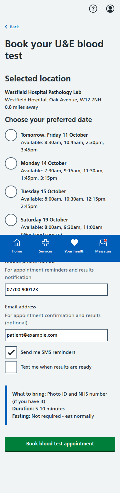

# Blood Pressure Module Screenshots

Complete collection of iPhone-formatted screenshots (393x852 pixels) for all screens in the blood pressure management prototype.

## Main Dashboard

**Main Dashboard** - Landing page showing all four patient journey options: shared decision-making for treatment selection, dose titration, BP measurement, and blood test booking.

---

## Shared Decision-Making Journey (4 screens)

### 1. Treatment Comparison

**Choose Your Treatment** - Interactive comparison interface for Amlodipine, Lisinopril, and Candesartan with effectiveness ratings, side effect profiles, and multimedia learning options.

### 2. Video Guides

**Video Learning Resources** - Healthcare professional explanations for each medication with cultural considerations, religious observances, and traditional medicine guidance.

### 3. AI Chatbot Interface

**AI Assistant** - Interactive chat interface with NHS BP Assistant for answering questions about treatments, with quick question buttons and voice input support.

### 4. Chatbot with Response

**AI Response Example** - Demonstration of intelligent responses about medication side effects with contextual information and professional medical advice reminders.

---

## Dose Titration Journey (5 screens)

### 1. Landing Page

**Dose Titration Landing** - Shows current medication status and recent BP readings with option to start review process.

### 2. Readings Review

**Confirm Blood Pressure Readings** - Patient-friendly interface for confirming home BP readings with clear status labels and helpful guidance.

### 3. AI Recommendation

**AI Medication Recommendation** - Comprehensive recommendation screen with clinical rationale, NICE guidelines reference, side effects, and monitoring plan.

### 4. Confirmation

**Dose Increase Confirmed** - Confirmation screen with next steps, care plan updates, and important safety information.

---

## BP Measurement Journey (5 screens)

### 1. Introduction

**Lifelight Technology Introduction** - Comprehensive overview of contactless BP measurement, process explanation, and preparation tips.

### 2. Location Selection

**Community Location Selection** - List of available venues with distances, opening hours, and facility information.

### 3. Appointment Booking

**Appointment Booking** - Date/time selection with contact details and SMS reminder options.

### 4. Booking Confirmation

**Appointment Confirmed** - Complete booking details with preparation instructions, calendar integration, and contact information.

### 5. Sample Results

**Sample Measurement Results** - Demo results showing measurement analysis, trend data, AI insights, and next steps.

---

## Blood Test Journey (5 screens)

### 1. Test Overview

**U&E Test Overview** - Explanation of why the test is needed, test details, and preparation information.

### 2. Educational Information

**Detailed U&E Information** - Comprehensive educational content about what the test measures and its importance for BP medication safety.

### 3. Location Selection

**Healthcare Facility Selection** - Various testing locations including hospitals, health centres, and private labs with detailed facility information.

### 4. Appointment Booking

**Appointment Booking Form** - Date/time selection with contact details, notification preferences, and preparation reminders.

### 5. Final Confirmation

**Appointment Confirmation** - Complete appointment details, step-by-step process explanation, results information, and calendar integration.

---

## Key Features Demonstrated

- **Shared Decision-Making Tools**: Interactive treatment comparison with multimedia learning resources and AI chatbot support
- **Cultural Sensitivity**: Multi-language support, religious considerations (Ramadan/fasting), and traditional medicine awareness
- **AI-Powered Assistance**: Intelligent chatbot with contextual responses about medications and side effects
- **Multimedia Education**: Video guides, audio stories, Easy Read formats, and visual learning aids
- **Patient-Centered Language**: Clear, jargon-free communication throughout all screens
- **Clinical Safety**: Appropriate NICE guidelines attribution and safety warnings
- **Interactive Navigation**: Working forms, radio buttons, and user input handling
- **Mobile-Responsive Design**: NHS App-appropriate layout optimized for mobile devices
- **Accessibility**: Proper semantic HTML structure and NHS design system compliance
- **Realistic Data**: Authentic medical scenarios, dates, locations, and contact information
- **Full User Journeys**: Complete end-to-end workflows for all four patient pathways

All screenshots captured at iPhone resolution (393x852 pixels) with full-page scrolling where needed to show complete content.