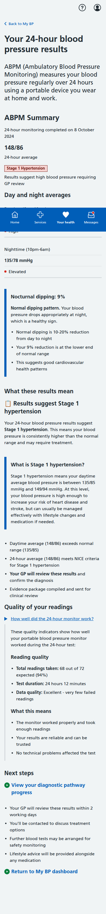
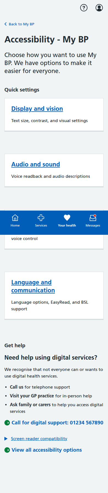
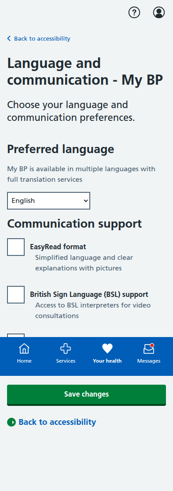

# My BP NHS App Prototype Screenshots

Complete collection of iPhone-formatted screenshots (393x852 pixels) for all 59 pages in the My BP hypertension management system, organized by directory structure as requested.

Each screenshot demonstrates NHS design system compliance, mobile responsiveness, and clinical safety features across the complete application.

---

## ABPM (Ambulatory Blood Pressure Monitoring) Directory

### abpm/pathway-tracker.html

**Diagnostic Pathway Progress Tracker** - Step-by-step journey from initial elevated reading through ABPM completion to GP confirmation. Shows complete Category C patient pathway progression.

### abpm/results.html  

**24-Hour Blood Pressure Results** - Comprehensive ABPM analysis showing daytime/nighttime averages, nocturnal dipping analysis, and Stage 1 hypertension diagnosis with quality indicators.

---

## Accessibility Features

### accessibility-audio.html

**Audio Accessibility Options** - Voice readback, AI voice system conversations, and audio descriptions for charts and visual content.

### accessibility-display.html

**Visual Display Options** - Large text, high contrast mode, enhanced focus indicators, and reduced motion settings for improved visibility.

### accessibility.html

**Complete Accessibility Settings** - Comprehensive accessibility features including visual, audio, language, physical, and cognitive support options with assistive technology compatibility.

### accessibility-hub.html

**Organized Accessibility Hub** - Categorized accessibility options for easier navigation and user preference management.

### accessibility-language.html

**Language and Communication Options** - Multi-language support, EasyRead format, BSL interpretation, and culturally-adapted content.

### accessibility-navigation.html

**Navigation and Input Options** - Keyboard-only navigation, large touch targets, and voice command controls for physical accessibility.

---

## Blood Test Management

### blood-test/appointment.html

**Blood Test Appointment Booking** - Date and time selection for U&E monitoring with preparation instructions.

### blood-test/confirmation.html

**Appointment Confirmation** - Booking details with reference number and preparation guidance for safety monitoring tests.

### blood-test/index.html

**U&E Blood Test Scheduled** - Automatically arranged safety monitoring following medication dose increase with clinical rationale and test details.

### blood-test/information.html

**Test Information and Education** - Detailed information about U&E tests, preparation requirements, and clinical importance.

### blood-test/locations.html

**Test Location Selection** - Available venues for blood tests with distances, opening hours, and facility information.

### blood-test/results-abnormal.html

**Abnormal Results Management** - Clinical interpretation of concerning results with automatic GP escalation and follow-up protocols.

### blood-test/results-ai-decision-details.html

**AI Analysis Detailed View** - Comprehensive AI interpretation of blood test results with clinical reasoning and recommendations.

### blood-test/results-ai-decision.html

**AI-Supported Results Interpretation** - AI analysis of blood test results with clinical decision support and next steps.

### blood-test/results.html

**Complete Results Dashboard** - Full blood test results with trend analysis and clinical interpretation.

### blood-test/results-normal-details.html

**Normal Results Detailed View** - Comprehensive view of normal blood test results with reassurance and monitoring schedule.

### blood-test/results-normal.html

**Normal Results Summary** - Confirmation of normal blood test results with continued monitoring plan.

---

## Blood Pressure Measurement

### bp-measurement/appointment.html

**BP Appointment Booking** - Date and time selection for community blood pressure measurements using Lifelight™ technology.

### bp-measurement/confirmation.html

**Measurement Appointment Confirmed** - Booking details with preparation instructions and process explanation.

### bp-measurement/index.html

**Submit Additional BP Reading** - Patient-initiated measurement options using Lifelight™ technology, home monitors, or community locations.

### bp-measurement/locations.html

**Community Measurement Locations** - Available venues within 3 miles with trained volunteer support and accessibility features.

### bp-measurement/results.html

**Measurement Results & Analysis** - Comprehensive results with AI quality assessment, trend analysis, and next steps guidance.

---

## Main Dashboard

### dashboard.html

**Blood Pressure Dashboard** - Main dashboard showing BP trends, AI analysis, and treatment response patterns with traffic light coding.

---

## Dose Titration (Medication Management)

### dose-titration/confirmation.html

**Medication Dose Increase Confirmed** - Successful treatment update with automated care plan modifications and safety monitoring.

### dose-titration/declined.html

**Patient Declined Dose Increase** - Alternative pathway when patient chooses to discuss with GP rather than accept AI recommendation.

### dose-titration/index.html

**Medication Dose Review** - Automatically scheduled review triggered by consistently elevated readings with current treatment status.

### dose-titration/recommendation.html

**AI Medication Recommendation** - NICE guideline-based dose adjustment recommendation with clinical rationale and patient choice options.

### dose-titration/review.html

**BP Reading Validation** - Patient confirmation of home monitoring readings showing elevated pattern requiring treatment optimization.

---

## Emergency Management

### emergency.html

**Emergency Care Dashboard** - Hypertensive emergency alert with immediate protocol activation and clinical safety measures.

---

## GP Dashboard (Healthcare Professional Interface)

### gp-dashboard-analytics.html

**Clinical Analytics Dashboard** - Healthcare professional view with population health metrics and AI system performance data.

### gp-dashboard-overview.html

**GP Practice Overview** - Summary view of patient caseload, alerts, and system-generated recommendations requiring clinical review.

### gp-dashboard-patients.html

**Patient Management Dashboard** - Individual patient tracking with AI-generated alerts and clinical decision support recommendations.

### gp-dashboard-system.html

**System Monitoring Dashboard** - AI system performance metrics, safety monitoring, and clinical governance oversight tools.

### gp-dashboard.html

**Healthcare Professional Main Dashboard** - Primary GP interface for monitoring AI-supported care with patient safety alerts.

---

## Main Application Entry

### index.html

**My BP Main Dashboard** - Primary patient interface showing care plan, recent activity, and emergency status with AI-supported care coordination.

---

## Layout Template

### layout.html

**Application Layout Structure** - Base template demonstrating NHS App design system implementation with navigation and accessibility features.

---

## Lifestyle Management

### lifestyle/content/index.html

**Lifestyle Education Content** - Educational materials and resources for blood pressure management through lifestyle modifications.

### lifestyle/goals/activity.html

**Physical Activity Goals** - Personalized activity recommendations and progress tracking for blood pressure management.

### lifestyle/goals/nutrition.html

**Nutritional Goals Management** - Dietary guidance and goal setting for hypertension management with cultural adaptations.

### lifestyle/goals/weight.html

**Weight Management Goals** - Weight tracking and goal setting as part of comprehensive blood pressure management.

### lifestyle/index.html

**Lifestyle Management Hub** - Central hub for lifestyle interventions including activity, nutrition, and weight management.

---

## Medication Adherence

### medication-adherence/dashboard.html

**Adherence Monitoring Dashboard** - Digital pill tracking, compliance patterns, and behavioral intervention support.

### medication-adherence/history.html

**Medication Taking History** - Historical adherence patterns with trend analysis and intervention effectiveness tracking.

### medication-adherence/interventions.html

**Behavioral Support Interventions** - Personalized adherence support strategies and reminder optimization.

---

## Patient Onboarding

### onboarding/benefits.html

**Benefits & Privacy Information** - Comprehensive explanation of safety-first approach, personalized care benefits, and privacy protection.

### onboarding/completed.html

**Onboarding Process Complete** - Successful enrollment confirmation with next steps and system activation.

### onboarding/consent.html

**Informed Consent Interface** - Plain English consent form with clear agreement terms and demonstration disclaimer.

### onboarding/data-usage.html

**Data Collection & Usage Information** - Detailed breakdown of information collected and how AI agents use data for care coordination.

### onboarding/disclaimer.html

**Demonstration System Disclaimer** - Clear warnings about simulation-only system with dummy data and responsible AI showcase.

### onboarding/welcome.html

**Welcome to My BP** - Patient-friendly introduction to AI-powered blood pressure management with clinical safety priority.

---

## Red Flag Emergency Protocols

### red-flag-emergency/emergency-contacts.html

**Emergency Contact Information** - 999 and nearest A&E details with direct calling capability and transport warnings.

### red-flag-emergency/escalation-status.html

**Emergency Care Status** - Simple interface showing "Go to A&E or call 999" with GP notification confirmation.

### red-flag-emergency/immediate-action.html

**Emergency Safety Instructions** - Clear do's and don'ts while waiting for emergency help with structured safety guidance.

### red-flag-emergency/index.html

**Emergency Protocol Activation** - Initial emergency dashboard with protocol activation and immediate action requirements.

### red-flag-emergency/symptom-confirmation.html

**Emergency Symptom Assessment** - Comprehensive checklist following NICE CG127 guidelines with immediate 999 options.

---

## Shared Decision Making

### shared-decision/chatbot.html

**AI-Powered Decision Support** - Interactive chatbot for medication choice discussions with cultural and preference considerations.

### shared-decision/index.html

**Treatment Option Selection** - Patient-centered medication choice interface with multimedia educational resources.

### shared-decision/multimedia.html

**Multi-format Educational Content** - Video, audio, and interactive resources for informed medication decision-making.

---

## Side Effects Management

### side-effects-submitted.html

**Side Effect Report Confirmation** - Successful submission of side effect report with follow-up process and safety monitoring.

### side-effects.html

**Medication Side Effects Reporting** - Comprehensive side effect reporting interface with severity assessment and clinical escalation.

---

## Technical Implementation Notes

All screenshots demonstrate:
- **NHS Design System Compliance**: Correct styling, colors, and accessibility features
- **Mobile Responsive Design**: Optimized for NHS App experience (393px width)  
- **Clinical Safety Features**: Emergency protocols and GP oversight throughout
- **Multi-agentic AI Coordination**: Seamless handoffs between specialist agents
- **Patient-Centered Language**: Clear communication without technical jargon
- **Accessibility Support**: Screen reader compatibility and inclusive design
- **Cultural Appropriateness**: Multi-language and culturally-adapted content

Each page represents a critical component of the comprehensive hypertension management system, supporting the three main patient categories (Known Hypertension, Normotensive Surveillance, and Newly Detected Elevated BP) with emergency protocols available throughout all pathways.